# BarBellix — Complete Project Documentation

**A multi-tenant gym management platform: member mobile app, staff web dashboard, and one shared API.**

| Field | Value |
|---|---|
| Document version | 1.0 |
| Date | 2026-09-11 |
| Repository | `barbellix` — npm workspaces monorepo |
| Branch documented | `master` |
| Commits covered | 43 — `0c4a936` (2026-07-19) through `f38ca23` (2026-08-30), plus the uncommitted payments work |
| Scale | 365 source files, ~31,400 lines across 4 workspaces |

> **How to read this document.** Sections 1–5 describe what was built and how it fits together. Sections 6–13 are the reference tables: every data model, every API route, every service function, every screen. Section 14 covers testing, section 15 covers deployment. **Section 16 is the pending-functionality analysis** — what is still missing, ordered by how much it matters.

---

## 1. Executive summary

BarBellix is a gym-management product built as three deliverables sharing one backend:

- **Member mobile app** — Expo / React Native. Training plans, live workout logging, AI coaching, progress tracking, nutrition, habits, QR gym check-in, class booking, and membership payment.
- **Staff web dashboard** — React / Vite. Gym-owner and trainer consoles for member management, trainer management, attendance analytics, payments, class scheduling, and workout-plan oversight.
- **API server** — Fastify / MongoDB. One multi-tenant API serving both clients, with role-based access control enforced at both the route layer and the data-query layer.

The platform supports **four roles** — `member`, `trainer`, `admin` (gym owner), and `superadmin` (platform operator) — over a **tenant-scoped, branch-scoped** data model, so one deployment can host multiple gyms.

**Where the project stands.** The core product is functionally complete and runs end to end: authentication, workout and diet planning with AI generation, attendance, progress tracking, class booking, messaging, trainer management, and payments. Payments were migrated from Stripe to **Cashfree** — India-first, covering UPI, cards, net banking and wallets — and verified against a live Cashfree sandbox account up to and including the real hosted checkout UI. A cash-payment flow with SMS OTP confirmation was added for members who pay at the front desk.

**What is not finished** is covered in full in section 16. The headline items: four notification toggles are inert because the server has no job scheduler; iOS is not buildable because `eas.json` has no `ios` profile and `app.json` has no camera usage-description string; and the legal pages still carry `[PLACEHOLDER]` markers. Password reset (previously the top item here) is now implemented end to end — see section 16.1, item 1.

---

## 2. Development timeline

The project began as a mock-only mobile prototype with AI API keys embedded in the client. The entire backend, web dashboard, and multi-tenancy model were built afterwards. The commit history reads as eight distinct phases.

### Phase 1 — Monorepo and backend foundation (2026-07-19)

| Commit | Change |
|---|---|
| `0c4a936` | Baseline commit before backend monorepo restructuring |
| `aabd718` | Scaffold npm workspace monorepo, move app into `apps/mobile` |
| `6a610d8` | Extract `packages/shared` — domain types and auth Zod schemas |
| `5da3bc0` | Scaffold `apps/server` — Fastify + Mongoose + MongoDB skeleton |
| `1c7fa85` | Auth module — register, login, refresh, logout, forgot-password |
| `d284b85` | Users, exercises, workouts modules |
| `bf48a10` | Attendance, workout sessions, progress, nutrition, habits modules |
| `feafce0` | Trainer and admin modules |
| `2a386e0` | Messaging and notification preferences |
| `052e57e` | **The AI proxy — the security fix that motivated the whole backend.** AI provider keys moved server-side. |
| `a1f2387` | Wire the mobile app to the real backend; mocks and client-side AI keys removed |

### Phase 2 — Web dashboard (2026-07-19)

| Commit | Change |
|---|---|
| `a12d064` | M0 — backend extensions for the web management dashboard |
| `9c5d71d` | M1 — Stripe billing backend: membership plans, checkout, webhooks |
| `ef309c9` | M2 — scaffold `apps/web`: Vite + React 19 + TypeScript + Tailwind v4 + shadcn/ui |
| `c036e50` | M3 — web auth and routing shell: MobX session, role-gated routes |
| `5130ff3` | M4 — owner/admin dashboard: KPIs, roster management, billing UI |
| `ddace70` | M5 — trainer dashboard: roster, plan builder, assignment, messaging |

### Phase 3 — Deployment and client-PRD gap closure (2026-07-20 to 2026-07-26)

| Commit | Change |
|---|---|
| `164b648`, `593c808`, `d4ede3f` | GitHub repo init, README rewrite, history merge |
| `ce79a49` | Containerize the stack; Render Blueprint for hosted deployment |
| `83035da` | Wire the last 3 mock mobile screens to the real backend |
| `e3f10fa` | Account and payment fields, admin analytics, real AI-generated workout plans |
| `55b68eb` | Grace period, QR device-pairing login, sponsorships, AI diet plans, payment history, photo upload |
| `5bc2df1` | Fix the N+1 query storm on the trainer and admin member roster |

### Phase 4 — Shared UI, classes, push (2026-07-26 to 2026-07-27)

| Commit | Change |
|---|---|
| `82f76f3` | M0 — shared UI component library on both clients |
| `bd33a63` | M1 backend — group class scheduling and booking |
| `50019c5` | M1 frontend — class scheduling and booking on mobile and web |
| `e0eb496` | M2 — real push notifications |
| `40537dd` | M3 — shared mapper helper, web code-splitting, working lint on every app |

### Phase 5 — Rebrand (2026-07-29 to 2026-07-30)

| Commit | Change |
|---|---|
| `1e600a5` | Rename project: FitPulse to BarBellix |
| `681ea8a` | Theme: Tech-Forward Powerhouse — Obsidian Black, Titanium Silver, Electric Volt |
| `7ed0d33` | BarBellix brand mark — bolt-monogram icon, favicon, app icon assets |

### Phase 6 — Production hardening (2026-08-09)

| Commit | Change |
|---|---|
| `2542cb3` | Vercel migration, Sentry, rate limiting, first tests |
| `6b6dbc9` | Fix seeded members missing `assignedTrainerId`; extend seed data |
| `3bbfee5` | Replace emoji icons with Ionicons on the member home screen |
| `c539d39` | Google sign-in, QR check-out, trainer sign-in QR; seed script removed |

### Phase 7 — Production bug fixes (2026-08-22 to 2026-08-30)

| Commit | Change |
|---|---|
| `108304f` | Explore card text-wrap bug, profile-setup prompt, richer AI exercise selection |
| `8e3c1d9` | **Production crash fix** — replaced argon2 with bcryptjs; the native addon could not be bundled for serverless |
| `cb2d068` | **Security fix** — `passwordHash` was leaking in every API response returning a User, through a Mongoose subdocument spread |
| `04e014f` | Real `favicon.ico` and vector logo assets |
| `f38ca23` | Gym-owner admin management: trainers, attendance, payments, workout oversight |

### Phase 8 — Cashfree payments and go-live prep (uncommitted at time of writing)

| Area | Change |
|---|---|
| Payments | Stripe removed entirely. **Cashfree Payment Gateway** integrated — orders API, hosted checkout through their client JS SDK, signed webhooks with replay protection |
| Cash payments | New SMS-OTP flow, so a front-desk cash payment is confirmed by the member rather than asserted by staff |
| Membership extension | Atomic MongoDB aggregation-pipeline update, so concurrent payments cannot double-extend or lose time |
| Legal | Public `/privacy` and `/terms` pages on the web app, linked from mobile registration |
| Tooling | `bootstrap-admin.ts` — creates the very first admin account, which no in-product path can do |
| Tests | 46 passing server tests across attendance, auth, billing, trainer, Cashfree, and cash-OTP |
| Docs | `docs/DEPLOYMENT.md` go-live checklist |

---

## 3. System architecture

<!-- diagram:architecture -->
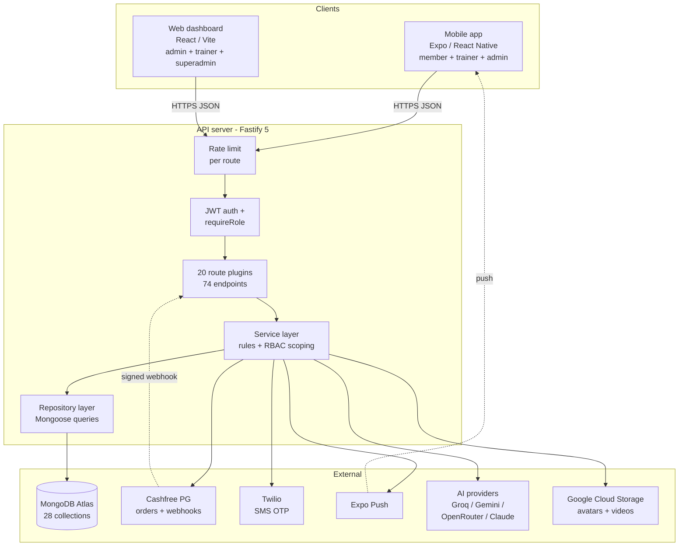
```mermaid
graph TB
    subgraph Clients
        M["Mobile app<br/>Expo / React Native<br/>member + trainer + admin"]
        W["Web dashboard<br/>React / Vite<br/>admin + trainer + superadmin"]
    end

    subgraph Server["API server - Fastify 5"]
        RL["Rate limit<br/>per route"]
        AU["JWT auth +<br/>requireRole"]
        RT["20 route plugins<br/>74 endpoints"]
        SV["Service layer<br/>rules + RBAC scoping"]
        RP["Repository layer<br/>Mongoose queries"]
    end

    subgraph External
        DB[("MongoDB Atlas<br/>28 collections")]
        CF["Cashfree PG<br/>orders + webhooks"]
        TW["Twilio<br/>SMS OTP"]
        EX["Expo Push"]
        AI["AI providers<br/>Groq / Gemini /<br/>OpenRouter / Claude"]
        GCS["Google Cloud Storage<br/>avatars + videos"]
    end

    M -->|HTTPS JSON| RL
    W -->|HTTPS JSON| RL
    RL --> AU
    AU --> RT
    RT --> SV
    SV --> RP
    RP --> DB
    SV --> CF
    SV --> TW
    SV --> EX
    SV --> AI
    SV --> GCS
    CF -.->|signed webhook| RT
    EX -.->|push| M
```

**The layering rule.** Routes own HTTP concerns and Zod validation. Services own business rules **and role scoping** — a trainer's request resolves a member through `findAssignedMemberByIdInTenant`, an admin's through `findMemberByIdInTenant`, so authorization is enforced by the query itself rather than by a separate check that can be forgotten. Repositories own Mongoose. Nothing skips a layer.

### Request lifecycle

<!-- diagram:request-pipeline -->
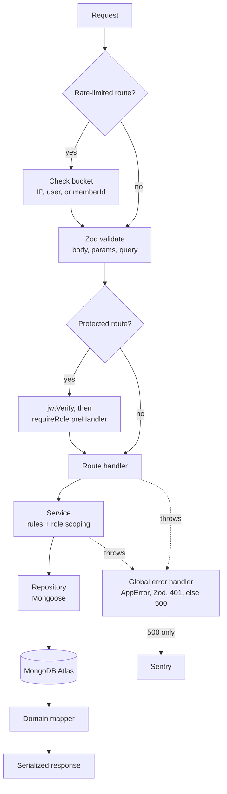
```mermaid
graph TD
    A["Request"] --> B{"Rate-limited route?"}
    B -->|yes| C["Check bucket<br/>IP, user, or memberId"]
    B -->|no| D["Zod validate<br/>body, params, query"]
    C --> D
    D --> E{"Protected route?"}
    E -->|yes| F["jwtVerify, then<br/>requireRole preHandler"]
    E -->|no| H["Route handler"]
    F --> H
    H --> I["Service<br/>rules + role scoping"] --> J["Repository<br/>Mongoose"] --> K[("MongoDB Atlas")]
    K --> L["Domain mapper"] --> M["Serialized response"]
    H -.->|throws| N["Global error handler<br/>AppError, Zod, 401, else 500"]
    I -.->|throws| N
    N -.->|"500 only"| O["Sentry"]
```

---

## 4. Technology stack

| Layer | Choice | Why it is here |
|---|---|---|
| Monorepo | npm workspaces | `apps/*` and `packages/*`; shared types compiled once, consumed by all three apps |
| API framework | Fastify 5 | Schema-first, fast, first-class TypeScript plugin model |
| Validation | Zod 3 + `fastify-type-provider-zod` | One schema validates the request and types the handler |
| Database | MongoDB + Mongoose 8 | The document model fits nested workout plans and profile subdocuments naturally |
| Auth | `@fastify/jwt` + rotating refresh tokens | Short-lived access token; hashed refresh token with reuse detection |
| Password hashing | bcryptjs, 12 rounds | Pure JS — argon2's native addon could not be bundled for serverless |
| Payments | Cashfree Payment Gateway, orders API | UPI, cards, net banking, wallets — the India-first requirement |
| SMS | Twilio, behind a provider seam | `SMS_PROVIDER` env var, the same swappable pattern as storage |
| Push | Expo Push | Works with the existing Expo client without a native module |
| Object storage | Local disk or Google Cloud Storage | `STORAGE_BACKEND` env var selects the backend |
| Monitoring | Sentry | Server, web and mobile; no-ops when the DSN is unset |
| Web UI | React 19 + Vite 8 + Tailwind v4 + Radix / shadcn | Code-split routes, dark-first theme |
| Web client state | MobX | A single observable `authStore`; pages are observers |
| Web server state | TanStack Query v5 | 2-minute stale time, refetch on window focus |
| Mobile | Expo SDK 54 + React Native 0.81 + React 19 | One codebase, OTA-updatable, no ejection needed |
| Mobile client state | Zustand + MMKV | A small auth store with fast native-backed persistence |
| Mobile navigation | React Navigation 6 | Bottom tabs for members, flat stacks for staff |
| Charts | Recharts on web, Victory Native on mobile | Different rendering models per platform |
| Testing | Vitest | 46 server tests, mocked at the repository boundary |

---

## 5. Repository layout

```
barbellix/
├── apps/
│   ├── server/          Fastify API — 145 files, ~8,979 lines
│   │   ├── src/
│   │   │   ├── app.ts                  builds Fastify, registers 20 route plugins
│   │   │   ├── server.ts               boots Sentry, listens
│   │   │   ├── config/env.ts           the single env-var schema
│   │   │   ├── plugins/                config, database, auth, error-handler
│   │   │   ├── db/models/              28 Mongoose models
│   │   │   ├── db/bootstrap-admin.ts   creates the first admin account
│   │   │   ├── lib/                    16 cross-cutting libraries
│   │   │   └── modules/                19 feature modules
│   │   └── test/                       46 Vitest tests
│   ├── web/             Admin + trainer dashboard — 72 files, ~7,772 lines
│   │   └── src/ pages, layouts, routes, components, api, store, lib
│   ├── mobile/          Expo app — 144 files, ~13,675 lines
│   │   └── src/ screens, navigation, components, hooks, api, store, lib, theme
├── packages/
│   └── shared/          Types, Zod schemas, constants — 4 files, ~989 lines
└── docs/                This document, deployment guide, PRD set, client status
```

**Module shape.** Every server module follows the same four files, and the convention is worth stating because it is what makes the codebase navigable:

```
modules/<name>/
├── routes.ts        HTTP surface, Zod schemas attached, role guards in preHandler
├── schemas.ts       Zod request and response definitions
├── service.ts       business rules, role scoping, cross-module orchestration
└── repository.ts    Mongoose queries — the only file that touches a model
```

### Root npm scripts

| Command | What it does |
|---|---|
| `npm run shared` | Build `packages/shared` — required before the server or web typechecks |
| `npm run shared:watch` | Rebuild shared on change |
| `npm run server` | Start the API in watch mode |
| `npm run web` | Start the web dashboard dev server |
| `npm run mobile` | Start Expo |
| `npm run mobile:tunnel` | Start Expo through a tunnel, for testing on a device off the LAN |
| `npm run mobile:typecheck` | Typecheck the mobile app |
| `npm run build` | Build shared, then server, then web |
| `npm run test` | Run the server test suite |
| `npm run lint` | Lint every workspace that defines a lint script |

---
## 6. Roles and permissions

Four roles, in a strict capability hierarchy. Each role's surface is deliberately different on mobile and web, because the jobs are different: members live in the app, staff live in the dashboard.

<!-- diagram:roles -->
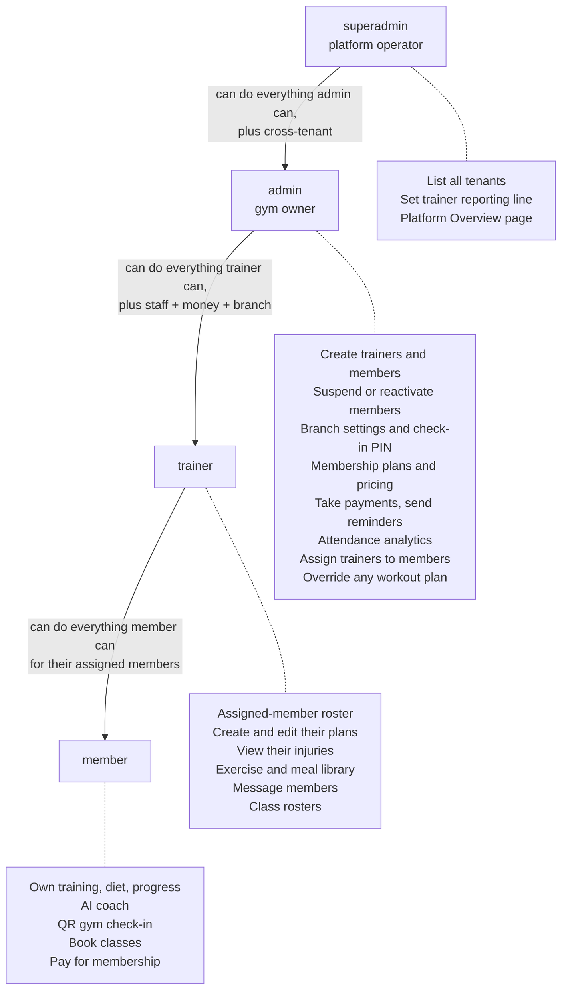
```mermaid
graph TD
    SA["superadmin<br/>platform operator"]
    AD["admin<br/>gym owner"]
    TR["trainer"]
    ME["member"]

    SA -->|"can do everything admin can,<br/>plus cross-tenant"| AD
    AD -->|"can do everything trainer can,<br/>plus staff + money + branch"| TR
    TR -->|"can do everything member can<br/>for their assigned members"| ME

    SA -.- SAC["List all tenants<br/>Set trainer reporting line<br/>Platform Overview page"]
    AD -.- ADC["Create trainers and members<br/>Suspend or reactivate members<br/>Branch settings and check-in PIN<br/>Membership plans and pricing<br/>Take payments, send reminders<br/>Attendance analytics<br/>Assign trainers to members<br/>Override any workout plan"]
    TR -.- TRC["Assigned-member roster<br/>Create and edit their plans<br/>View their injuries<br/>Exercise and meal library<br/>Message members<br/>Class rosters"]
    ME -.- MEC["Own training, diet, progress<br/>AI coach<br/>QR gym check-in<br/>Book classes<br/>Pay for membership"]
```

### Where each role is enforced

| Enforcement point | Mechanism | Example |
|---|---|---|
| Route level | `fastify.requireRole(...)` in `preHandler` | `PATCH /trainer/members/:id/status` is admin-only |
| Service level | Requester-scoped repository call | A trainer resolves members via `findAssignedMemberByIdInTenant`; an admin via `findMemberByIdInTenant` |
| Service level, finer | Per-trainer permission flags | `assertTrainerCanManage()` checks `trainerPermissions.canManageExerciseLibrary` before library writes |
| Service level, reporting line | `reportsToRole` on the trainer | A trainer who reports to `superadmin` can only be edited by a superadmin, not by a gym admin |
| Web route level | `RequireAuth` then `RequireRole` | `/admin/platform` carries a second, nested superadmin-only guard |
| Mobile navigation | `RootNavigator` branch on role | Role decides which navigator mounts at all; there is no shared shell to escape from |

### Capability matrix

| Capability | member | trainer | admin | superadmin |
|---|---|---|---|---|
| Log workouts, meals, habits, body metrics | yes | own | own | own |
| AI coach and AI plan generation | yes | yes | yes | yes |
| QR or PIN gym check-in | yes | yes | yes | yes |
| Book and cancel classes | yes | yes | yes | yes |
| Pay for own membership | yes | — | — | — |
| View assigned members' data | — | yes | all members | all members |
| Create and edit member workout plans | own only | assigned only | any member | any member |
| Manage exercise and meal library | — | if permitted | yes | yes |
| Message members | — | yes | yes | yes |
| Create trainer and member accounts | — | — | yes | yes |
| Suspend or reactivate a member | — | — | yes | — |
| Assign a trainer to a member | — | — | yes | yes |
| Set trainer library permissions | — | — | yes | yes |
| Branch settings, check-in PIN, capacity | — | — | yes | yes |
| Membership plans and pricing | — | — | yes | yes |
| Take payment, mark paid, cash OTP | — | — | yes | yes |
| Send payment-due reminders | — | — | yes | yes |
| Attendance analytics and feed | — | — | yes | yes |
| Class templates and rosters | — | yes | yes | yes |
| Sponsors management | — | — | yes | yes |
| List all tenants on the platform | — | — | — | yes |
| Set a trainer's reporting line | — | — | — | yes |

---

## 7. Data model

28 Mongoose models. Everything hangs off `Tenant`, and almost every collection carries a `tenantId` so a query can never accidentally cross gyms.

### Core — identity, tenancy, billing

<!-- diagram:erd-core -->
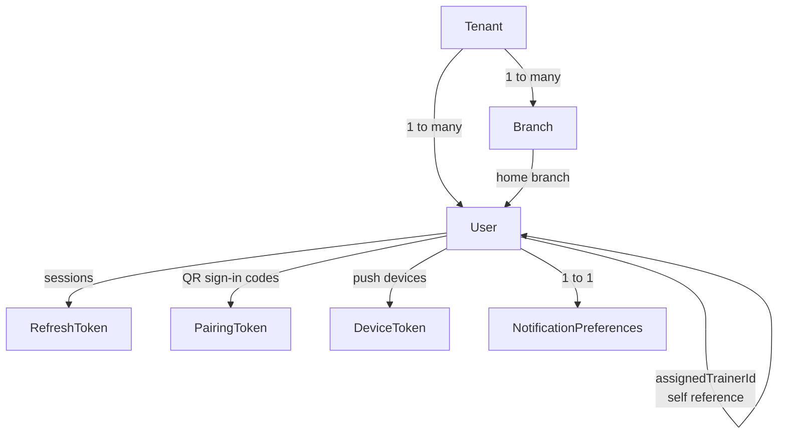
```mermaid
graph TD
    T["Tenant"]
    B["Branch"]
    U["User"]
    RT["RefreshToken"]
    PT["PairingToken"]
    DT["DeviceToken"]
    NP["NotificationPreferences"]

    T -->|"1 to many"| B
    T -->|"1 to many"| U
    B -->|"home branch"| U
    U -->|"assignedTrainerId<br/>self reference"| U
    U -->|"sessions"| RT
    U -->|"QR sign-in codes"| PT
    U -->|"push devices"| DT
    U -->|"1 to 1"| NP
```

### Billing and payments

<!-- diagram:erd-billing -->
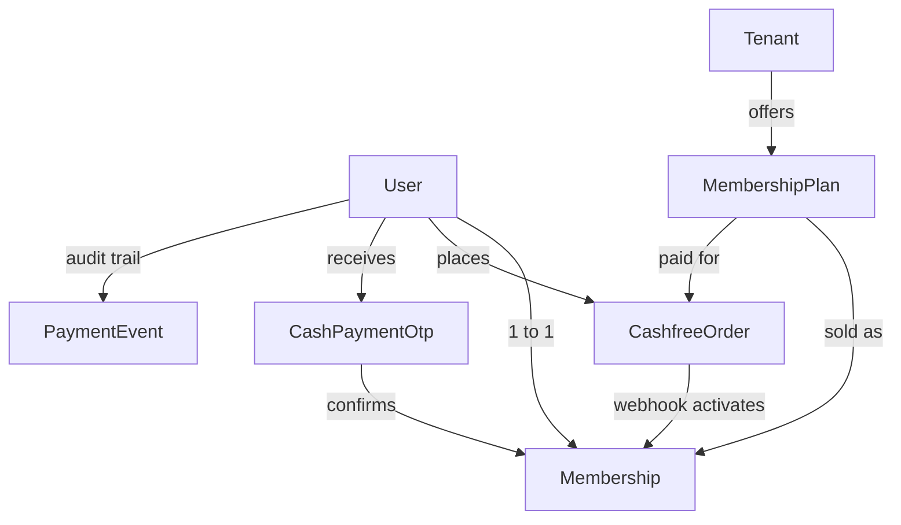
```mermaid
graph TD
    T["Tenant"]
    U["User"]
    MP["MembershipPlan"]
    MS["Membership"]
    CO["CashfreeOrder"]
    OT["CashPaymentOtp"]
    PE["PaymentEvent"]

    T -->|"offers"| MP
    MP -->|"sold as"| MS
    U -->|"1 to 1"| MS
    U -->|"places"| CO
    MP -->|"paid for"| CO
    CO -->|"webhook activates"| MS
    U -->|"receives"| OT
    OT -->|"confirms"| MS
    U -->|"audit trail"| PE
```

### Training and activity

<!-- diagram:erd-training -->
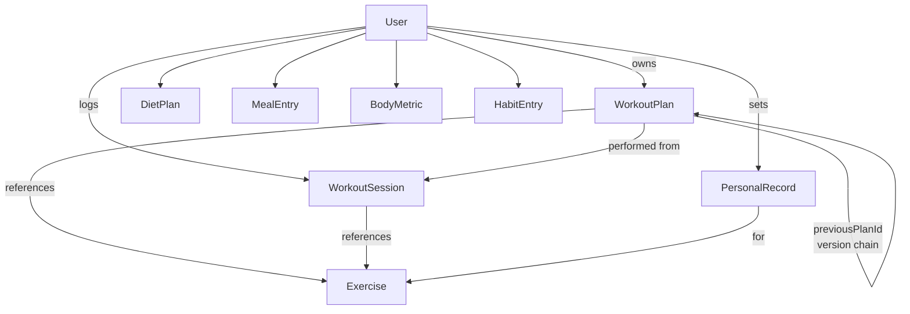
```mermaid
graph TD
    U["User"]
    EX["Exercise"]
    WP["WorkoutPlan"]
    WS["WorkoutSession"]
    PR["PersonalRecord"]
    DP["DietPlan"]
    ME["MealEntry"]
    BM["BodyMetric"]
    HE["HabitEntry"]

    U -->|"owns"| WP
    U -->|"logs"| WS
    U -->|"sets"| PR
    WP -->|"performed from"| WS
    WP -->|"previousPlanId<br/>version chain"| WP
    WP -->|"references"| EX
    WS -->|"references"| EX
    PR -->|"for"| EX
    U --> DP
    U --> ME
    U --> BM
    U --> HE
```

### Gym floor and classes

<!-- diagram:erd-gym -->
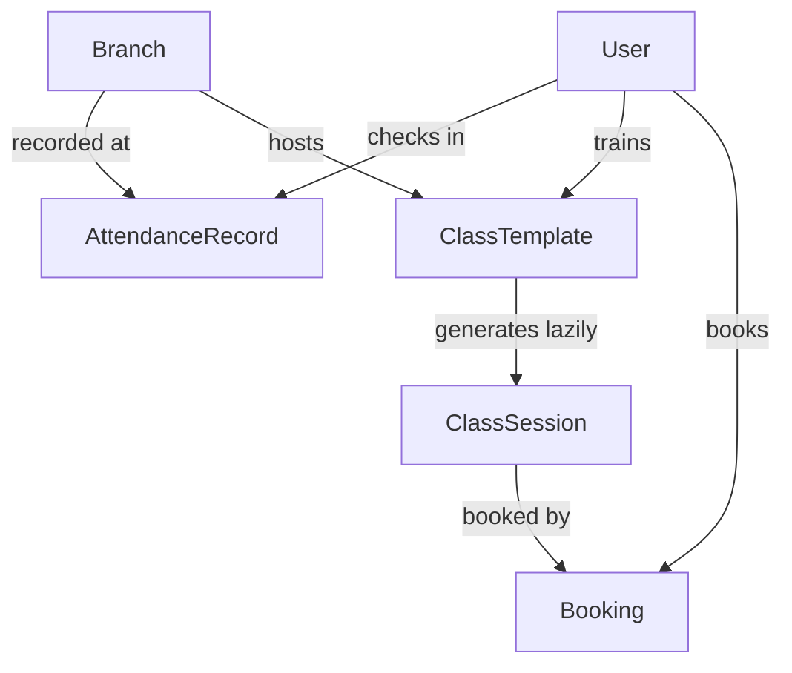
```mermaid
graph TD
    U["User"]
    BR["Branch"]
    AR["AttendanceRecord"]
    CT["ClassTemplate"]
    CS["ClassSession"]
    BK["Booking"]

    U -->|"checks in"| AR
    BR -->|"recorded at"| AR
    BR -->|"hosts"| CT
    U -->|"trains"| CT
    CT -->|"generates lazily"| CS
    CS -->|"booked by"| BK
    U -->|"books"| BK
```

### Model reference

| Model | Purpose | Key fields | Notable constraints |
|---|---|---|---|
| `Tenant` | One gym business | `name`, `planTier`, `themeConfig` | Root of the tenancy tree |
| `Branch` | One physical location | `qrCodeToken` unique, `checkInPin`, `capacity`, `checkInMethods`, `autoCheckoutAfterMins`, `gracePeriodDays`, `checkInIntervalDays` | QR token is the check-in credential |
| `User` | Every human, all four roles | `role`, `status`, `email` unique, `passwordHash` select false, `profile` subdocument, `assignedTrainerId`, `trainerPermissions`, `reportsToRole` | `passwordHash` is never selected by default |
| `Exercise` | Exercise catalog | `name`, `muscleGroups`, `equipment`, `instructions`, `mediaUrl`, `isCustom`, `tenantId` sparse | Null `tenantId` means a global catalog entry |
| `Meal` | Reusable meal library | `name`, `mealType`, macros, `isCustom`, `tenantId` sparse | Same global-vs-tenant split as Exercise |
| `WorkoutPlan` | A member's training plan | `days` with nested exercises, `goal`, `generatedBy`, `active`, `version`, `previousPlanId`, `changeSummary` | Versioned: edits supersede rather than mutate |
| `WorkoutSession` | One logged workout | `sets` subdocuments, `durationMins`, `perceivedEffort` | Drives streaks, volume, PRs |
| `DietPlan` | AI or trainer diet plan | daily calorie and macro targets, `meals` | Meals are inline copies, not refs |
| `MealEntry` | One logged meal | `loggedAt`, `mealType`, macros | The member's own food log |
| `BodyMetric` | One body measurement | `weightKg`, `bodyFatPct`, `measurements` | Powers the weight and body-fat charts |
| `PersonalRecord` | A best lift | `exerciseId`, `value`, `unit` | — |
| `HabitEntry` | One habit, one day | `habitId`, `date`, `completed` | Unique on user plus habit plus date |
| `AttendanceRecord` | One gym visit | `checkedInAt`, `checkOutAt`, `method` | An open record means still inside |
| `ClassTemplate` | A recurring class | `occurrences`, `trainerId`, `capacity` | Sessions are generated from this lazily |
| `ClassSession` | One dated instance | `date`, `startTime`, `bookedCount`, `waitlistCount`, `status` | Unique on template plus date |
| `Booking` | A member's seat | `status` booked, waitlisted or cancelled | Partial-unique so a cancelled booking can be rebooked |
| `MembershipPlan` | A purchasable plan | `priceCents`, `currency` default inr, `billingInterval` | Prices stored in the minor unit |
| `Membership` | One member's subscription | `status`, `paymentStatus`, `paymentMethod`, `gatewayOrderId`, `startDate`, `endDate`, `lastPaymentReminderAt` | Unique per user; extended atomically |
| `CashfreeOrder` | An online payment attempt | `cashfreeOrderId` unique, `paymentSessionId`, `amountCents`, `status` | Unique order id gives webhook idempotency |
| `CashPaymentOtp` | A front-desk cash OTP | `codeHash`, `amountCents`, `attempts`, `expiresAt`, `usedAt` | Hashed, single-use, 10-minute TTL, 5-attempt cap |
| `PaymentEvent` | Payment audit trail | `type`, `amountCents`, `planName`, `occurredAt` | Backs the payment-history view |
| `Message` | 1:1 message | `senderId`, `recipientId`, `text`, `read` | Trainer and member threads |
| `Sponsor` | Gym partner brand | `name`, `logoUrl`, `websiteUrl`, `active` | Member-facing sponsor list |
| `DeviceToken` | Expo push token | `expoPushToken` unique, `platform`, `lastSeenAt` | One row per device |
| `NotificationPreferences` | Per-user toggles | 9 boolean preferences plus reminder time | `_id` is the userId — a true 1:1 |
| `RefreshToken` | A session | `tokenHash` unique, `expiresAt` TTL, `revokedAt`, `replacedByTokenId` | Rotation chain; reuse revokes every session |
| `PairingToken` | A QR sign-in code | `tokenHash` unique, 10-minute TTL, `usedAt` | Single-use, redeemed atomically |
| `AIRecommendationAcceptance` | Accepted AI advice | `recommendationId`, `acceptedAt` | Unique per user and recommendation |

**Two data-model decisions worth calling out.**

`Membership.endDate` is never computed in application code. Extension runs as a MongoDB aggregation-pipeline update using `$$NOW`, `$dateAdd`, `$max` and `$ifNull`, so two simultaneous payments cannot read the same start date and both extend from it. The pipeline also handles the three real cases correctly in one expression: a fresh purchase starts now, a renewal on an active membership stacks onto the existing end date, and a renewal after expiry restarts from now rather than back-dating.

`WorkoutPlan` edits **supersede** rather than mutate. Editing a member's plan deactivates the old row and inserts a new one with `version + 1`, a `previousPlanId` pointer, and a `changeSummary`. A member can therefore see what changed and when, and a trainer's edit can never silently rewrite the history a member trained against.

---
## 8. API reference

**74 endpoints** across 20 route plugins. Only the auth module uses a route prefix; every other plugin registers absolute paths. The "Access" column is the role guard applied in `preHandler`; where a service applies further scoping, that is noted.

### 8.1 Public — no authentication

| Method | Path | Description |
|---|---|---|
| GET | `/health` | Liveness plus MongoDB connection state |
| GET | `/uploads/*` | Serves locally-stored uploads, with MIME sniffing, a path-traversal guard, and HTTP Range support |
| POST | `/webhooks/cashfree` | Cashfree payment webhook. Signature and timestamp verified against a raw body before anything is trusted |

### 8.2 Authentication

| Method | Path | Access | Description |
|---|---|---|---|
| POST | `/auth/register` | public | Self-registration. Always creates a `member` — staff can never be created this way |
| POST | `/auth/login` | public | Email and password sign-in |
| POST | `/auth/google` | public | Google ID-token sign-in, verified against `GOOGLE_CLIENT_ID` |
| POST | `/auth/pair` | public | Redeem a single-use QR pairing token for a session |
| POST | `/auth/refresh` | refresh token is the credential | Rotate the refresh token and issue a new access token |
| POST | `/auth/logout` | authenticated | Revoke the presented refresh token |
| POST | `/auth/forgot-password` | public | Emails a single-use reset link (Resend, see `lib/email.ts`). Always returns the same generic message, regardless of whether the account exists or the email actually sent - no user enumeration |
| POST | `/auth/reset-password` | public | Redeems the emailed token, sets the new password, and revokes every refresh token for the account |

### 8.3 Self-service account

| Method | Path | Access | Description |
|---|---|---|---|
| GET | `/me` | authenticated | Current user |
| PUT | `/me` | authenticated | Update own name and contact details |
| PUT | `/me/password` | authenticated | Change own password, current password required |
| PUT | `/me/profile` | authenticated | Update fitness profile: goals, body stats, diet preference, gym access |
| POST | `/me/injuries` | authenticated | Add an injury entry |
| DELETE | `/me/injuries/:id` | authenticated | Remove an injury entry |
| GET | `/me/notification-preferences` | authenticated | Read notification preferences |
| PUT | `/me/notification-preferences` | authenticated | Update notification preferences |
| POST | `/me/device-tokens` | authenticated | Register an Expo push token |
| DELETE | `/me/device-tokens/:token` | authenticated | Unregister a push token |

### 8.4 Training

| Method | Path | Access | Description |
|---|---|---|---|
| GET | `/workout-plans` | authenticated | List own plans |
| POST | `/workout-plans` | authenticated | Create a plan |
| GET | `/workout-plans/:id` | authenticated | One plan, ownership checked |
| GET | `/workout-sessions` | authenticated | List own logged sessions |
| POST | `/workout-sessions` | authenticated | Log a completed session |
| GET | `/exercises` | authenticated | Search the tenant plus global exercise catalog |
| POST | `/exercises` | trainer, admin, superadmin | Create a custom exercise |
| PATCH | `/exercises/:id` | trainer, admin, superadmin | Update a custom exercise |
| DELETE | `/exercises/:id` | trainer, admin, superadmin | Delete a custom exercise |
| POST | `/exercises/:id/video` | trainer, admin, superadmin | Upload a demo video, 100 MB cap |

Trainers are further gated by `trainerPermissions.canManageExerciseLibrary` inside the service.

### 8.5 Attendance and progress

| Method | Path | Access | Description |
|---|---|---|---|
| POST | `/attendance/check-in` | authenticated | Check in, or check out if a record is already open. Accepts QR, PIN, NFC or manual |
| GET | `/attendance/history` | authenticated | Own check-in history |
| GET | `/attendance/summary` | authenticated | Streak and frequency summary |
| GET | `/progress/metrics` | authenticated | Body-metric history |
| POST | `/progress/metrics` | authenticated | Log a body metric |
| GET | `/progress/prs` | authenticated | Personal records |
| GET | `/progress/check-in-status` | authenticated | Whether a periodic progress check-in is due, from the branch interval and grace period |

### 8.6 Nutrition and habits

| Method | Path | Access | Description |
|---|---|---|---|
| GET | `/nutrition/meals/today` | authenticated | Today's logged meals |
| POST | `/nutrition/meals` | authenticated | Log a meal |
| DELETE | `/nutrition/meals/:id` | authenticated | Delete own meal log |
| GET | `/nutrition/diet-plans` | authenticated | Own diet plans |
| GET | `/meals` | authenticated | Search the reusable meal library |
| POST | `/meals` | trainer, admin, superadmin | Create a library meal |
| PATCH | `/meals/:id` | trainer, admin, superadmin | Update a library meal |
| DELETE | `/meals/:id` | trainer, admin, superadmin | Delete a library meal |
| GET | `/habits/today` | authenticated | Today's habit entries |
| POST | `/habits/:habitId/toggle` | authenticated | Toggle one habit |

Trainers are further gated by `trainerPermissions.canManageMealLibrary`.

### 8.7 AI coach

All authenticated; all rate-limited per user rather than per IP, because the cost is per account.

| Method | Path | Description |
|---|---|---|
| GET | `/ai/recommendations` | Rule-engine recommendations, no LLM call |
| POST | `/ai/recommendations/:id/accept` | Record that the member accepted a recommendation |
| POST | `/ai/coach/complete` | Chat completion with the member's real training context attached |
| POST | `/ai/coach/generate-plan` | Generate a structured workout plan |
| POST | `/ai/coach/generate-diet-plan` | Generate a diet plan |
| POST | `/ai/coach/generate-full-plan` | Workout plus diet in one request, two LLM calls |
| POST | `/ai/coach/regenerate-plan` | Deterministic regeneration from recent session data, no LLM |

### 8.8 Trainer and member management

| Method | Path | Access | Description |
|---|---|---|---|
| GET | `/trainer/members` | trainer, admin, superadmin | Member roster, scoped to the caller's assignment |
| GET | `/trainer/stats` | trainer, admin, superadmin | Roster KPIs |
| POST | `/trainer/members/:memberId/assign-plan` | trainer, admin, superadmin | Assign a plan to a member |
| PUT | `/trainer/members/:memberId/plans/:planId` | trainer, admin, superadmin | Edit a member's plan — supersedes, does not mutate |
| GET | `/trainer/members/:memberId/injuries` | trainer, admin, superadmin | Read a member's injuries |
| GET | `/trainer/available-trainers` | admin, superadmin | Trainers available for assignment |
| PATCH | `/trainer/members/:memberId/assign-trainer` | admin, superadmin | Set a member's trainer |
| PATCH | `/trainer/members/:memberId/status` | admin | Suspend or reactivate a member |
| PATCH | `/trainer/members/:memberId/info` | admin | Edit a member's contact details |
| POST | `/trainer/members/:memberId/login-pairing` | admin | Generate a QR sign-in code for a member |
| POST | `/admin/trainers` | admin, superadmin | Create a trainer account, returns a pairing token |
| POST | `/admin/members` | admin, superadmin | Create a member account, returns a pairing token |
| POST | `/admin/trainers/:trainerId/login-pairing` | admin, superadmin | Generate a QR sign-in code for a trainer |
| PATCH | `/admin/trainers/:trainerId/permissions` | admin, superadmin | Toggle a trainer's library permissions |

For the two trainer-targeting endpoints, the service further restricts trainers whose `reportsToRole` is `superadmin` so a gym admin cannot edit them.

### 8.9 Gym owner dashboard

All admin and superadmin.

| Method | Path | Description |
|---|---|---|
| GET | `/admin/dashboard-stats` | Owner KPI tiles |
| GET | `/admin/analytics/attendance` | Tenant-wide attendance analytics |
| GET | `/admin/attendance/recent` | Recent check-in feed |
| GET | `/admin/branch` | Read branch settings |
| PUT | `/admin/branch` | Update branch settings |
| GET | `/admin/members/:memberId/progress` | One member's progress data |
| GET | `/admin/members/:memberId/attendance` | One member's attendance history |

### 8.10 Billing and payments

Admin surface — admin and superadmin:

| Method | Path | Description |
|---|---|---|
| GET | `/admin/membership-plans` | List plans |
| POST | `/admin/membership-plans` | Create a plan |
| PUT | `/admin/membership-plans/:planId` | Update a plan |
| GET | `/admin/payment-gateway-status` | Whether Cashfree credentials are configured |
| POST | `/admin/members/:memberId/membership/checkout-session` | Create a Cashfree checkout session on a member's behalf |
| POST | `/admin/members/:memberId/membership/mark-paid` | Manually mark a membership paid, including comp |
| PUT | `/admin/members/:memberId/membership/dates` | Edit membership dates |
| GET | `/admin/members/:memberId/payment-history` | Payment event history |
| POST | `/admin/members/:memberId/cash-payment/initiate` | Send the member a 6-digit cash-payment OTP by SMS |
| POST | `/admin/members/:memberId/cash-payment/confirm` | Verify the OTP and record the cash payment |
| POST | `/admin/members/:memberId/payment-reminder` | Push a payment-due reminder to the member |

Member surface — authenticated:

| Method | Path | Description |
|---|---|---|
| POST | `/me/membership/checkout-session` | Pay for own membership |
| GET | `/me/membership` | Own membership status |
| GET | `/me/membership-plans` | Plans available to buy |

### 8.11 Classes

| Method | Path | Access | Description |
|---|---|---|---|
| GET | `/classes/schedule` | authenticated | Schedule for a date range, with the caller's booking state. Generates sessions lazily from templates |
| POST | `/classes/sessions/:sessionId/book` | authenticated | Book, or join the waitlist if full |
| POST | `/classes/bookings/:bookingId/cancel` | authenticated | Cancel own booking |
| GET | `/classes/my-bookings` | authenticated | Own upcoming bookings |
| GET | `/admin/class-templates` | trainer, admin, superadmin | List recurring class templates |
| POST | `/admin/class-templates` | trainer, admin, superadmin | Create a template |
| PUT | `/admin/class-templates/:templateId` | trainer, admin, superadmin | Update a template |
| GET | `/admin/class-sessions/:sessionId/roster` | trainer, admin, superadmin | Booked and waitlisted roster |
| GET | `/admin/trainers` | trainer, admin, superadmin | Trainers selectable for a class |

### 8.12 Messaging, sponsors, superadmin

| Method | Path | Access | Description |
|---|---|---|---|
| GET | `/messages/:otherUserId` | authenticated | Fetch a 1:1 thread |
| POST | `/messages` | authenticated | Send a message |
| PUT | `/messages/:id/read` | authenticated | Mark a message read |
| GET | `/sponsors` | authenticated | Active sponsors, member-facing |
| GET | `/admin/sponsors` | admin, superadmin | All sponsors including inactive |
| POST | `/admin/sponsors` | admin, superadmin | Create a sponsor |
| PUT | `/admin/sponsors/:sponsorId` | admin, superadmin | Update a sponsor |
| GET | `/superadmin/tenants` | superadmin | Every tenant on the platform |
| PATCH | `/superadmin/trainers/:trainerId/reports-to` | superadmin | Set whether a trainer reports to admin or superadmin |

### 8.13 Rate limits

Rate limiting is registered with `global: false`, so only these routes are limited. The key is deliberately different per group.

| Route | Limit | Keyed by |
|---|---|---|
| `POST /auth/register` | 5 per hour | IP |
| `POST /auth/login` | 10 per 15 minutes | IP |
| `POST /auth/google` | 10 per 15 minutes | IP |
| `POST /auth/pair` | 20 per hour | IP |
| `POST /auth/forgot-password` | 3 per hour | IP |
| `POST /auth/reset-password` | 10 per hour | IP |
| `POST /ai/coach/complete` | 20 per hour | user |
| `POST /ai/coach/generate-plan` | 8 per hour | user |
| `POST /ai/coach/generate-diet-plan` | 8 per hour | user |
| `POST /ai/coach/generate-full-plan` | 5 per hour | user |
| `POST /ai/coach/regenerate-plan` | 8 per hour | user |
| `POST /admin/members/:memberId/cash-payment/initiate` | 3 per hour | **the member**, not the admin |
| `POST /admin/members/:memberId/cash-payment/confirm` | 10 per hour | the member |
| `POST /admin/members/:memberId/payment-reminder` | 1 per 6 hours | the member |

The last three are keyed by the member being acted on rather than the staff member acting. That is what bounds how many SMS messages or push notifications a single member can receive, no matter how many admins are clicking.

---
## 9. Server modules and functions

19 feature modules. The table lists every exported service function — these are the business-logic entry points, one layer below the HTTP routes.

| Module | Responsibility | Exported service functions |
|---|---|---|
| `admin` | Gym-owner dashboard: analytics, KPIs, branch settings, per-member drill-downs | `getAttendanceAnalytics`, `getBranch`, `updateBranch`, `getDashboardStats`, `getMemberProgress`, `getMemberAttendanceHistory`, `getRecentAttendance` |
| `ai-coach` | AI coaching: chat, structured plan generation, rule-based recommendations | `generateWorkoutPlan`, `generateDietPlan`, `generateFullPlan`, `regenerateWorkoutPlan`, `acceptRecommendation`, `completeChat` |
| `attendance` | Gym check-in and check-out, streaks, frequency | `computeSummary`, `computeSummariesForUsers`, `getHistory`, `getHistoryForMember`, `checkIn` |
| `auth` | Registration, password and Google sign-in, QR pairing, token rotation, password reset | `register`, `login`, `loginWithGoogle`, `pairDevice`, `refresh`, `logout`, `forgotPassword`, `resetPassword` |
| `billing` | Plans, online checkout, cash OTP, manual payment, reminders, webhook | `deriveSubscriptionStatus`, `isAccessBlocked`, `listPlans`, `listActivePlans`, `getMembershipSummary`, `getMembershipSummariesForUsers`, `getMembershipCounts`, `updateMembershipDates`, `createPlan`, `updatePlan`, `createCheckoutSessionForMember`, `markPaid`, `getPaymentGatewayStatus`, `getPaymentHistory`, `getMembershipForSelf`, `initiateCashPayment`, `confirmCashPayment`, `sendPaymentReminder`, `handleCashfreeWebhook` |
| `classes` | Recurring templates, lazy session generation, booking and waitlist | `listTemplates`, `createTemplate`, `updateTemplate`, `listTrainers`, `getSchedule`, `bookSession`, `cancelMyBooking`, `getMyBookings`, `getRoster` |
| `exercises` | Exercise catalog search and CRUD, demo-video upload | `searchExercises`, `getExercisesByIds`, `createExercise`, `updateExercise`, `uploadExerciseVideo`, `deleteExercise` |
| `habits` | Daily habit tracking | `listToday`, `toggleHabit` |
| `meals` | Trainer-curated reusable meal library | `searchMeals`, `createMeal`, `updateMeal`, `deleteMeal` |
| `messaging` | 1:1 member and trainer threads with read receipts | `getThread`, `sendMessage`, `markMessageRead` |
| `notifications` | Expo push device-token lifecycle | `registerDeviceToken`, `unregisterDeviceToken` |
| `nutrition` | A member's own food log and diet plans | `listToday`, `logMeal`, `deleteMeal`, `listDietPlans` |
| `progress` | Body metrics, personal records, periodic check-in status | `listMetrics`, `logMetric`, `computeCheckInStatus`, `getCheckInStatus`, `listPRs`, `recordIfPR` |
| `sponsors` | Gym partner listings, member-facing read plus admin CRUD | `listActiveSponsors`, `listAllSponsors`, `createSponsor`, `updateSponsor` |
| `superadmin` | Platform-level capabilities | `listTenants`, `setTrainerReportsTo` |
| `trainer` | Trainer and member relationship management, staff account creation | `listMembers`, `getStats`, `updateMemberStatus`, `updateMemberInfo`, `generateLoginPairingToken`, `assignPlan`, `updateMemberPlan`, `getMemberInjuries`, `setTrainerPermissions`, `generateTrainerLoginPairingToken`, `listAvailableTrainers`, `createTrainer`, `createMember`, `assignTrainer` |
| `uploads` | Static file serving for the local storage backend, with Range support | routes only |
| `users` | Self-service account and preferences | `getMe`, `updateMyProfile`, `addMyInjury`, `removeMyInjury`, `updateMyInfo`, `changeMyPassword`, `getNotificationPreferences`, `updateNotificationPreferences` |
| `workouts` | Workout plan CRUD and session logging | `listPlans`, `getPlan`, `createPlan`, `listSessions`, `findRecentSessions`, `logSession` |

### 9.1 Cross-cutting libraries

| Library | Exported functions | Purpose |
|---|---|---|
| `cashfree.ts` | `isConfigured`, `createOrder`, `getOrderStatus`, `verifyWebhookSignature` | Cashfree client. Converts the stored minor-unit amount to decimal rupees at the API boundary only. Webhook verification adds a 300-second timestamp-freshness check the SDK does not do, closing a replay window |
| `cashPaymentOtp.ts` | `issueCashPaymentOtp`, `verifyCashPaymentOtp` | SHA-256-hashed 6-digit OTP, bound to member and amount, 10-minute TTL, single-use, voided after 5 failed attempts |
| `sms.ts` | `isConfigured`, `sendSms` | Twilio behind a provider seam. Unlike push, it **throws** on failure, because a cash-payment OTP that silently vanishes is worse than a visible error |
| `push.ts` | `registerDeviceToken`, `unregisterDeviceToken`, `sendPushToUser` | Expo push, best-effort — swallows errors so a failed notification never fails the request that triggered it |
| `refreshToken.ts` | `issueRefreshToken`, `rotateRefreshToken`, `revokeRefreshToken`, `revokeAllRefreshTokens` | Rotation with reuse detection. A replayed token revokes every session for that user |
| `pairingToken.ts` | `issuePairingToken`, `redeemPairingToken` | 24 random bytes, hashed, 10-minute TTL, redeemed atomically so a QR code cannot be used twice |
| `password.ts` | `hashPassword`, `verifyPassword` | bcrypt at 12 rounds |
| `googleAuth.ts` | `verifyGoogleIdToken` | Verifies a Google Identity Services ID token server-side |
| `phone.ts` | `toE164` | Phone normalization, defaulting to India, applied at the point of use |
| `storage.ts` | `UPLOADS_DIR`, `isBase64ImageDataUri`, `putBase64Image`, `isSupportedVideoMimeType`, `putVideoStream` | Object storage with a local and a GCS backend behind one interface |
| `trainerPermissions.ts` | `assertTrainerCanManage` | Gates library writes on a trainer's permission flags; admin and superadmin always pass |
| `mappers.ts` | `toDomainUser` | Explicit field-by-field User mapping. **It deliberately does not spread the Mongoose profile subdocument** — that spread was the cause of the `passwordHash` leak fixed in `cb2d068` |
| `mappers-base.ts` | `idStr`, `isoStr` | Shared primitives used by every module's mapper |
| `errors.ts` | `AppError` and subclasses | `ValidationError` 400, `UnauthorizedError` 401, `ForbiddenError` 403, `NotFoundError` 404, `ConflictError` 409, `BadGatewayError` |
| `objectId.ts` | `isValidObjectId` | Rejects malformed ids before they reach Mongoose |
| `sentry.ts` | `initSentry` | No-ops when `SENTRY_DSN` is unset |

### 9.2 Plugins

| Plugin | What it does |
|---|---|
| `config.ts` | Parses and validates every environment variable once, decorates `fastify.config`. Registered first, so a misconfigured deployment fails at boot rather than at first request |
| `database.ts` | Connects Mongoose, logs connection errors, disconnects on close |
| `auth.ts` | Registers JWT, decorates `fastify.authenticate` and `fastify.requireRole(...roles)` |
| `error-handler.ts` | `AppError` keeps its own status and message; Zod and Fastify validation errors become 400; JWT errors become 401; anything else is captured to Sentry and returned as a generic 500 |

### 9.3 AI coach internals

The AI coach is the one module with real internal structure beyond the standard four files.

<!-- diagram:ai-plan -->
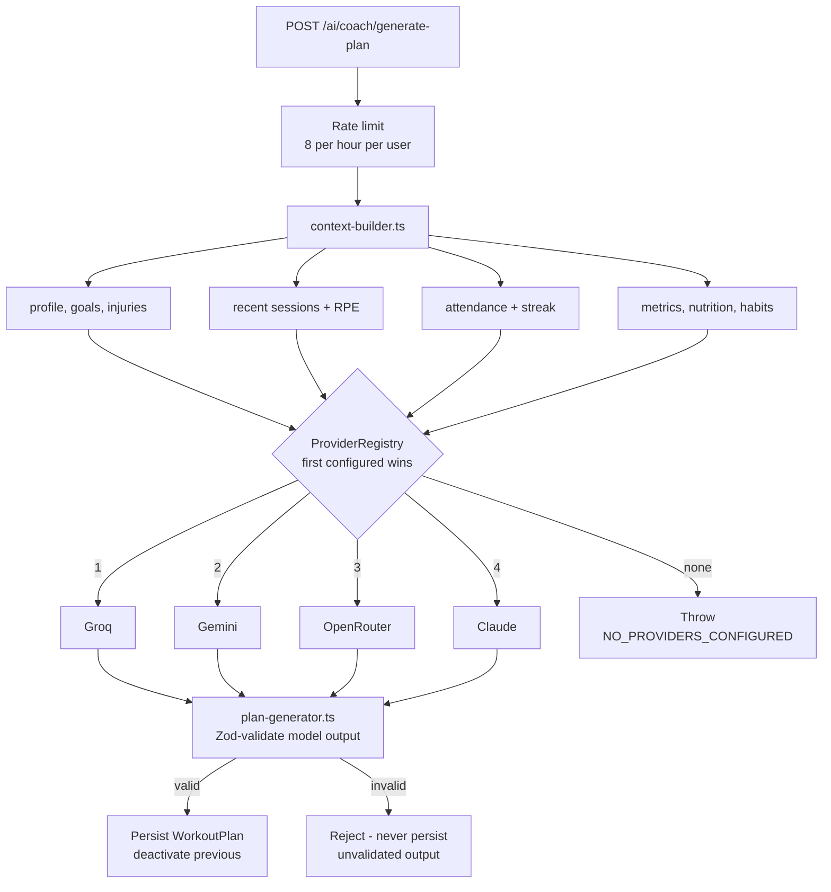
```mermaid
graph TD
    A["POST /ai/coach/generate-plan"] --> B["Rate limit<br/>8 per hour per user"]
    B --> C["context-builder.ts"]
    C --> C1["profile, goals, injuries"]
    C --> C2["recent sessions + RPE"]
    C --> C3["attendance + streak"]
    C --> C4["metrics, nutrition, habits"]
    C1 --> D{"ProviderRegistry<br/>first configured wins"}
    C2 --> D
    C3 --> D
    C4 --> D
    D -->|1| F["Groq"]
    D -->|2| H["Gemini"]
    D -->|3| J["OpenRouter"]
    D -->|4| L["Claude"]
    D -->|none| M["Throw<br/>NO_PROVIDERS_CONFIGURED"]
    F --> N
    H --> N
    J --> N
    L --> N["plan-generator.ts<br/>Zod-validate model output"]
    N -->|valid| O["Persist WorkoutPlan<br/>deactivate previous"]
    N -->|invalid| P["Reject - never persist<br/>unvalidated output"]
```

| File | Role |
|---|---|
| `context-builder.ts` | Assembles the member's real training context from users, workouts, progress, nutrition, habits and attendance, so the model answers from logged numbers rather than generalities |
| `plan-generator.ts` | Structured generation plus **Zod validation of the model's output** before anything is written to the database |
| `recommendations.ts` | A non-LLM rule engine — RPE averaging, frequency and streak checks. Costs nothing and always works |
| `providers/` | `GroqProvider`, `GeminiProvider`, `OpenRouterProvider`, `ClaudeProvider`, all behind `BaseProvider`, selected in that order by `ProviderRegistry` |

---

## 10. Key flows

### 10.1 Authentication and token rotation

<!-- diagram:auth-flow -->
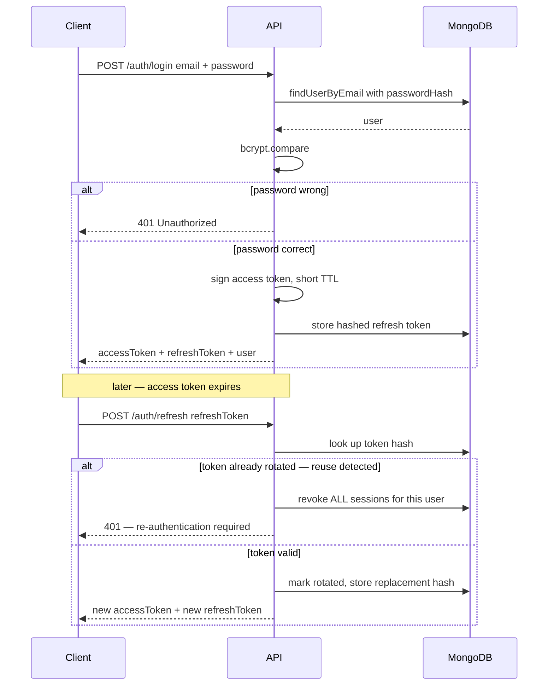
```mermaid
sequenceDiagram
    participant C as Client
    participant A as API
    participant DB as MongoDB

    C->>A: POST /auth/login email + password
    A->>DB: findUserByEmail with passwordHash
    DB-->>A: user
    A->>A: bcrypt.compare
    alt password wrong
        A-->>C: 401 Unauthorized
    else password correct
        A->>A: sign access token, short TTL
        A->>DB: store hashed refresh token
        A-->>C: accessToken + refreshToken + user
    end

    Note over C,A: later — access token expires

    C->>A: POST /auth/refresh refreshToken
    A->>DB: look up token hash
    alt token already rotated — reuse detected
        A->>DB: revoke ALL sessions for this user
        A-->>C: 401 — re-authentication required
    else token valid
        A->>DB: mark rotated, store replacement hash
        A-->>C: new accessToken + new refreshToken
    end
```

Reuse detection is the part worth noting: presenting an already-rotated refresh token is treated as a stolen-token signal, and every session for that user is revoked rather than just the one.

### 10.2 QR device pairing — how staff and members sign in without a password

Accounts created by an admin never get a password. They sign in by scanning a QR code shown on the dashboard.

<!-- diagram:pairing-flow -->
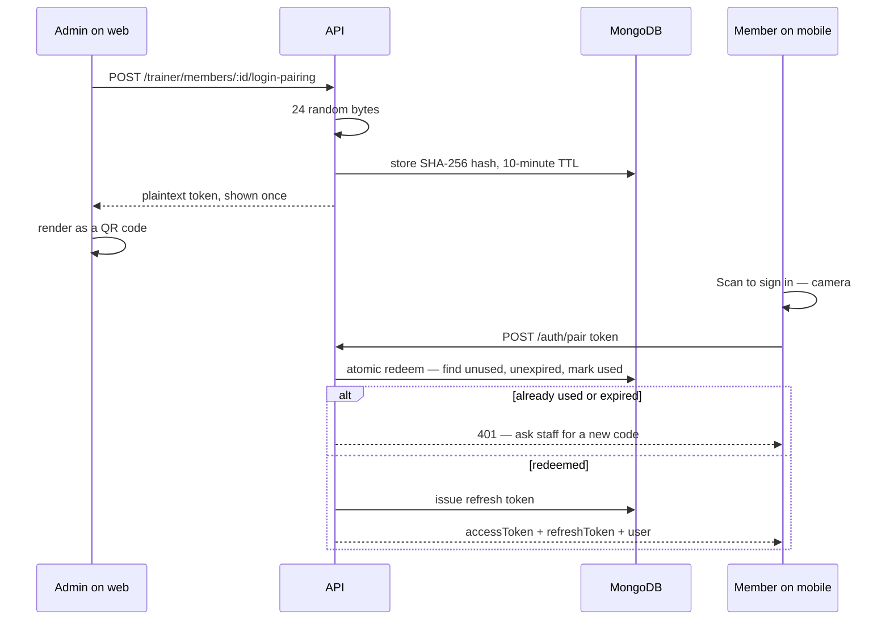
```mermaid
sequenceDiagram
    participant AD as Admin on web
    participant A as API
    participant DB as MongoDB
    participant M as Member on mobile

    AD->>A: POST /trainer/members/:id/login-pairing
    A->>A: 24 random bytes
    A->>DB: store SHA-256 hash, 10-minute TTL
    A-->>AD: plaintext token, shown once
    AD->>AD: render as a QR code
    M->>M: Scan to sign in — camera
    M->>A: POST /auth/pair token
    A->>DB: atomic redeem — find unused, unexpired, mark used
    alt already used or expired
        A-->>M: 401 — ask staff for a new code
    else redeemed
        A->>DB: issue refresh token
        A-->>M: accessToken + refreshToken + user
    end
```

### 10.3 Gym check-in and check-out

One endpoint handles both directions, so the member taps the same button either way.

<!-- diagram:checkin-flow -->
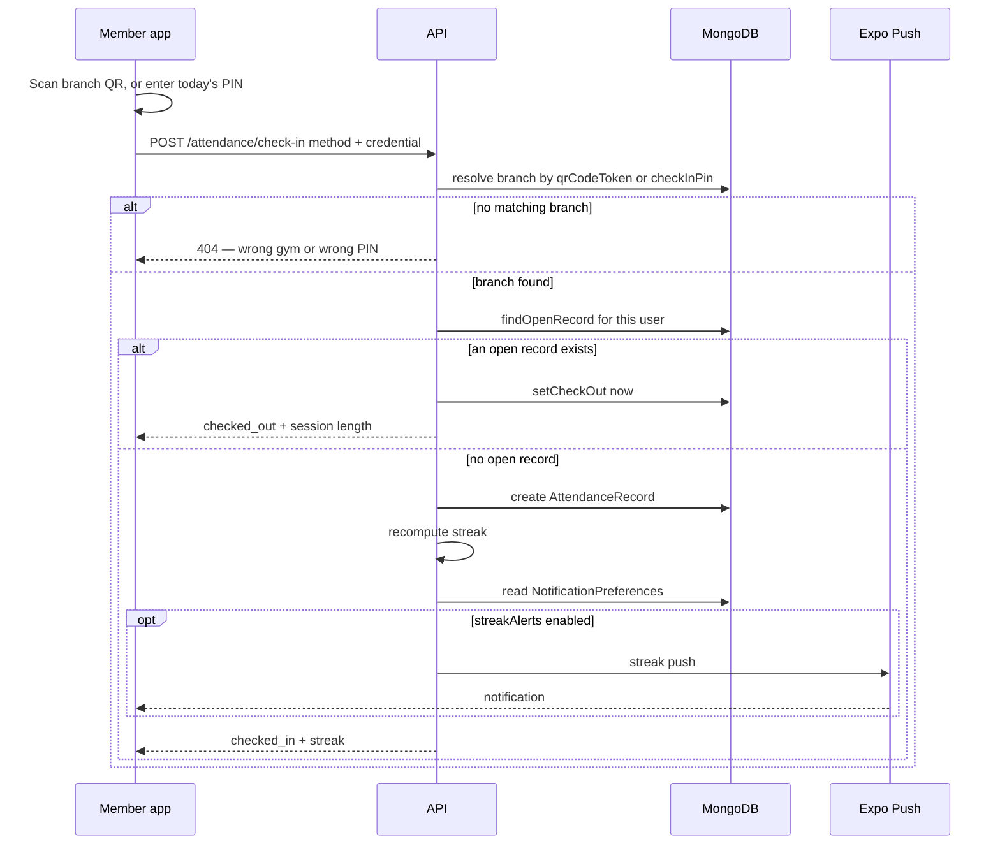
```mermaid
sequenceDiagram
    participant M as Member app
    participant A as API
    participant DB as MongoDB
    participant P as Expo Push

    M->>M: Scan branch QR, or enter today's PIN
    M->>A: POST /attendance/check-in method + credential
    A->>DB: resolve branch by qrCodeToken or checkInPin
    alt no matching branch
        A-->>M: 404 — wrong gym or wrong PIN
    else branch found
        A->>DB: findOpenRecord for this user
        alt an open record exists
            A->>DB: setCheckOut now
            A-->>M: checked_out + session length
        else no open record
            A->>DB: create AttendanceRecord
            A->>A: recompute streak
            A->>DB: read NotificationPreferences
            opt streakAlerts enabled
                A->>P: streak push
                P-->>M: notification
            end
            A-->>M: checked_in + streak
        end
    end
```

### 10.4 Online membership payment — Cashfree

The important architectural fact: **Cashfree's hosted checkout has no plain-URL redirect.** It requires loading their client-side JavaScript SDK from a real web page. That is why the server hands back a URL pointing at the app's own `/billing/checkout` page rather than at Cashfree directly, and why both the web dashboard and the mobile app open that same page.

<!-- diagram:online-payment -->
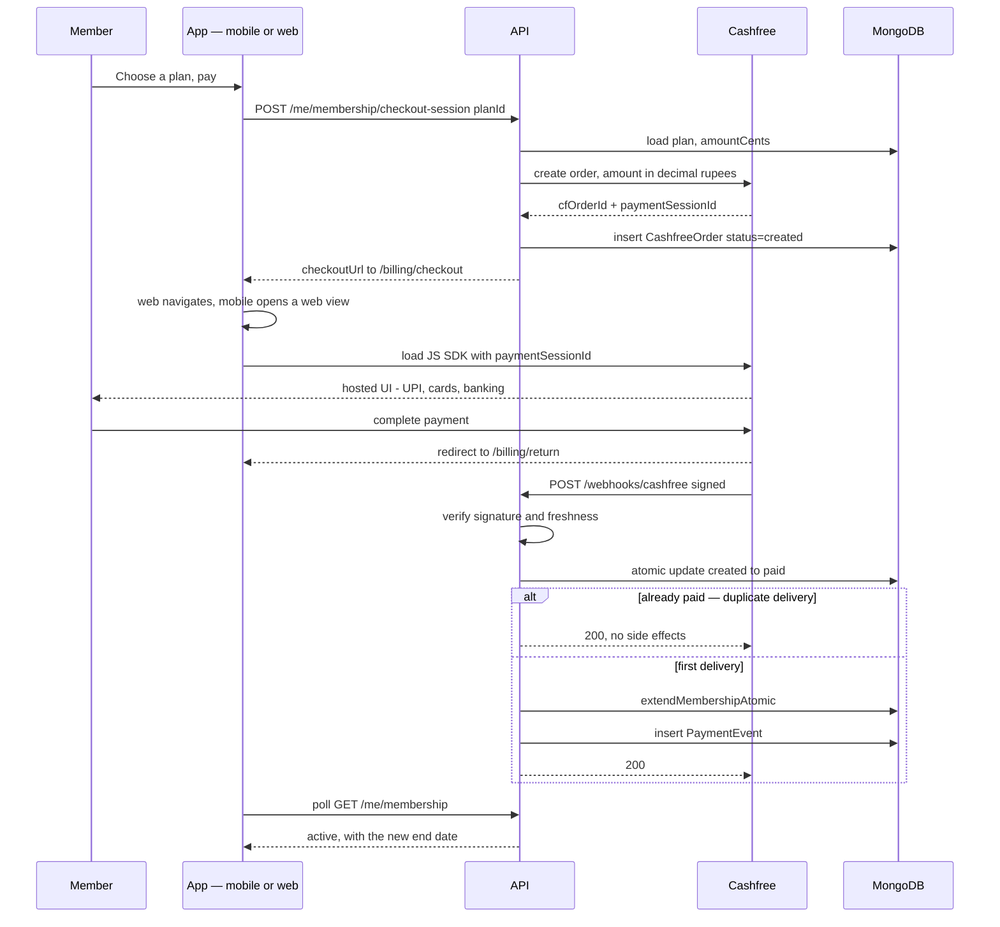
```mermaid
sequenceDiagram
    participant U as Member
    participant CL as App — mobile or web
    participant A as API
    participant CF as Cashfree
    participant DB as MongoDB

    U->>CL: Choose a plan, pay
    CL->>A: POST /me/membership/checkout-session planId
    A->>DB: load plan, amountCents
    A->>CF: create order, amount in decimal rupees
    CF-->>A: cfOrderId + paymentSessionId
    A->>DB: insert CashfreeOrder status=created
    A-->>CL: checkoutUrl to /billing/checkout
    CL->>CL: web navigates, mobile opens a web view
    CL->>CF: load JS SDK with paymentSessionId
    CF-->>U: hosted UI - UPI, cards, banking
    U->>CF: complete payment
    CF-->>CL: redirect to /billing/return
    CF->>A: POST /webhooks/cashfree signed
    A->>A: verify signature and freshness
    A->>DB: atomic update created to paid
    alt already paid — duplicate delivery
        A-->>CF: 200, no side effects
    else first delivery
        A->>DB: extendMembershipAtomic
        A->>DB: insert PaymentEvent
        A-->>CF: 200
    end
    CL->>A: poll GET /me/membership
    A-->>CL: active, with the new end date
```

Three deliberate choices in that flow:

- **The webhook is the source of truth, not the redirect.** The return page says thank you; it does not grant access. A member who closes the browser mid-redirect still gets their membership.
- **Idempotency is a database constraint, not a code check.** The `created → paid` transition is a single atomic `findOneAndUpdate`; a duplicate webhook delivery matches nothing and returns null, so extension can never run twice.
- **The client polls.** Mobile refetches membership status after the browser closes rather than trusting what the redirect said.

### 10.5 Cash payment with OTP confirmation

The requirement was that a member paying cash at the front desk confirms it themselves, so a payment cannot be recorded purely on staff assertion.

<!-- diagram:cash-otp -->
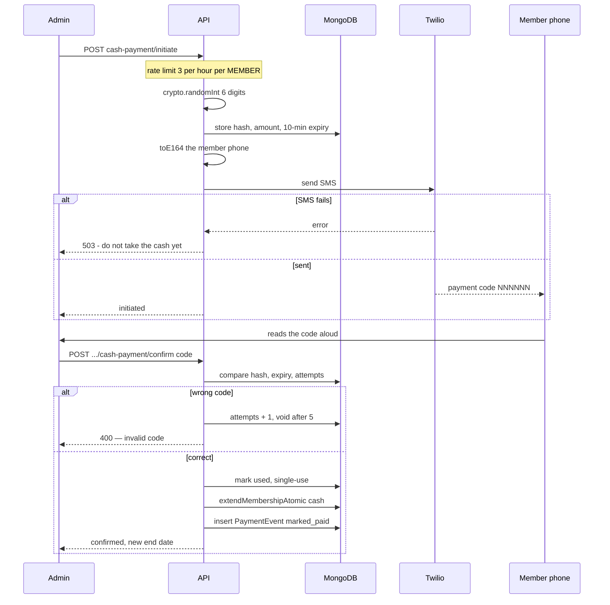
```mermaid
sequenceDiagram
    participant AD as Admin
    participant A as API
    participant DB as MongoDB
    participant TW as Twilio
    participant M as Member phone

    AD->>A: POST cash-payment/initiate
    Note over A: rate limit 3 per hour per MEMBER
    A->>A: crypto.randomInt 6 digits
    A->>DB: store hash, amount, 10-min expiry
    A->>A: toE164 the member phone
    A->>TW: send SMS
    alt SMS fails
        TW-->>A: error
        A-->>AD: 503 - do not take the cash yet
    else sent
        TW-->>M: payment code NNNNNN
        A-->>AD: initiated
    end
    M->>AD: reads the code aloud
    AD->>A: POST .../cash-payment/confirm code
    A->>DB: compare hash, expiry, attempts
    alt wrong code
        A->>DB: attempts + 1, void after 5
        A-->>AD: 400 — invalid code
    else correct
        A->>DB: mark used, single-use
        A->>DB: extendMembershipAtomic cash
        A->>DB: insert PaymentEvent marked_paid
        A-->>AD: confirmed, new end date
    end
```

The OTP is bound to the **amount** as well as the member, so a code issued for one price cannot be replayed to confirm a different one.

### 10.6 Workout plan versioning

<!-- diagram:plan-versioning -->
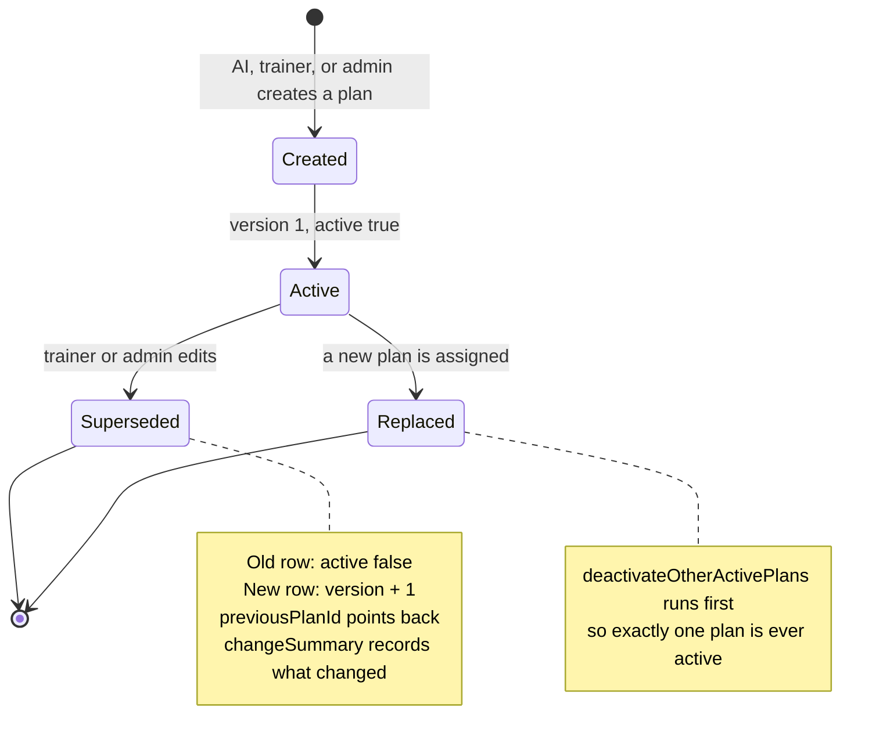
```mermaid
stateDiagram-v2
    [*] --> Created: AI, trainer, or admin creates a plan
    Created --> Active: version 1, active true
    Active --> Superseded: trainer or admin edits
    Superseded --> [*]
    Active --> Replaced: a new plan is assigned
    Replaced --> [*]

    note right of Superseded
        Old row: active false
        New row: version + 1
        previousPlanId points back
        changeSummary records what changed
    end note

    note right of Replaced
        deactivateOtherActivePlans runs first
        so exactly one plan is ever active
    end note
```

`deactivateOtherActivePlans` exists because of a real bug: assigning a second plan used to leave both marked active, and the member's app would show whichever came back first. The fix is now covered by a regression test.

---
## 11. Web dashboard

React 19 on Vite, `createBrowserRouter`, every page lazy-loaded except the login screen. Session state is a single MobX store; server state is TanStack Query.

<!-- diagram:web-routes -->
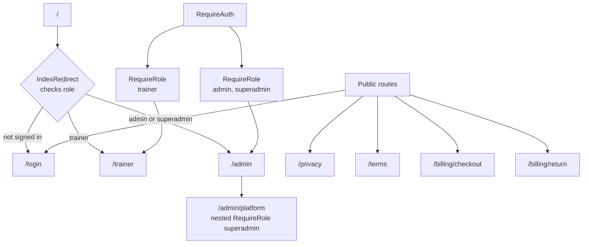
```mermaid
graph TD
    R["/"] --> IR{"IndexRedirect<br/>checks role"}
    IR -->|not signed in| L["/login"]
    IR -->|trainer| T["/trainer"]
    IR -->|admin or superadmin| AD["/admin"]

    P["Public routes"] --> L
    P --> PR["/privacy"]
    P --> TE["/terms"]
    P --> BC["/billing/checkout"]
    P --> BR["/billing/return"]

    RA["RequireAuth"] --> RR1["RequireRole<br/>admin, superadmin"]
    RA --> RR2["RequireRole<br/>trainer"]
    RR1 --> AD
    RR2 --> T
    AD --> SP["/admin/platform<br/>nested RequireRole superadmin"]
```

`RequireRole` redirects a wrong-role user to **their own** home rather than to a dead end, so a trainer who follows an admin link lands somewhere useful. `/admin/platform` carries a second nested guard, so an admin who types the URL is bounced even though they already passed the outer admin check.

### 11.1 Admin pages

| Route | Page | What it does |
|---|---|---|
| `/admin` | `AdminHomePage` | Owner dashboard: 8 KPI tiles — total clients, sessions today, attendance rate, 30-day check-ins, new enrollments, pending payments, expired subscriptions, online versus cash — plus a recent-activity feed |
| `/admin/members` | `MembersPage` | Full roster with search, status filter and sort. Actions: new member, edit details, edit membership dates, assign trainer, collect cash payment, send checkout link, QR pairing |
| `/admin/members/:memberId` | `MemberDetailPage` | One member in full: streak, sessions, weight, workout plans with superseded markers, recent sessions, check-in history, payment history, personal records, weight chart, injuries |
| `/admin/trainers` | `TrainersPage` | Trainer roster and creation. The reporting-line control is superadmin-only |
| `/admin/workout-plans/new` | `CreateWorkoutPlanPage` | Build a plan template |
| `/admin/members/:memberId/assign-plan` | `AssignPlanPage` | Assign a template to a member |
| `/admin/members/:memberId/plans/:planId/edit` | `EditMemberPlanPage` | Edit an assigned plan, with a required change note |
| `/admin/analytics` | `AnalyticsPage` | 30-day check-in volume, chart or table view |
| `/admin/attendance` | `AttendanceFeedPage` | The 50 most recent check-ins, tagged by method |
| `/admin/plans` | `MembershipPlansPage` | Membership plan and pricing CRUD |
| `/admin/sponsors` | `SponsorsPage` | Sponsor and brand-deal CRUD |
| `/admin/classes` | `ClassesPage` | Recurring class definitions |
| `/admin/classes/roster` | `ClassRosterPage` | Next 14 days of sessions, with per-session booking rosters |
| `/admin/branch` | `BranchSettingsPage` | Branch info and membership enforcement rules |
| `/admin/settings` | `SettingsPage` | Profile, security, payment gateway, notifications |
| `/admin/platform` | `PlatformOverviewPage` | **superadmin only** — cross-tenant gym list and platform totals |

### 11.2 Trainer pages

| Route | Page | What it does |
|---|---|---|
| `/trainer` | `TrainerHomePage` | Roster at a glance: active members, sessions today, attendance rate, recent joiners |
| `/trainer/members` | `MembersPage` | Assigned-member roster with search |
| `/trainer/members/:memberId` | `MemberDetailPage` | Membership status, profile and injuries |
| `/trainer/members/:memberId/assign-plan` | `AssignPlanPage` | Assign a plan template |
| `/trainer/plans/new` | `CreatePlanPage` | Build a new plan |
| `/trainer/exercises` | `ExerciseLibraryPage` | Exercise and meal library browser and editor |
| `/trainer/classes/roster` | `ClassRosterPage` | Shared with admin |
| `/trainer/messages/:otherUserId?` | `MessagesPage` | Two-pane member messaging |

### 11.3 Public pages

| Route | Page | Why it exists |
|---|---|---|
| `/login` | `LoginPage` | Email and password plus Google sign-in |
| `/privacy` | `PrivacyPolicyPage` | Required for app-store submission and for handling health data. **Still contains placeholders** |
| `/terms` | `TermsOfServicePage` | Same. **Still contains placeholders** |
| `/billing/checkout` | `CheckoutRedirectPage` | Loads the Cashfree JS SDK and starts checkout. Used by both web and mobile, because Cashfree has no plain-URL redirect |
| `/billing/return` | `BillingReturnPage` | Post-checkout confirmation. Explicitly not the source of truth — the webhook is |

### 11.4 Shared web components

| Component | Purpose |
|---|---|
| `DataTable` | Generic table over the shadcn primitives; the caller owns filtering and sorting |
| `StatCard` | KPI tile used across both dashboards |
| `WorkoutPlanEditor` | The day-and-exercise plan builder, shared by admin create, admin edit and trainer create |
| `LoginPairingDialog` | The QR sign-in flow, shared by the member and trainer rosters |
| `QRCodeImage` | Client-side QR rendering — no external QR service, so no member id leaves the browser |
| `InjuriesCard` | Read-only member injuries, shared by the admin and trainer detail pages. Staff can view, never edit |
| `BrandMark`, `EmptyState`, `ErrorState` | Shell and state components |
| `statusBadges` | `UserStatusBadge`, `PaymentStatusBadge`, `MembershipStatusBadge`, `SubscriptionStatusBadge` |

---

## 12. Mobile app

Expo SDK 54, React Native 0.81, React 19. The role decides which navigator mounts at the root — there is no shared shell to escape from, so a member build and an admin build are structurally different apps at runtime.

<!-- diagram:mobile-nav -->
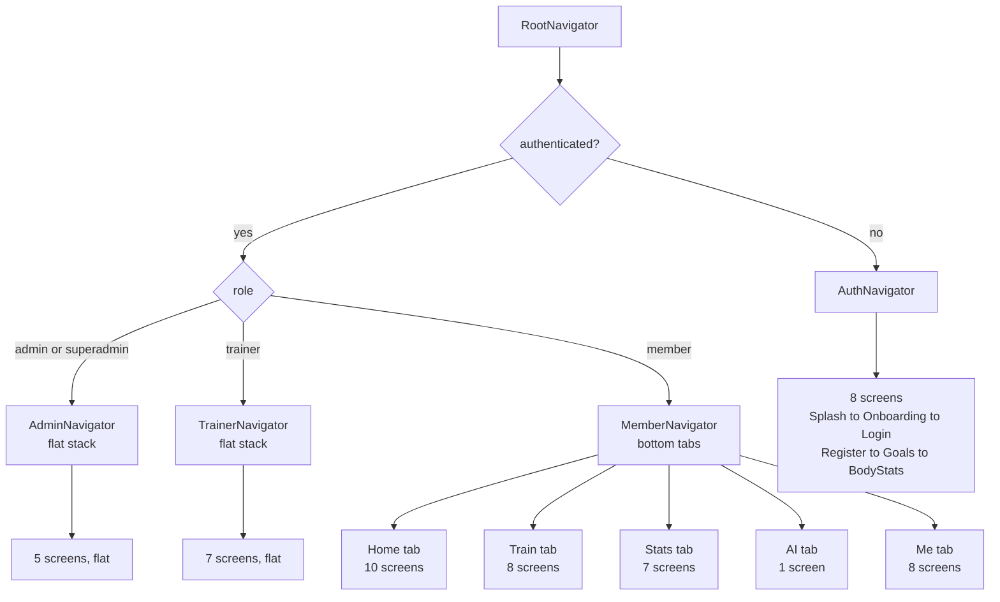
```mermaid
graph TD
    RN["RootNavigator"] --> AUTH{"authenticated?"}
    AUTH -->|no| AN["AuthNavigator"]
    AUTH -->|yes| ROLE{"role"}
    ROLE -->|admin or superadmin| ADN["AdminNavigator<br/>flat stack"]
    ROLE -->|trainer| TN["TrainerNavigator<br/>flat stack"]
    ROLE -->|member| MN["MemberNavigator<br/>bottom tabs"]

    AN --> A1["8 screens<br/>Splash to Onboarding to Login<br/>Register to Goals to BodyStats"]
    TN --> TR1["7 screens, flat"]
    ADN --> AD1["5 screens, flat"]

    MN --> T1["Home tab<br/>10 screens"]
    MN --> T2["Train tab<br/>8 screens"]
    MN --> T3["Stats tab<br/>7 screens"]
    MN --> T4["AI tab<br/>1 screen"]
    MN --> T5["Me tab<br/>8 screens"]
```

An onboarding subtlety worth recording, because it is not obvious from the code: `beginRegistration()` activates real tokens **without** flipping `isAuthenticated`. If it flipped the flag, `RootNavigator` would immediately swap to the member app and skip goal selection and body stats. `completeOnboarding()` flips it at the true end.

### 12.1 Auth screens

| Screen | Purpose |
|---|---|
| `SplashScreen` | Branded launch, auto-advances |
| `OnboardingScreen` | Swipeable intro with a log-in escape hatch |
| `LoginScreen` | Email and password plus Google, links to sign-up and scan-to-sign-in |
| `RegisterScreen` | Create account, with working links to the hosted Terms and Privacy pages |
| `GoalSelectionScreen` | Multi-select fitness goals, skippable |
| `BodyStatsScreen` | Starting measurements and training experience |
| `ForgotPasswordScreen` | Reset request. **See section 16 — no email is sent** |
| `ScanToSignInScreen` | Camera QR scanner that redeems an admin-issued pairing token |

### 12.2 Member screens — 33 total

| Area | Screens |
|---|---|
| Home and classes | `HomeScreen`, `ClassesHomeScreen`, `ClassDetailScreen`, `MyBookingsScreen` |
| AI plan wizard | `AIWizardBasicsScreen`, `AIWizardGoalScreen`, `AIWizardDietScreen`, `AIWizardGymAccessScreen`, `AIWizardInjuriesScreen`, `AIWizardReviewScreen` |
| Training | `WorkoutHomeScreen`, `ActiveWorkoutScreen`, `WorkoutSummaryScreen`, `WorkoutHistoryScreen`, `WorkoutDetailScreen`, `ExerciseLibraryScreen`, `ExerciseDetailScreen`, `ExercisePickerScreen` |
| Progress | `ProgressHomeScreen`, `BodyMetricsScreen`, `PersonalRecordsScreen`, `OneRMCalculatorScreen` |
| Nutrition and habits | `NutritionScreen`, `DietPlanScreen`, `HabitTrackerScreen` |
| AI coach | `AICoachScreen` — server AI, with an on-device fallback that answers from the member's own logged numbers when the API is unavailable |
| Profile and membership | `ProfileHomeScreen`, `MembershipCardScreen`, `PaymentCheckoutScreen`, `QRCheckInScreen`, `EditProfileScreen`, `NotificationsScreen`, `SettingsScreen`, `SponsorshipScreen` |

### 12.3 Trainer and admin screens

| Role | Screens |
|---|---|
| Trainer | `TrainerHomeScreen`, `MemberListScreen`, `MemberDetailScreen`, `AssignPlanScreen`, `MessageMemberScreen`, `ClassRosterListScreen`, `ClassRosterDetailScreen` |
| Admin | `AdminHomeScreen`, `AttendanceFeedScreen` — live, refreshes every 15 seconds, `AnalyticsScreen`, `MemberManagementScreen`, `BranchSettingsScreen` |

### 12.4 Mobile hooks

| Hook | Purpose |
|---|---|
| `useActiveWorkout` | The entire live-workout state machine — sets, exercises, completion. Pure state, no UI, no API |
| `useRestTimer` | Rest countdown, deliberately split out from the workout state |
| `useStopwatch` | Elapsed session time |
| `useCheckIn` | Owns the check-in mutation lifecycle and invalidates attendance queries on success |
| `useProgressData` | Derives chart-ready series from raw API responses |
| `useAICoach` | Deterministic rule-based recommendations, structured so a model can replace the internals later |
| `useLocalCoach` | On-device coach fallback — answers always cite the member's own numbers |
| `useTrainerData` | The single source of trainer-dashboard data, so trainer screens make no direct query calls |
| `usePushRegistration` | Requests permission and registers the push token once per session; silently no-ops in Expo Go, which no longer supports remote push |

---

## 13. Shared package

`packages/shared` is the contract between the three apps. It is built once and imported by all of them, which is what prevents the classic drift where a mobile enum and a server enum disagree by one value.

| Export group | Count | Contents |
|---|---|---|
| Types | 71 | `User`, `UserRole`, `WorkoutPlan`, `WorkoutDay`, `FitnessGoal`, `ClassSession`, `MuscleGroup`, `InjuryCondition`, `InjurySeverity`, `DietPreference`, `GymAccess`, `CheckInMethod`, membership and payment status unions, and the rest of the domain |
| Zod schemas | 22 | Request and response schemas shared between server validation and client forms |
| Constants | 17 | Enum value lists and their display-label maps |

The constants file is the single place enum lists and label maps live. Copying a label map into a component is the mistake this package exists to prevent.

---

## 14. Testing status

**46 server tests, all passing.** Mocked at the repository and model boundary, so the tests exercise real business logic without a database.

| Suite | Tests | Covers |
|---|---|---|
| `test/billing/service.test.ts` | 16 | Payment-event branching for online versus cash, the full `deriveSubscriptionStatus` truth table, `isAccessBlocked` grace-period boundaries |
| `test/attendance/service.test.ts` | 7 | Streak computation, check-in and the check-out toggle |
| `test/lib/cashfree.test.ts` | 7 | The minor-unit to decimal-rupee conversion in both directions, and `isConfigured` branching |
| `test/auth/service.test.ts` | 6 | Registration, login, token handling |
| `test/lib/cashPaymentOtp.test.ts` | 5 | OTP issue and verify, expiry, attempt cap, single use |
| `test/trainer/service.test.ts` | 5 | Requester scoping for trainer versus admin, and supersede-not-mutate plan editing |

**Verified manually against real infrastructure, beyond the unit tests:**

| What | Result |
|---|---|
| `extendMembershipAtomic` against a real MongoDB Atlas database | Fresh insert, stacking onto an active membership, restart after expiry, and yearly interval — all correct |
| Cashfree sandbox, end to end in a real browser | Real order created, real payment session, real hosted checkout UI rendered showing the correct amount and the member's phone number, with UPI QR, cards, net banking, wallets and pay-later all present |
| Double plan assignment against the real database | Exactly one active plan, one superseded — the bug fix holds |
| `bootstrap-admin.ts` | Creates an admin; duplicate-email and short-password guards both fire |

**Not covered.** This is stated plainly because it matters more than the coverage that exists:

| Gap | Detail |
|---|---|
| 15 of 19 server modules have no tests | `admin`, `ai-coach`, `classes`, `exercises`, `habits`, `meals`, `messaging`, `notifications`, `nutrition`, `progress`, `sponsors`, `superadmin`, `uploads`, `users`, `workouts` |
| Security-sensitive libraries untested | `pairingToken.ts` — QR sign-in, `trainerPermissions.ts` — authorization, `refreshToken.ts`, `password.ts`, `googleAuth.ts` |
| Web has no test tooling at all | No test script, no Vitest, no Testing Library, no end-to-end runner |
| Mobile has no test tooling at all | No test script, no jest-expo, no Detox or Maestro |
| Cashfree webhook never received a real delivery | Verification requires the server to be reachable from the public internet |
| Twilio SMS never sent a real message | No account credentials exist yet |

---

## 15. Deployment and configuration

Full detail is in `docs/DEPLOYMENT.md`. The summary:

| Tier | Variables | Consequence if unset |
|---|---|---|
| **Required** | `MONGODB_URI`, `JWT_ACCESS_SECRET`, `JWT_REFRESH_SECRET` | The server does not boot |
| **Silently wrong if unset** | `CORS_ORIGIN`, `STORAGE_BACKEND`, `PUBLIC_URL`, `WEB_APP_BASE_URL`, `CASHFREE_RETURN_URL` | Boots and appears to work, but: CORS defaults to any origin; local storage loses every upload on a serverless redeploy; checkout URLs point at localhost |
| **Feature gates** | `CASHFREE_APP_ID`, `CASHFREE_SECRET_KEY`, `CASHFREE_WEBHOOK_SECRET`, `TWILIO_ACCOUNT_SID`, `TWILIO_AUTH_TOKEN`, `TWILIO_FROM_NUMBER` | Online checkout and cash OTP return a clear 503 instead of failing strangely |
| **Genuinely optional** | `SENTRY_DSN`, `GROQ_API_KEY`, `GEMINI_API_KEY`, `OPENROUTER_API_KEY`, `ANTHROPIC_API_KEY`, `GOOGLE_CLIENT_ID` | One feature each is disabled, cleanly |

**Bootstrapping the first admin.** Every account-creation path needs an existing admin, and self-registration always creates a member. There is no in-product way to create the first admin account. Run once against the production database after deploying:

```
cd apps/server
npx tsx src/db/bootstrap-admin.ts <email> <password> <firstName> <lastName>
```

---
## 16. Pending functionality

This section is deliberately blunt. Items are ordered by how much they matter to a real user or a real launch, not by how hard they are.

### 16.1 Release blockers

These stop a launch. Each one is a thing a user or a reviewer will hit immediately.

| # | Gap | What actually happens today | What it needs |
|---|---|---|---|
| 1 | ~~Password reset does not work, end to end~~ **RESOLVED** | `lib/email.ts` (Resend, swappable via `EMAIL_PROVIDER`, same seam convention as `SMS_PROVIDER`/`STORAGE_BACKEND`) plus `PasswordResetToken` (mirrors `PairingToken` — hashed, single-use, atomic redeem, 60-minute TTL) and `POST /auth/reset-password` now exist. `forgotPassword` emails a real `${WEB_APP_BASE_URL}/reset-password?token=...` link and still returns the same generic message either way (no user enumeration, and no different behavior if email sending is unconfigured or fails — that's logged, not thrown). A successful reset revokes every refresh token for the account, the same "security" response used for detected refresh-token theft. Unit-tested (`test/lib/email.test.ts`, `test/lib/passwordResetToken.test.ts`, `test/auth/service.test.ts`); **not yet verified against a real Resend account or a live inbox** — `RESEND_API_KEY`/`EMAIL_FROM_ADDRESS` need setting and an actual send needs to be watched land, same caveat this document already carries for Twilio SMS. |
| 2 | ~~The web dashboard has no password-reset route at all~~ **RESOLVED** | `/forgot-password` and `/reset-password` pages now exist on web (`pages/auth/ForgotPasswordPage.tsx`, `pages/auth/ResetPasswordPage.tsx`), linked from a new "Forgot password?" link on `LoginPage`. Mobile's existing `ForgotPasswordScreen` needed no server-contract change; the reset itself happens by opening the emailed link in a browser (which lands on the web page above) rather than a native mobile screen — deep-linking a custom `barbellix://` scheme out of an email client isn't reliable without Universal Links/App Links, which is out of scope here. |
| 3 | **Legal pages ship with `[PLACEHOLDER]` markers** | `/privacy` and `/terms` render with `[PLACEHOLDER: legal entity name]`, `[PLACEHOLDER: registered address]` and `[PLACEHOLDER: support email]` visible on the page. This blocks public launch and app-store review for an app that collects health data | Real legal entity name, registered address and support email |
| 4 | **iOS cannot be built or submitted** | `eas.json` has three build profiles, all Android-only — there is no `ios` key in the file. An iOS build would fall back to `http://localhost:4000` for its API base URL and be silently non-functional. `app.json` has no `ios.infoPlist`, so no `NSCameraUsageDescription` — **Apple rejects any build that opens the camera without one**, and this app has two camera screens | An `ios` profile in `eas.json` with the API and web base URLs, `ios.infoPlist` with camera and photo usage strings, `ios.buildNumber`, and `expo.extra.eas.projectId` |
| 5 | **File uploads do not survive a redeploy** | `STORAGE_BACKEND` defaults to `local`, which writes avatars and exercise videos to `apps/server/uploads/` — an ephemeral filesystem on the documented serverless host. Uploads can disappear on the next request | A Google Cloud project and bucket, `STORAGE_BACKEND=gcs`, `GCS_BUCKET_NAME`, `GCS_CREDENTIALS_JSON`. The GCS code path is written and typechecked but has never run against a live bucket |
| 6 | **`CORS_ORIGIN` defaults to any origin** | Left unset, the API accepts requests from any website, indefinitely, for an app handling health data and payments | Set it to the real web dashboard origin before going live |
| 7 | **The payments work is uncommitted** | The entire Cashfree migration, the legal pages, the billing pages, the new tests and the deployment guide exist only in one working tree — no branch, no remote, no backup | Commit and push |

### 16.2 Features that look finished but are inert

These are worse than missing features, because the UI promises them.

| Gap | The promise shown to the user | The reality |
|---|---|---|
| **Personal Record Alerts toggle** | "Celebrate when you hit a new PR" | The preference saves to the database. No code ever reads it. No notification is ever sent |
| **Weekly Report toggle** | "Sunday summary of volume, sessions, and streak" | Same — and it cannot work at all, because the server has **no job scheduler**. Every push in the product is triggered by an inbound request |
| **AI Tips and Insights toggle** | "Smart nudges based on your training patterns" | Same. Additionally, the settings screen has a **second, duplicate** AI-tips toggle held in local component state that is never persisted anywhere |
| **Check-in confirmations toggle** | Implied confirmation on check-in | Never consulted |

Three of the nine notification preferences are genuinely honored — `streakAlerts`, `trainerMessages` and `classBookings`. `workoutReminders` works, but only as a device-local scheduled notification, so it stops if the app is uninstalled and never reflects server-side state.

**The root cause is one missing piece:** there is no scheduled-job infrastructure in the server. Anything periodic — weekly reports, membership-expiry reminders, auto-checkout of members who forgot to tap out — cannot exist until that is added.

| Also inert | Detail |
|---|---|
| `checkInIntervalDays` on a branch | The field exists, the API accepts it, and the progress service consumes it — but no UI anywhere exposes it. A gym owner cannot change the check-in interval without a raw API call |
| Mobile class-template API client | `fetchClassTemplates`, `createClassTemplate` and `updateClassTemplate` are written and exported in the mobile API layer with **zero call sites**. A complete admin class-template client was built and no screen was ever made for it |
| `PlaceholderScreen` component | Defined and exported, never imported. Dead code — good news in that no "coming soon" screen ships, but it should go |
| `fetchAttendanceHistory`, `fetchWorkoutPlan` on mobile | Defined, never called |

### 16.3 Integrations that are coded but unverified

Both fail cleanly with a 503 when unconfigured, which is the right behavior. Neither has been proven against a live account.

| Integration | Verified | Not verified |
|---|---|---|
| **Cashfree** | Order creation, the amount conversion, and the real hosted checkout UI — confirmed in a browser against a live sandbox account | **A completed payment and the resulting webhook delivery.** This matters more than it sounds: membership activation, renewal, expiry extension and access restoration are all webhook-driven. The untested half is the half that keeps memberships accurate. Verification needs the server reachable from the public internet — a deployment or a tunnel |
| **Twilio SMS** | Nothing | Everything. No real code has ever been sent. This gates the entire cash-payment OTP flow — the front-desk payment path does not work until Twilio is configured and tested |
| **Google Cloud Storage** | Typechecks | Never run against a live bucket |

### 16.4 Feature parity gaps between web and mobile

These read as inconsistency to a client, and both directions have holes.

| Capability | Web | Mobile |
|---|---|---|
| Member photo on the roster | **missing** — `avatarUrl` is not rendered on the web roster or detail page | upload works |
| Progress photo timeline | missing | missing — a separate feature from the profile avatar; needs a storage and gallery design |
| Class template management | yes | **missing** — the API client exists, the screen does not |
| Branch settings depth | full — methods, PIN, grace period, capacity | **thin** — name and capacity only |
| Muscle-gain progress | **not surfaced** on the admin drill-in | yes |
| Sponsors administration | yes | read-only |
| Membership plans and pricing | yes | missing |
| Trainer management | yes | missing |
| Payment history on a member | yes | missing |
| Superadmin platform overview | yes | missing — admin and superadmin share one mobile navigator |
| Password reset | **no route at all** | screen exists but is non-functional |
| Registration | no route — staff are created by an admin | yes |
| Habit tracker, nutrition, 1RM, PRs, QR check-in, diet plan | missing by design — member features | yes |

### 16.5 Testing gaps

| Gap | Detail |
|---|---|
| Server module coverage | 4 of 19 modules tested. Untested includes `admin` — the entire owner dashboard, `ai-coach` — the headline feature with four providers, and `users` — profile, password change and preferences |
| Security-sensitive libraries | `pairingToken.ts` — the QR sign-in credential — and `trainerPermissions.ts` — authorization — have no tests |
| Web | No test tooling exists. Every payment, membership and QR-login UI path is untested |
| Mobile | No test tooling exists |

### 16.6 Security and account hardening not built

| Gap | Current state |
|---|---|
| Two-factor authentication | Not built |
| Session management UI | A user cannot see or revoke their active sessions. Reuse detection exists server-side, but there is no way to say "sign out my other devices" |
| Per-feature access blocking | Blocking is all-or-nothing at the login gate. A member whose payment lapses cannot authenticate at all, rather than losing specific features inside an active session |
| Rate-limit error message | A 429 returns a generic "Internal server error" body, because the global error handler does not special-case it. Low severity, but confusing |
| Audit logging | No audit-log model. There is no record of which admin suspended a member or changed a price |

### 16.7 Originally scoped but never started

The PRD set in `docs/prd/` describes a larger product than what was built, and says so itself: it is a future-state blueprint, not a description of the current build. These workstreams have **no data models at all**.

| PRD area | What it called for | Status |
|---|---|---|
| Trainer assignment lifecycle | Request, admin-assigned, change requests | No model — assignment is a single `assignedTrainerId` field |
| **AI review queue** | A `pending_review` to `approved` or `rejected` state machine, described in the PRD as "the core trust mechanism the whole product is built on" | No model, no code |
| Workout templates | A reusable `WorkoutTemplate` entity | No model |
| **Adaptive interval engine** | `IntervalRule`-driven check-in prompts, a `ProgressCheckIn` submission flow, plan versioning with a version-diff UI — **the PRD's own stated primary goal** | Plan versioning exists. The interval engine and check-in submission flow do not. Needs the same missing job-scheduler infrastructure |
| Gamification | XP, levels, badges, challenges, leaderboards, referrals | Only streaks exist |
| Wearables | Five provider integrations | Nothing |
| Super admin portal | AI prompt library, feature flags, RBAC UI, audit logs, backup and restore | The whole superadmin surface is 2 endpoints and 1 page |
| Content feed | Health and fitness articles, a CMS | Nothing. Blocked on a content-source decision |
| Future roadmap | Posture analysis, form correction, calories from a photo, barcode scanner, grocery lists, injury-risk prediction, voice coach, community groups, corporate wellness | Explicitly out of scope for the core build |

One process note that belongs here: the client-status document records that **the original requirements message was cut off mid-sentence**. There may be requirements that were never captured. Worth getting the rest of that message before planning the next phase.

### 16.8 Suggested order of work

**Steps 1 to 3 — getting to a real launch.**

<!-- diagram:roadmap-a -->
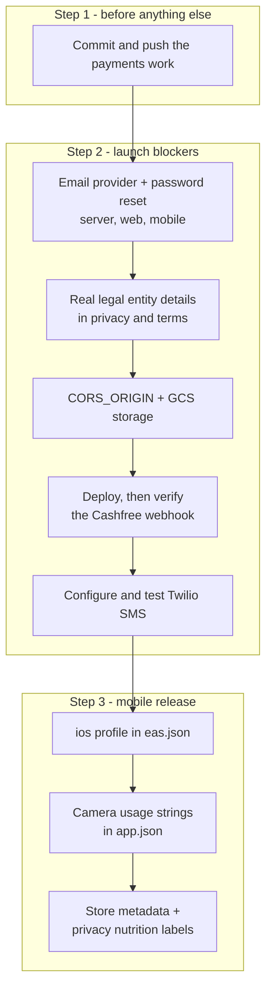
```mermaid
graph TD
    subgraph S1["Step 1 - before anything else"]
        A1["Commit and push the payments work"]
    end
    subgraph S2["Step 2 - launch blockers"]
        B1["Email provider + password reset<br/>server, web, mobile"]
        B2["Real legal entity details<br/>in privacy and terms"]
        B3["CORS_ORIGIN + GCS storage"]
        B4["Deploy, then verify<br/>the Cashfree webhook"]
        B5["Configure and test Twilio SMS"]
    end
    subgraph S3["Step 3 - mobile release"]
        C1["ios profile in eas.json"]
        C2["Camera usage strings<br/>in app.json"]
        C3["Store metadata +<br/>privacy nutrition labels"]
    end
    A1 --> B1 --> B2 --> B3 --> B4 --> B5 --> C1 --> C2 --> C3
```

**Steps 4 to 6 — after launch.**

<!-- diagram:roadmap-b -->
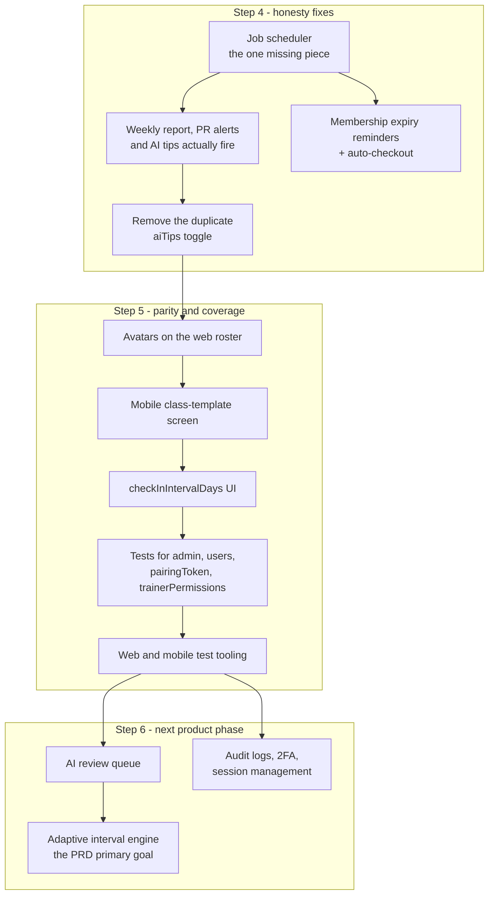
```mermaid
graph TD
    subgraph S4["Step 4 - honesty fixes"]
        D1["Job scheduler<br/>the one missing piece"]
        D2["Weekly report, PR alerts<br/>and AI tips actually fire"]
        D3["Remove the duplicate<br/>aiTips toggle"]
        D4["Membership expiry reminders<br/>+ auto-checkout"]
    end
    subgraph S5["Step 5 - parity and coverage"]
        E1["Avatars on the web roster"]
        E2["Mobile class-template screen"]
        E3["checkInIntervalDays UI"]
        E4["Tests for admin, users,<br/>pairingToken, trainerPermissions"]
        E5["Web and mobile test tooling"]
    end
    subgraph S6["Step 6 - next product phase"]
        F1["AI review queue"]
        F2["Adaptive interval engine<br/>the PRD primary goal"]
        F3["Audit logs, 2FA,<br/>session management"]
    end
    D1 --> D2 --> D3
    D1 --> D4
    D3 --> E1 --> E2 --> E3 --> E4 --> E5
    E5 --> F1 --> F2
    E5 --> F3
```

| Step | Theme | Why this order |
|---|---|---|
| 1 | Commit the work | Everything else is at risk until the payments migration exists somewhere other than one working tree |
| 2 | Launch blockers | Password reset and the legal placeholders are the two things that make a public launch impossible. Storage and CORS are the two that make it unsafe. The webhook and SMS verifications need a deployment, so they come after it |
| 3 | Mobile release | Depends on step 2 — the store listing needs real legal URLs, and the app needs a working password reset before real users install it |
| 4 | Honesty fixes | The job scheduler is one piece of infrastructure that unlocks four promised-but-inert features at once, plus membership reminders and auto-checkout |
| 5 | Parity and coverage | Nothing here blocks a launch, but each item is a visible inconsistency or an untested risk |
| 6 | Next product phase | The AI review queue and the adaptive interval engine are the PRD's actual differentiators, and both are greenfield |

---

## 17. Summary

**What exists and works.** A complete, multi-tenant gym platform with four roles, 74 API endpoints, 28 data models, 21 web pages, 53 mobile screens, and a shared type contract that keeps all three apps honest with each other. Authentication with rotating refresh tokens and reuse detection. QR-based passwordless sign-in for staff-created accounts. Gym check-in and check-out with streaks. AI coaching with a four-provider fallback chain and Zod-validated model output. Workout plan versioning that supersedes rather than mutates. Class scheduling with waitlists. Cashfree online payments with atomic, concurrency-safe membership extension and idempotent webhook handling. Cash payments confirmed by SMS OTP. Three real production bugs found and fixed — a password-hash leak in every user response, a serverless crash from a native addon, and a double-active-plan bug.

**What does not.** Password reset is a dead end in both apps. Four notification toggles save state and do nothing, because the server has no scheduler. iOS cannot be built. The legal pages say `[PLACEHOLDER]`. Uploads do not survive a redeploy on the intended host. The payment webhook — the half that keeps memberships accurate — and the SMS layer that the entire cash-payment flow depends on have never run against real accounts.

The distance between those two paragraphs is section 16, and most of it is a few days of focused work rather than new architecture. The two exceptions are the job scheduler, which is genuinely new infrastructure, and the adaptive interval engine, which is a product phase in its own right.
