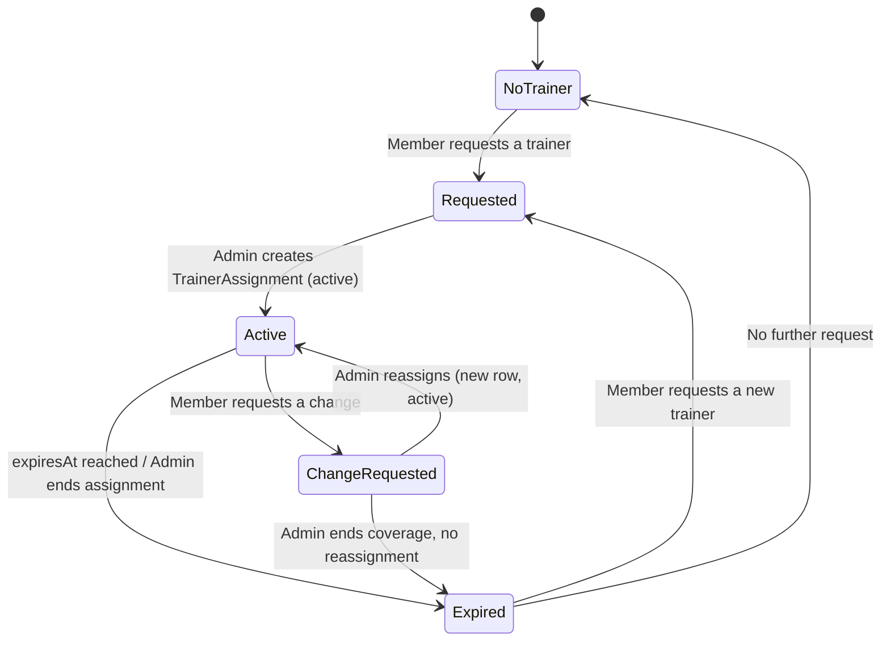
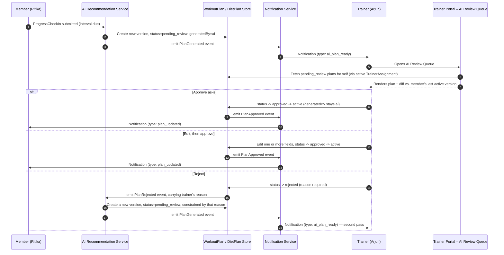

# Part 4 — Trainer Management & the AI → Trainer Review Workflow

> **Document set:** this is Part 4 of a 13-part architecture-level PRD for the *AI-Powered Fitness
> Ecosystem* — the full enterprise vision (mobile + web + trainer portal + admin + super admin + AI
> recommendation engine + microservice backend) as scoped in the 2026-08-01 ecosystem brief. See
> [`README.md`](./README.md) for the full part list and reading order. This part assumes Part 0
> (personas, vision, business model) and Part 1 (roles, permissions, canonical data model) as
> prerequisites and uses their entity names, enums, and role names verbatim throughout.

---

## 1. Why This Part Exists

Part 0's core differentiating claim is not that AI generates a workout — every competitor does
that — but that it keeps regenerating one from real progress data, with a certified human always
in the loop before a change reaches a paying member. Part 1 supplies the data model that makes that
claim enforceable: `WorkoutPlan`/`DietPlan` carry independent `status` and `generatedBy` axes, and
`TrainerAssignment` is the join table every trainer capability is scoped through.

This part specifies the two workflows that turn those fields into a working product:

1. **How a member ends up with a trainer at all**, and how that relationship changes over time
   (§2) — because the AI-review pipeline in §3 has no trainer to notify without it.
2. **What happens between an AI-generated plan existing and a member seeing it** (§3) — the
   Platform's single most important workflow, walked through end-to-end with Ritika and Arjun.
3. **Everything else a trainer is entitled to do**, each capability restated with concrete
   acceptance criteria and, where Part 1 left a design question open, an explicit call (§4).

The rule that governs every section below, restated because it is the one most often implemented
wrong: **a trainer's access is never `WHERE tenantId = :self.tenantId`. It is always
`WHERE trainerId = :self AND TrainerAssignment.status = 'active'`.** A trainer cannot see, message,
review a plan for, schedule a session with, or assign a challenge to any member without an active
`TrainerAssignment` row naming that exact trainer — regardless of shared tenant or branch.

## 2. Trainer Assignment Lifecycle

`TrainerAssignment.status` is a three-value enum: `active | expired | change_requested`. Two of
the states a member's trainer relationship passes through — "no trainer yet" and "a request has
been made but no row exists to hold it" — are *not* enum values, because there is no
`TrainerAssignment` row yet to carry a status. The diagram below shows the full relationship
lifecycle; the note beneath it draws the line between persisted states and these pre-row states.



**`Active`, `ChangeRequested`, and `Expired` above map 1:1 to `TrainerAssignment.status` values
`active`, `change_requested`, and `expired`.** `NoTrainer` and `Requested` are not stored on a
`TrainerAssignment` row at all — `NoTrainer` is simply the absence of any `active` row for the
member, and `Requested` is delivered as a `Notification` (Part 1 §3.7) of type
`trainer_assignment_requested` addressed to the tenant's Admins, with `payload.memberId` and an
optional `payload.preferredTrainerId` if the member expresses one. There is nothing to version or
supersede at this stage, so a full entity would be over-modeling a one-shot signal.

| Transition | Trigger | Who can do it | Scope enforced |
|---|---|---|---|
| `NoTrainer → Requested` | Member taps "Request a trainer" | **Member**, Own scope | Writes a `Notification` only; no `TrainerAssignment` row created |
| `Requested → Active` | Admin picks a trainer and fulfils the request | **Admin only**, Tenant scope | Admin creates `TrainerAssignment{status: active, assignedBy: adminUserId}` |
| `Active → ChangeRequested` | Member is unhappy with their trainer and asks for a different one | **Member**, Own scope | Existing row's `status` flips to `change_requested`; old trainer keeps read access until resolved |
| `ChangeRequested → Active` | Admin resolves the request | **Admin only**, Tenant scope | Admin ends the old row (`status: expired`) and creates a new row (`status: active`, new `trainerId`) — Part 1 §3.3: "an explicit, auditable transition, never a silent overwrite" |
| `Active → Expired` | `expiresAt` is reached, or Admin ends coverage directly (e.g., membership lapse, trainer offboarded) | **System (scheduled) or Admin**, Tenant scope | No replacement implied; member falls back to `NoTrainer` unless a new request follows |
| `ChangeRequested → Expired` | Admin ends coverage instead of reassigning (rare — e.g., the member also cancels their subscription mid-request) | **Admin only**, Tenant scope | Old row closes with no successor row created |

Two properties here are load-bearing for the rest of this document. First, **only Admin ever writes
a `TrainerAssignment` row** — never the trainer, never the AI layer; a trainer wanting a new client
can only ask Admin, like any member's request. Second, **exactly one `active` row per member at any
time** (Part 1 §3.3), which is what makes "Assigned" an unambiguous scope in §4 — a trainer-facing
query never has to disambiguate between two simultaneously active trainers.

## 3. The AI → Trainer Review Pipeline

This is the workflow Part 0 calls the Platform's defining claim made real. Every AI-authored plan
reaching a member with an assigned trainer passes through it; a member with no assigned trainer
(Free tier) is the documented exception, and even then the product discloses the absence of
review in-product.

### 3.1 The review sequence



The queue fetch in step 6 is the same scope rule from §1 restated in query form:
`WHERE trainerId = :self AND status = 'pending_review'`, joined through an `active`
`TrainerAssignment` row — a plan for a member not on Arjun's roster never enters his queue, even if
he's the only trainer at that branch that day.

> **Design decision — what "reject" actually does.** A rejection is neither a dead end nor an
> infinite loop. The AI Recommendation Service automatically regenerates **exactly one** replacement
> version, using the trainer's required rejection reason as a hard constraint on the new generation
> call (e.g., "ignored her reported knee pain" becomes an explicit exclusion, not just a log entry).
> That replacement re-enters the same trainer's queue as a fresh `pending_review` row. A *second*
> rejection within the same interval cycle stops the auto-regeneration; the trainer must then author
> the plan directly — from a `WorkoutTemplate`, the member's last active version, or from scratch —
> entering as `generatedBy: trainer`, `status: active`, no review needed (Part 1 §3.4). The one-retry
> cap avoids an unbounded AI-trainer ping-pong that would blow past Objective #2's 24-hour turnaround
> target, bounds AI generation cost for tenants on metered-overage billing (Part 0 §3.1), and keeps
> the trainer as final authority after one good-faith automated attempt. Every rejection and its
> reason is written to `AuditLogEntry` regardless of which path follows.

### 3.2 `WorkoutPlan.status` state machine (DietPlan is identical)

`DietPlan.status` uses the exact same five values and the exact same transitions below —
substitute "meal" for "exercise" throughout and nothing else changes, which is why Part 1 defines
`status` and `generatedBy` once and reuses them across both entities.

```mermaid
stateDiagram-v2
    [*] --> pending_review: AI generates a plan; member has an active TrainerAssignment
    [*] --> active: AI generates a plan; member has NO active TrainerAssignment (Free tier)
    [*] --> active: Trainer authors a plan from scratch (generatedBy=trainer)

    pending_review --> approved: Trainer approves, as-is or after edits
    pending_review --> rejected: Trainer rejects (reason required)

    approved --> active: System activates (immediate, or scheduled to the next plan-start day)
    active --> superseded: A later version is approved and activated

    rejected --> [*]: Terminal for this row; AI regenerates a new pending_review row (§3.1)
```



Two details matter here. `approved` and `active` stay distinct values, not one collapsed "live"
state, because some tenants gate a newly approved plan behind a scheduled start — approved
Wednesday doesn't have to yank Thursday's workout mid-week; it can activate on the next plan-start
day (same mechanism as `IntervalRule` tenant overrides, Part 1 §3.6). And `previousVersionId`
always chains to the immediately prior row, including a `rejected` one, preserving full authoring
history for audit — but the member-facing "what changed" diff (§3.3) is always computed against the
last version that reached `active`, never one the member was never shown.

There is deliberately no `expired` state for plans — Part 1's enum has no such value. A plan's only
end-of-life is `superseded` by a later `active` version; a rejected draft simply never lives at all.

### 3.3 Worked example: Ritika's interval check-in

Ritika is four weeks into body recomposition. Her interval cadence is the platform default of 7
days, and her `ProgressCheckIn` for interval 6 comes due. Here is the full cycle, version by
version.

1. **Submission.** Ritika logs `weightKg`, `bodyFatPct`, waist/chest/arm measurements, and rates
   `recoveryScore: 2` and `energyLevel: 3` — the second consecutive check-in with a low recovery
   score. `ProgressCheckIn.submittedAt` is stamped and the AI Recommendation Service picks it up.
2. **AI proposes changes.** Comparing this check-in against interval 5 and Ritika's
   `MedicalProfile`/free-text notes, the engine proposes three concrete, explainable changes and
   writes them as `WorkoutPlan{version: 7, previousVersionId: <v6 id>, status: pending_review,
   generatedBy: ai, source: interval_adjustment}`:
   - Reduce back-squat volume roughly 10% (4×8 → 3×8 at the same load) — justified by two
     consecutive low `recoveryScore` entries.
   - Add one 20-minute low-intensity (Zone 2) cardio session on what is currently a rest day —
     justified by `weightKg` trend flattening despite logged adherence.
   - Increase overhead-press rest interval from 60s to 90s — justified by a shoulder ache Ritika
     noted in a prior check-in's free text, cross-referenced against `MedicalProfile.injuries[]`.
3. **Notification.** The Notification Service fires `Notification{userId: Arjun's id, type:
   ai_plan_ready, payload: {memberId: Ritika's id, planId: v7's id, changeCount: 3}}`, reaching
   Arjun via push on the Trainer app, an in-app badge on the web Trainer Portal, or both.
4. **Review.** Arjun opens the AI Review Queue, sees v7 sorted by SLA age, and expands the
   what-changed-since-v6 diff. He agrees with the squat-volume reduction and the added cardio
   session. For the third, his own coaching notes (`TrainerAssignment.notes`) tell him Ritika's
   shoulder responds better to a substitution than a longer rest interval, so he swaps the overhead
   press for a landmine press instead of accepting the AI's parameter tweak.
5. **Approval.** Because this edit happens while v7 is still `pending_review` — Arjun is finishing
   a draft the member never saw, not intervening on a live plan — it updates the *same* row rather
   than minting v8 (§4.2 covers why a mid-cycle edit to an already-active plan differs). Arjun
   clicks Approve; v7 goes `pending_review → approved → active`, and v6 goes `active → superseded`.
6. **Ritika is notified.** She receives `Notification{type: plan_updated}` and opens the app to a
   "What changed since v6" panel: the AI's two accepted proposals, plus the landmine-press
   substitution, each tagged with who made it.

> **Design decision — does `generatedBy` change to `trainer` because Arjun edited one exercise?**
> No, it stays `ai`. `generatedBy` records **which process created the row**, not who last touched
> it: v7 exists because the AI Recommendation Service's generation event created it in step 2, and
> an edit made while finishing that same row's review doesn't change what created it. `generatedBy:
> trainer` is reserved for rows a trainer's own write action creates from nothing — a
> `WorkoutTemplate` instantiation, a from-scratch build, or a fresh mid-cycle version on an
> already-active plan (§4.2) — matching Part 1 §3.4's own example: "a trainer wrote it from scratch
> and it needs no review." This keeps two things measurable: how often a trainer accepts an AI draft
> with zero edits (Part 0 Objective #2's under-60-second case, invisible if any edit silently
> reclassified the row), and AI usage billing (Part 0 §3.1) — a trainer's edit is not a new billable
> generation call. Part 0's three-way member-facing language — "AI-generated, trainer-edited, or
> trainer-authored" — is a **derived** label, not a fourth enum value: the UI joins `generatedBy`
> with whether an edit-type `AuditLogEntry` exists against the row. Ritika's plan renders
> "AI-generated, reviewed and edited by Arjun"; a pure accept-as-is plan reads plain "AI-generated";
> a template build for a different client reads "Written by Arjun" — three labels, two stored
> fields, no schema additions.

## 4. Trainer Capability Requirements & Acceptance Criteria

Every capability below restates its scope from Part 1 §2.2 and adds concrete, testable acceptance
criteria. Unless stated otherwise, **scope is `Assigned` and is enforced by joining through an
`active` `TrainerAssignment` row** — repeated deliberately in each subsection because it is the one
rule every implementation of this part must never regress on.

### 4.1 Reviewing AI-generated workout and meal plans

- Given a trainer with an active `TrainerAssignment` for member X, when a plan for X reaches
  `status: pending_review`, it appears in that trainer's AI Review Queue in the same operation that
  writes the row — the `Notification` is emitted synchronously with the status write, not on a
  delay.
- Given a trainer with no active `TrainerAssignment` for member Y, Y's `pending_review` plans never
  appear in that trainer's queue, even if Y shares the trainer's `tenantId`.
- Every queued plan renders a field-level diff against the member's last `active` version (§3.2);
  a member's first-ever plan renders labeled "Initial Plan" with nothing to diff against.
- The queue sorts oldest-pending-first by default and surfaces an overdue badge past 24 hours,
  operationalizing Part 0 Objective #2's median-turnaround target.

### 4.2 Modifying workouts and meals

- Given a `pending_review` draft, edits made before the trainer approves update that same row in
  place (§3.3, step 5) — no new version is minted, because the member has never seen the unedited
  draft and there is nothing yet to preserve a "before" state of.
- Given an already-`active` plan, a mid-cycle trainer edit (e.g., a member reports pain the same
  week) always creates a new version row — `version + 1`, `previousVersionId` set to the current
  active row's id, `generatedBy: trainer`, activated immediately with no review step since the
  trainer authored it directly — and the prior row transitions `active → superseded`. This is the
  literal reading of Part 1 §2.2's "writes create a new plan version," scoped specifically to edits
  against plans already live.
- Every edit, either path, is recorded as an `AuditLogEntry{action: plan_edited, beforeState,
  afterState}` regardless of whether it produced a new row.

### 4.3 Adding custom exercises

> **Design decision — does a trainer-authored exercise need Admin approval before entering the
> library?** Yes, by default. Part 1 §2.2 already makes this tenant-configurable ("if the tenant
> enables a review step"); this part sets the platform default to **enabled**. An `Exercise` write
> is scoped `Own tenant library` (Part 1 §2.2) — its blast radius is every trainer and member in the
> tenant, not one member, unlike a `WorkoutPlan` edit. `Exercise`'s `safetyNotes` and
> `commonMistakes` fields exist because bad form guidance is a safety issue, so a tenant-wide-visible
> write earns the same review posture this document applies to AI output reaching members. A tenant
> can disable the gate (e.g., a solo independent trainer modeled as a tenant of one, Part 0 §3.3,
> where "Admin" and "trainer" are the same person) — but that is an explicit opt-out, not the
> default.
>
> Part 1 §3.4's `Exercise` entity doesn't list a `status` field, though §2.2's text requires one for
> `pending_approval`. This part adds `Exercise.status[active|pending_approval|rejected]` to close
> that gap — extending the spine rather than inventing a parallel name.

- Given the review gate enabled (default), a new `Exercise` is created `status: pending_approval`,
  `createdBy: trainerId`; it is excluded from every member-facing and other-trainer-facing search
  until an Admin approves it, but remains visible (marked "pending approval") to its own author so
  they can preview or withdraw it.
- Given the gate disabled, a new `Exercise` is `status: active` immediately, still fully attributed
  via `createdBy`, and subject to after-the-fact `ModerationFlag` reporting like any content.
- A trainer's write path can only ever set `Exercise.tenantId` to their own tenant — never `null`
  (the global library, Super Admin-managed only, Part 1 §3.4).

### 4.4 Uploading exercise videos

- Video assets attach to `Exercise.media.videos[]` and inherit the same `pending_approval` gate as
  the parent exercise's text content when the tenant has it enabled — a video cannot make an
  otherwise-unreviewed exercise visible tenant-wide.
- Uploads are format- and size-validated and malware-scanned at the media-ingest layer (Part 9)
  before `media.videos[]` is populated; a failed scan never reaches `pending_approval`, it fails
  the upload outright.

### 4.5 Adding notes

- Coaching notes attach to `TrainerAssignment.notes` — a running, per-member log scoped strictly to
  the trainer named on that `active` row; it is never visible to any other trainer, even one in the
  same tenant, even one who previously held an `expired` assignment to the same member.
- A trainer may additionally attach a member-visible note to a specific plan version at approval
  time (distinct from the private `TrainerAssignment.notes` log) — this is what lets Ritika see
  *why* Arjun swapped the overhead press, not just *that* he did.

### 4.6 Creating reusable WorkoutTemplates

- `WorkoutTemplate` (Part 1 §3.4) is a standalone entity — it never carries `memberId`, `status`,
  `version`, or `generatedBy`, because it is not assigned to anyone; it is a reusable blueprint.
- Instantiating a template for a specific member always creates a brand-new `WorkoutPlan` row
  (`days[]` copied in, `memberId` set, `generatedBy: trainer`) — the template is never mutated or
  referenced live by the resulting plan, so archiving or editing a template afterward has zero
  effect on plans already instantiated from it.
- Templates are scoped `Own tenant library`: visible to every trainer in the tenant, editable only
  by their creating `trainerId` or an Admin.

### 4.7 Managing only assigned users

- Every trainer-facing roster or member-detail query is, without exception,
  `WHERE trainerId = :self AND TrainerAssignment.status = 'active'` — restated a final time: every
  capability in this section depends on it, and Part 1 §2.2 calls it the single most important
  scope rule in this document.
- A direct API call for a member with no active assignment to the calling trainer fails
  (403/404) exactly as the UI would — the scope check lives at the service layer (Part 9), never
  only in client-side filtering.
- A trainer with 40 assigned clients across a 3-branch tenant has no code path that returns a 41st,
  however many members share their branch or tenant.

### 4.8 Monitoring adherence

Adherence is computed from two logged-vs-planned rates, both windowed to the member's current
interval (default 7 days, per `IntervalRule`):

- **Workout adherence %** = completed, logged workouts ÷ planned `WorkoutDay` entries in the
  member's current `active` `WorkoutPlan` for that window.
- **Meal compliance %** = logged-compliant meals ÷ prescribed `DietPlan.meals[]` entries for the
  same window, sourced from the member's meal-compliance logging action (Part 1 §2.1).

Acceptance criteria:

- Both figures are computed and surfaced only for a trainer's own assigned roster — a trainer's
  dashboard aggregate (e.g., "6 of 40 assigned members below 50% adherence this week") never
  includes members outside their `active` `TrainerAssignment` set; the tenant-wide rollup is a
  separate, coarser Admin-only view (Part 1 §2.3).
- The dashboard shows a trend across the last three intervals, not a single snapshot — so a
  trainer can see a member sliding before they churn (echoing Ritika's stated churn risk in Part 0:
  a plan that feels unchanged for a month, paired with a trainer who never noticed adherence
  slipping).

### 4.9 Scheduling 1:1 sessions

Distinct from tenant-wide group class scheduling (Admin-managed capacity/roster, outside this
part's scope). This part introduces `TrainingSession`, extending Part 1's vocabulary:

```
TrainingSession { id, tenantId, trainerId, memberId, scheduledAt, durationMin,
                  status[scheduled|completed|cancelled|no_show], location }
```

- A `TrainingSession` can only be created between a trainer and a member sharing an `active`
  `TrainerAssignment` at creation time — the same scope check as every other capability here.
- Distinct from tenant-wide `ClassSchedule` (group capacity, Admin-managed, covered elsewhere) — a
  trainer's 1:1 calendar and a branch's class calendar are never the same resource.
- Double-booking validation checks only the trainer's own calendar — no need to check for a
  conflicting *other* trainer for the same member, since exactly one `active` assignment can exist
  per member (§2).

### 4.10 Assigning Challenges

`Challenge` (Part 1 §3.7) is tenant-scoped content; assigning one to a specific member needs a join
row not yet in Part 1's entity list, added here as an extension:

```
ChallengeParticipant { id, challengeId, memberId, assignedBy(trainerId),
                       status[assigned|in_progress|completed] }
```

- A trainer may read the full `Challenge` catalog for their tenant (`Tenant` scope) but may only
  create a `ChallengeParticipant` row for members on their own assigned roster (`Assigned` scope) —
  two scopes on two operations of the same feature, and both must hold.
- Assigning a challenge fires `Notification{type: challenge_assigned}` to the member; completion
  updates `GamificationState.xp`/`badgeIds[]` per Part 1 §3.7.

---

**Previous:** [Part 3 — Website Portals](./03-website-portals.md)
**Next:** [Part 5 — The AI Recommendation Engine](./05-ai-recommendation-engine.md)
