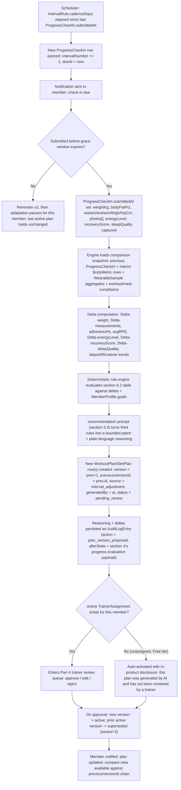

# Part 5 — The AI Recommendation Engine: Closed-Loop Adaptive Programming

> **Document set:** this is Part 5 of a 13-part architecture-level PRD for the *AI-Powered Fitness
> Ecosystem* — the full enterprise vision (mobile + web + trainer portal + admin + super admin + AI
> recommendation engine + microservice backend) as scoped in the 2026-08-01 ecosystem brief. See
> [`README.md`](./README.md) for the full part list, reading order, and how this vision relates to
> the BarBellix codebase that exists today. This part specifies the Platform's stated **Primary
> Goal** — *continuously adapt a member's workout and meal plan based on their progress* — in full
> mechanical detail. It is the deepest and most load-bearing part of the document set: every other
> part either feeds this engine (Parts 2, 3, 6) or governs what happens to what it produces
> (Part 4). Vague treatment here undermines the whole Platform's differentiating claim.

---

## 1. Purpose & Scope

Part 0 §2 states the Platform's core differentiator as **closed-loop programming, not one-shot
generation**: a plan is never a static artifact; every `IntervalRule.cadenceDays` days (7 by
default), the system compares a member's new progress snapshot against their last one and proposes a
*specific, explainable* set of changes — not a fresh plan invented from nothing. This part is the
literal specification of that loop: what data feeds it (§2), what it produces (§4), the exact
prompts that drive it (§3), how a "new plan" is actually a new *version* chained to the old one
(§5), the end-to-end cadence mechanism and the deterministic rules that decide what changes (§6),
and the provider/cost/safety architecture that keeps it running reliably at scale (§7).

Two design commitments run through everything below and are worth stating up front because they
resolve most of the ambiguity a looser spec would leave open:

1. **The rule engine is deterministic code, not LLM judgment.** §6.2's decision-rule table is
   evaluated in application code against real deltas. The LLM is never asked "should we cut
   calories?" — it is told *which* rules fired and asked to turn that into member-facing language
   and bounded numeric edits (§3.3), keeping every adaptation reproducible, testable, and auditable.
2. **An interval adjustment is a patch, not a regeneration.** `source: initial` calls the full
   generation prompts (§3.1, §3.2). `source: interval_adjustment` never does — it always calls the
   comparison/adjustment prompt (§3.3), whose output is a diff applied to the *previous* version's
   `days[]` / `meals[]`. This is what makes "the AI keeps regenerating your workout" (Part 0 §1)
   literally true: the member's Tuesday push day only changes because a specific rule said so, and
   the diff is visible.

## 2. Inputs: What the Engine Reads

Every input the brief specifies resolves to a named field on an entity from Part 1 §3. Where Part 1
deliberately defers the concrete logging entity to Part 6 (workout completion, meal compliance,
water-intake logs), that is called out explicitly rather than invented here.

| Brief input | Source entity.field | Notes |
|---|---|---|
| Current weight | `ProgressCheckIn.weightKg` (latest submitted), falling back to the most recent `BodyMetric.weightKg`, falling back to the cached `MemberProfile.currentWeightKg` | The engine always prefers the cadence-aligned `ProgressCheckIn` value for comparison purposes; ad-hoc `BodyMetric` rows fill gaps between check-ins |
| Historical weight | Ordered time series of `ProgressCheckIn.weightKg` (one per `intervalNumber`) unioned with ad-hoc `BodyMetric.weightKg`, both keyed by `memberId` and ordered by `submittedAt` / `recordedAt` | This series is what §6.1's delta computation diffs against |
| Progress photos | `ProgressCheckIn.photos[]` | Shown side-by-side in the member's compare view (§5); not fed to the LLM prompts in §3 — vision-based analysis is a Part 10 roadmap item, not core |
| Measurements | `ProgressCheckIn.{waistCm, chestCm, armCm, thighCm, hipCm}` for cadence check-ins; `BodyMetric.measurements{}` for ad-hoc entries | `IntervalRule.fieldsCollected[]` determines which of these are mandatory for a given tenant/member's cadence |
| Workout history | Completed-session data joined against the active `WorkoutPlan.days[]` / `WorkoutDay.exercises[]` — completion count, logged sets/reps, logged RPE | Part 1 intentionally does not yet name a per-session logging entity; Part 6 formalizes it. For this part's purposes it is read as an aggregate: sessions completed ÷ sessions planned in the interval window, and per-exercise logged load/RPE |
| Meal compliance | Logged-adherence data joined against `DietPlan.meals[]` | Same deferral as above — Part 6 formalizes the log entity; this engine consumes it as an adherence percentage per interval |
| Sleep | `WearableSample` where `metric = sleep`, aggregated over the interval; self-reported `ProgressCheckIn.sleepQuality[1-5]` as a corroborating signal; `LifestyleProfile.sleepHoursTarget` as the baseline to compare against | Wearable-sourced metrics require an active `WearableConnection.status = connected`, a Premium-tier feature (Part 0 §3.2) — Free-tier adaptation runs on self-reported fields only |
| Steps | `WearableSample` where `metric = steps` | Same Premium/wearable gating as above |
| Heart rate | `WearableSample` where `metric = heart_rate` | Resting-HR trend is used as a fitness/recovery proxy in §6.2 (rule R9) |
| Calories burned | `WearableSample` where `metric = calories_burned` | Cross-checked against `DietPlan.dailyTargets.calories` for compliance and against workout-history volume for load estimation |
| Water intake | `LifestyleProfile.waterIntakeTargetMl` (target) vs. logged actual intake | Logged actual is another Part 6 entity; the engine treats sustained under-target intake as a lifestyle flag surfaced through the AI Chat Coach (§3.4), not a plan-mutation trigger on its own |
| Trainer feedback | `ChatMessage.content` in a thread where `escalatedToTrainer = true` (the trainer's replies land in the same `ChatConversation`); structured notes attached during Part 4's review action (surfaced as `WorkoutDay.exercises[].notes` or a rejection reason) | Trainer feedback is treated as a manual override signal in §6.3, not a normal delta — a trainer's explicit note outranks every automatic rule |

`WearableSample` rows only exist for a `memberId` with at least one `WearableConnection` whose
`status = connected`; a `revoked` or `error` connection causes the engine to fall back to
self-reported `ProgressCheckIn` fields for that member and to flag the check-in as
lower-confidence (§6.3, rule R11).

## 3. AI Prompt Specifications

Every prompt below is stored as an `AIPromptTemplate` row (`promptText` = the template text,
`isActive` = which version is live, `updatedBy` = the Super Admin who last edited it — Part 1 §2.4,
Part 1 §3.6). The `roleTarget` enum value is given for each so it's unambiguous which template a
given engine call resolves against. All four are goal-aware: the `MemberProfile.goals[]` value is
interpolated directly rather than collapsed to a generic bucket, per Part 1 §3.2's note that
downstream generation prompts branch on the specific one of the ten goal values.

### 3.1 Workout Plan Generation — `roleTarget: workout_gen`

Used only for `source: initial` (first plan ever) or `source: manual_request` (member explicitly
asks for a rebuild, Part 1 §2.1). Never used for `interval_adjustment` — see §1's second
commitment.

```
SYSTEM:
You are the Platform's certified-strength-coach-equivalent workout programming engine. You
generate structured resistance/cardio/mobility programs, never free-text advice. You must:
- Respect every entry in injuries[] and chronicConditions[] as a hard constraint — never program
  an exercise whose primaryMuscle/movement pattern is contraindicated by a listed injury.
- Match workoutSplitPreference exactly if it is not "custom"; if "custom", infer a split from
  goals[], experienceLevel, and weeklyAvailability.
- Produce exactly 7 WorkoutDay entries per week regardless of daysPerWeek — non-training days are
  WorkoutDay rows with exercises: [] and dayLabel prefixed "Rest".
- Output strict JSON matching the schema below. No prose outside the JSON.

USER TEMPLATE:
Generate an initial workout plan for member {{memberId}}.
Goal: {{MemberProfile.goals}}
Experience level: {{MemberProfile.experienceLevel}}
Split preference: {{MemberProfile.workoutSplitPreference}}
Weekly availability: {{MemberProfile.weeklyAvailability.days}} days,
  {{MemberProfile.weeklyAvailability.sessionDurationMin}} min/session
Activity level: {{MemberProfile.activityLevel}}
Injuries (hard constraints): {{MedicalProfile.injuries}}
Chronic conditions: {{MedicalProfile.chronicConditions}}
Home-only / equipment: {{GymPreference.homeWorkoutOnly}}, {{GymPreference.equipmentAvailable}}
Exercise library: draw exerciseId values only from the tenant-visible Exercise catalog provided
  as a separate context block (not embedded here for token efficiency).

EXPECTED OUTPUT (strict JSON):
{
  "daysPerWeek": 4,
  "days": [
    {
      "dayLabel": "Day 1 - Push",
      "exercises": [
        { "exerciseId": "ex_barbell_bench_press", "sets": 4, "reps": "6-8",
          "tempo": "2-0-1", "restSec": 120, "notes": "Top set RPE 8" }
      ]
    },
    { "dayLabel": "Rest - Day 2", "exercises": [] }
  ],
  "rationale": "One sentence explaining the split choice and why it fits the goal/experience pair."
}
```

### 3.2 Diet/Meal Plan Generation — `roleTarget: diet_gen`

Same `source: initial` / `manual_request` scoping as §3.1.

```
SYSTEM:
You are the Platform's nutrition-planning engine. You set daily macro targets and assemble meals
from the provided Meal catalog only — you never invent a meal or ingredient not in that catalog.
You must:
- Respect allergies[] as a hard exclusion filter on ingredients[].
- Respect foodPreference (vegetarian/vegan/non_vegetarian) as a hard filter on Meal.cuisine and
  ingredients[].
- Set dailyTargets.calories using an evidence-based estimate (Mifflin-St Jeor equivalent) adjusted
  for activityLevel and goal direction (deficit for weight_loss, surplus for weight_gain/muscular,
  maintenance for others unless goals[] indicates otherwise).
- Output strict JSON. No prose outside the JSON.

USER TEMPLATE:
Generate an initial diet plan for member {{memberId}}.
Goal: {{MemberProfile.goals}}
Current / target weight: {{MemberProfile.currentWeightKg}} / {{MemberProfile.targetWeightKg}} kg
Activity level: {{MemberProfile.activityLevel}}
Food preference: {{LifestyleProfile.foodPreference}}
Allergies: {{MedicalProfile.allergies}}
Water intake target: {{LifestyleProfile.waterIntakeTargetMl}} ml (informational, not a macro)
Meal catalog: tenant-visible Meal rows provided as a separate context block.

EXPECTED OUTPUT (strict JSON):
{
  "dailyTargets": { "calories": 2100, "proteinG": 160, "carbsG": 220, "fatG": 65 },
  "meals": [
    { "mealId": "meal_grilled_chicken_rice_bowl", "mealType": "lunch",
      "calories": 620, "proteinG": 52, "carbsG": 60, "fatG": 15 }
  ],
  "rationale": "One sentence tying the calorie target to the stated goal direction."
}
```

### 3.3 Progress-Comparison & Adjustment-Reasoning — `roleTarget: recommendation`

This is the prompt the interval loop (§6.1) calls on every `interval_adjustment`. It never sees a
blank slate: it receives the fired rules from the deterministic engine (§6.2) plus the raw deltas,
and its job is to turn a rule ID into a specific, bounded, explainable patch — not to decide
whether adaptation should happen at all.

```
SYSTEM:
You are the Platform's progress-adjustment reasoning engine. You never invent a plan mutation that
was not licensed by one of the firedRules provided to you. Your job is to:
1. Translate each fired rule into a concrete, bounded edit against the previous plan version
   (previousWorkoutPlan.days[] / previousDietPlan.meals[]/dailyTargets).
2. Where two fired rules would conflict, apply the precedence order given in ruleContext.precedence
   and note the conflict in "reasoning".
3. Write "reasoning" in plain language suitable to show both the member and their trainer.
4. Never output a mutation whose magnitude exceeds the bound stated for that rule in ruleContext.
5. Output strict JSON only.

USER TEMPLATE:
Member {{memberId}}, goal {{MemberProfile.goals}}, interval #{{ProgressCheckIn.intervalNumber}}.
Fired rules: {{firedRules}}  // e.g. ["R1","R4"], see rule table context block
Rule bounds/precedence: {{ruleContext}}
Deltas: weightKg {{previousCheckIn.weightKg}} -> {{currentCheckIn.weightKg}},
  adherence% {{workoutAdherencePct}}, mealCompliance% {{mealCompliancePct}},
  energyLevel {{previousCheckIn.energyLevel}} -> {{currentCheckIn.energyLevel}},
  recoveryScore {{previousCheckIn.recoveryScore}} -> {{currentCheckIn.recoveryScore}},
  avgLoggedRPE {{avgLoggedRPE}}, wearableTrends {{wearableAggregates}}
Previous WorkoutPlan (version {{previousWorkoutPlan.version}}): {{previousWorkoutPlan.days}}
Previous DietPlan (version {{previousDietPlan.version}}): {{previousDietPlan.dailyTargets}}

EXPECTED OUTPUT (strict JSON):
{
  "firedRules": ["R1", "R4"],
  "mutations": {
    "workoutPlanPatch": {
      "dayEdits": [
        { "dayLabel": "Day 3 - Legs", "action": "modify",
          "exercises": [{ "exerciseId": "ex_back_squat", "field": "loadPct", "from": 100, "to": 90 }] },
        { "dayLabel": "Day 6 - Rest", "action": "unchanged" }
      ],
      "addRestDay": false,
      "addCardioSessions": 1
    },
    "dietPlanPatch": {
      "dailyTargets": { "calories": { "from": 2100, "to": 1975 } }
    }
  },
  "reasoning": "Weight loss slowed to 0.18%/week against a 0.25% threshold, and logged meal
    compliance was 91%, so calories were reduced by 125 and one cardio session was added rather
    than cutting further, per R1.",
  "confidence": "high",
  "requiresTrainerAttention": true
}
```

### 3.4 AI Chat Coach — `roleTarget: chat`

```
SYSTEM:
You are the Platform's AI Chat Coach for member {{memberId}}. You give fitness and nutrition
guidance grounded in their MemberProfile, MedicalProfile, and current active plans. You are not a
doctor and must never diagnose, prescribe, or adjust medication.

Disclaimer rule: any time your response touches pain, injury, a symptom (dizziness, chest pain,
numbness, sharp/localized joint pain, unusual shortness of breath), or a medication interaction,
you must include, verbatim: "This isn't medical advice — please check with a doctor or your
assigned trainer before continuing." Do not omit this for a "quick question" — the rule is
triggered by topic, not by how the member frames the question.

Escalation rule (hard, not optional): if the member's message describes a new or worsening injury,
a pain symptom, or any medical-emergency indicator, you must set escalatedToTrainer = true on your
response's ChatMessage row. Then:
- If an active TrainerAssignment exists for this member, tell the member you're flagging this for
  their trainer {{TrainerAssignment.trainerId}} and that the trainer will follow up — do not
  attempt to resolve the medical question yourself beyond the disclaimer above.
- If no active TrainerAssignment exists (unassigned/Free-tier member), do not claim to escalate to
  anyone — deflect explicitly: "I can't evaluate this — please see a doctor or licensed
  professional before continuing this movement/plan."
- If the message indicates a possible medical emergency (chest pain, fainting, severe breathing
  difficulty), skip coaching entirely and respond only with guidance to seek emergency care
  immediately; still set escalatedToTrainer = true so the flag is visible regardless of assignment.

Never contradict an active MedicalProfile.injuries[] entry (e.g. do not suggest an exercise the
member's own trainer has already excluded for a listed injury).

USER TEMPLATE:
ConversationId: {{ChatConversation.id}}
Recent messages: {{ChatMessage.history (last 10, role+content)}}
Member context: goals {{MemberProfile.goals}}, injuries {{MedicalProfile.injuries}},
  active WorkoutPlan version {{WorkoutPlan.version}}, active DietPlan version
  {{DietPlan.version}}
New message: {{ChatMessage.content}}

EXPECTED OUTPUT (strict JSON):
{
  "content": "the reply text shown to the member",
  "escalatedToTrainer": false,
  "disclaimerIncluded": false
}
```

## 4. Outputs: What the Engine Writes

Every output the brief specifies lands in a named field on `WorkoutPlan`, `WorkoutDay`, or
`DietPlan` (Part 1 §3.4) — never a bespoke response shape that lives only in an API layer.

| Brief output | Entity.field | Notes |
|---|---|---|
| Weekly workout plan | `WorkoutPlan.days[]` | Always 7 `WorkoutDay` entries per week (§3.1); `WorkoutPlan.daysPerWeek` records how many are training days |
| Daily workout | `WorkoutDay.exercises[]` for that day's entry in `WorkoutPlan.days[]` | One `WorkoutDay` per calendar day, addressed by `dayLabel` |
| Daily meals | `DietPlan.meals[]`, filtered by the day's rotation and `Meal.mealType` | `mealType` values (`breakfast/lunch/dinner/snack/pre_workout/post_workout`) group the day's entries |
| Calories | `DietPlan.dailyTargets.calories` | |
| Protein | `DietPlan.dailyTargets.proteinG` | |
| Carbs | `DietPlan.dailyTargets.carbsG` | |
| Fat | `DietPlan.dailyTargets.fatG` | |
| Rest days | `WorkoutDay` entries with `exercises: []` and `dayLabel` prefixed `"Rest"` | A convention this spec fixes so `WorkoutPlan.days[]` is always calendar-complete regardless of `daysPerWeek` |
| Cardio plan | `WorkoutDay.exercises[]` entries whose `exerciseId` resolves to an `Exercise` with `category = "cardio"` | May be a dedicated day or appended to a strength day depending on the goal-specific split (Part 6 finalizes the `Exercise.category` enum) |
| Stretching / mobility | `WorkoutDay.exercises[]` entries whose `Exercise.tags[]` includes `mobility`, typically as a warm-up/cool-down block within each training `WorkoutDay` | Also used as the dedicated content of a `"Recovery"` day inserted by rule R4 (§6.2) |
| Progress evaluation | The `recommendation`-prompt output (§3.3) persisted as `AuditLogEntry.afterState` on the `plan_version_proposed` action (`targetType: WorkoutPlan`\|`DietPlan`, `targetId`: the new version's id) | `AuditLogEntry` (Part 1 §3.8) is append-only and immutable, which is exactly the durability guarantee "every version stored so users can compare" requires; the member-facing "what changed and why" card reads `afterState.reasoning` directly |

## 5. Plan Versioning Mechanics

Every `WorkoutPlan` / `DietPlan` write — whether from `source: initial`, `interval_adjustment`,
`manual_request`, or a trainer's edit during Part 4 review — creates a **new row**, never an
in-place update. This is what Part 1 §2.2 means by "writes create a new plan version": a trainer
adding a note or swapping an exercise produces `version: previousVersion + 1` exactly like an
AI-driven interval adjustment does.

**Chaining.** `previousVersionId` on the new row points at the row it supersedes.
`version` is always `previousVersion.version + 1`; the first plan a member ever gets has
`version: 1`, `previousVersionId: null`, `source: initial`. The full history for a member is
either `WHERE memberId = :id ORDER BY version ASC` (fast, needs no traversal) or reconstructed by
walking `previousVersionId` pointers back to `null` — the two must always agree, and a mismatch is
a data-integrity bug, not a valid state.

**Comparing two versions.** "Compare previous plans" is a structural diff, not a text diff:

```
GET /plans/compare?memberId=:id&planType=workout&fromVersion=:v1&toVersion=:v2

1. Fetch WorkoutPlan rows WHERE memberId = :id AND version IN (:v1, :v2)
2. Match WorkoutDay entries across the two by dayLabel
3. For each matched pair, diff exercises[] by exerciseId:
     - present in v2 only        -> "added"
     - present in v1 only        -> "removed"
     - present in both, any of
       {sets, reps, tempo, restSec} differ -> "changed" (field-level diff)
4. For DietPlan: diff dailyTargets{} scalar-by-scalar, and meals[] by (mealId, mealType)
   using the same added/removed/changed logic
5. Return { addedExercises[], removedExercises[], changedExercises[], calorieDelta,
            macroDeltas{proteinG,carbsG,fatG}, sourceVersion, targetVersion }
```

This is the same shape the trainer review UI (Part 4) and the member's "what changed" screen both
render from — one diff algorithm, two consumers.

**Activation and supersession.** Exactly one `status: active` row may exist per member per plan
type at any time. When a `pending_review` version is approved (by a trainer, per Part 4's
workflow, or automatically for an unassigned Free-tier member per §6.1), two writes happen in the
same transaction: the newly approved row transitions to `status: active`, and whatever row was
previously `active` for that member/plan-type transitions to `status: superseded`. A `superseded`
row is never deleted or hidden — it remains permanently queryable through the version chain, which
is the entire mechanism behind "every version stored so users can compare." A `rejected` version
(Part 4) keeps its `previousVersionId` link for audit purposes but never becomes `active`, and the
active pointer does not move — the member keeps training on the prior `active` version until a
replacement is approved.

## 6. The Interval-Based Adaptive Loop & Decision Rules

### 6.1 The loop

`IntervalRule.cadenceDays` (platform default 7, overridable per tenant or per member within
admin-set bounds — Part 1 §2.4) drives a scheduler that, on elapse, opens a new `ProgressCheckIn`
row for the member and walks it through submission, comparison, decision, and — if applicable —
trainer review.



Two branches deserve emphasis. First, a missed check-in (branch `E`) never triggers a plan change
by omission — silence is not a signal the engine acts on; it only pauses future adaptation until
the member re-engages. Second, the unassigned branch (`O`) implements Part 0 §1's disclosure
commitment: it is the *only* path by which an AI-authored plan reaches `active` without passing
through Part 4's review queue, gated on the absence of an `active` `TrainerAssignment`, not on
subscription tier directly (a Premium member who has declined a trainer gets the same disclosure).

### 6.2 Decision-rule table

These are evaluated in application code, in the order given, against the deltas computed in step
`H`. Each rule's *bound* (the magnitude it's allowed to request) is passed to the §3.3 prompt as
`ruleContext` so the LLM cannot exceed it.

| # | Trigger condition (measurable) | Plan mutation | Bound |
|---|---|---|---|
| R1 | `goals` includes `weight_loss`; Δweight < 0.25%/week (normalized for `cadenceDays` ≠ 7); logged meal-compliance% > 85 | Reduce `DietPlan.dailyTargets.calories`; add one cardio `WorkoutDay`/session | Calorie cut 100–150 kcal; +1 cardio session/week |
| R2 | `goals` includes `strength` or `powerlifting`; 3 consecutive logged sessions with avg RPE ≥ 9 on a primary lift | Reduce prescribed load on affected lifts (deload) and add one rest day | Load reduction 10%; +1 rest day, next interval only |
| R3 | Completed sessions ÷ planned sessions in the interval < 60% (missed > 40%) | Reduce weekly volume/frequency (`daysPerWeek` −1 and/or accessory `exercises[].sets` −1) — never escalate difficulty when adherence is the failure mode | `daysPerWeek` change ≤ 1; no calorie or load increase this cycle |
| R4 | `energyLevel` ≤ 2 **and** `recoveryScore` ≤ 2 on the current **and** previous `ProgressCheckIn` | Insert one additional recovery/mobility `WorkoutDay` (`dayLabel: "Recovery"`, `exercises[]` from `Exercise.tags` including `mobility`) regardless of goal | Overrides R1/R2/R6 for this interval — recovery takes precedence (§6.3) |
| R5 | `goals` includes `body_recomposition`; Δweight within ±0.3% (stalled); logged top-set load increased on ≥ 2 tracked lifts | Hold `dailyTargets.calories`; shift macro split toward protein | `proteinG` target raised to 1.8–2.2 g/kg bodyweight; `carbsG` reduced to absorb the shift; `fatG` unchanged |
| R6 | `goals` includes `weight_gain` or `muscular`; Δweight < 0.15%/week; meal-compliance% > 85 | Increase `dailyTargets.calories`; raise `carbsG` primarily | Calorie increase 150–250 kcal |
| R7 | `WearableSample(sleep)` avg < `LifestyleProfile.sleepHoursTarget` − 1.5 h over the interval, with `recoveryScore` trending down | Suppress any rule that would otherwise increase weekly volume/frequency this cycle | Hard cap: no frequency increase regardless of R2/R6 direction |
| R8 | `WearableSample(steps)` daily avg down > 30% vs. prior interval; `goals` includes `weight_loss` or `general_fitness` | Add a daily step-count nudge and/or one low-impact cardio `WorkoutDay` | +1 low-impact session; independent of the weight trend itself |
| R9 | `goals` includes `endurance`; `WearableSample(heart_rate)` resting trend decreasing; completed cardio sessions ≥ planned | Increase cardio duration or intensity (progressive overload) | +10% duration or pace target; strength days untouched |
| R10 | `bodyFatPct` decreasing while `weightKg` stable or rising, regardless of stated goal | Overrides R1: do not cut calories even under a `weight_loss` goal — this is a recomposition signal, not a stall | Calories held; reasoning must state the override explicitly |
| R11 | Two consecutive `ProgressCheckIn`s missing `waistCm`/`chestCm`/etc. while `weightKg` is present | Downgrade confidence; apply conservative bounds only (no aggressive cuts/increases); force `status: pending_review` even for an otherwise-unassigned Free-tier member | Confidence flag `low`; routes to branch `N` regardless of §6.1's `M` check |
| R12 | Trainer feedback or an escalated `ChatMessage` flags pain/injury against a currently-programmed exercise | Remove/substitute the flagged `exerciseId` (query `Exercise` by matching `primaryMuscle`/`tags` excluding the flagged movement pattern); cross-check/update `MedicalProfile.injuries[]` | Safety override — always forces `pending_review`, ignores every other rule's output for that exercise |

### 6.3 Precedence & conflict resolution

Rules are not mutually exclusive, so precedence is fixed rather than left to the model: **safety
(R12) > recovery (R4, R7) > adherence-driven volume correction (R3) > goal-progress rules
(R1/R2/R5/R6/R9) > activity nudges (R8)**, with data-quality (R11) acting as a side-constraint that
can force review regardless of where in the ordering the winning rule sits. R10 is a standing
exception clause on R1 specifically (recomposition beats a naive weight-stall read), and the §3.3
prompt is required to name any such override in its `reasoning` field rather than silently picking
one outcome.

## 7. Provider Strategy, Fallback Order & Safety Thresholds

### 7.1 Provider chain

**Primary:** Anthropic Claude — a Sonnet-class model (currently Claude Sonnet 5) for the generation
and recommendation prompts (§3.1–3.3), and a Haiku-class model for the higher-volume AI Chat Coach
(§3.4) where per-message cost dominates. All calls carry the resolved `AIPromptTemplate.version`
so a prompt rollback (Part 1 §2.4) is a pointer flip, never a redeploy.

**Fallback chain**, triggered by a 5xx response, a timeout > 8s, a 429 rate-limit, or a
content-policy refusal on the primary:

1. **Fallback 1 — OpenAI** (GPT-4-class), same prompt payloads translated to that provider's
   message format by the AI Gateway service.
2. **Fallback 2 — Google Gemini** (Gemini-class), same translation pattern.

A circuit breaker trips after 3 consecutive primary failures within 60 seconds and routes new
calls to Fallback 1 for a cooldown window before re-probing the primary; the same pattern applies
one level down if Fallback 1 degrades too. If all three are unavailable, `interval` adjustments
queue (§6.1's branch `H` onward) rather than failing silently — a member never receives a plan
from an unverified or empty response, and a `Notification` informs them the adaptation is delayed,
not skipped.

### 7.2 Security requirement (hard constraint)

No provider API key is ever present in a mobile, web, or trainer-portal client bundle or
configuration. Every call in §3 and §7.1 is made server-side through the AI Gateway service; a
client only ever calls the Platform's own authenticated API, never a model provider directly.
**Enforcement of this boundary — key storage, rotation, and the CI/lint checks that catch an
accidental client-side leak — is specified in Part 10**; this part only fixes the requirement
itself as non-negotiable, since a leaked provider key is both a cost-exposure and a data-exposure
incident (member profile data would be in the leaked call's payload).

### 7.3 Per-tier rate limiting & cost control

Quotas track Part 0 §3.2's subscription tiers directly:

| Tier | Plan generation | AI Chat Coach | Notes |
|---|---|---|---|
| **Free** | 1 generation per `IntervalRule.cadenceDays` cycle (`source: initial` or the interval's own `interval_adjustment` — not both) | Daily message cap (e.g. 15/day) | No trainer review path exists (§6.1 branch `O`); quota resets on cycle boundary, not calendar day |
| **Premium** | Unlimited regenerations, soft fair-use ceiling (e.g. 50/day) beyond which requests queue rather than reject | Unlimited, routed to the Haiku-class model by default for cost, escalating to Sonnet-class on complex/medical-adjacent queries | Wearable-derived inputs (§2) unlocked |
| **Gym Enterprise** | Dedicated quota pool per contract; overage metered per Part 0 §3.1's usage-based AI add-on | Pooled across the tenant's members | Admin can view usage against quota (Part 1 §2.3) but not edit prompt content |

Cost controls layered on top of the quota table: prompt-template response caching for
low-variance outputs (e.g. macro-target recompute with unchanged inputs is not re-sent to the
model), batching of same-cycle `interval_adjustment` calls where a gym runs synchronized check-in
days, and the Haiku/Sonnet model-tiering split on the Chat Coach described above.

### 7.4 Safety thresholds

Independent of §6.2's rules, the generation and recommendation prompts enforce non-negotiable
floors regardless of what a rule requests: `DietPlan.dailyTargets.calories` may never drop below
an age/sex/weight-appropriate minimum (a hard floor computed server-side, not prompt-negotiable);
no single-interval load change may exceed 20% in either direction; and
`MedicalProfile.injuries[]`/`chronicConditions[]` are re-checked against the proposed patch as a
final validation pass, not only at initial generation. Any output violating a floor is rejected
before persistence, and the interval falls back to holding the prior version unchanged plus a
forced `pending_review` flag (as in R11) so a human sees why automation declined to act.

---

**Previous:** [Part 4 — Trainer Management & the AI Review Workflow](./04-trainer-management-and-ai-review-workflow.md)
**Next:** [Part 6 — Exercise & Meal Libraries, Progress Tracking & Wearables](./06-exercise-meal-libraries-progress-wearables.md)
