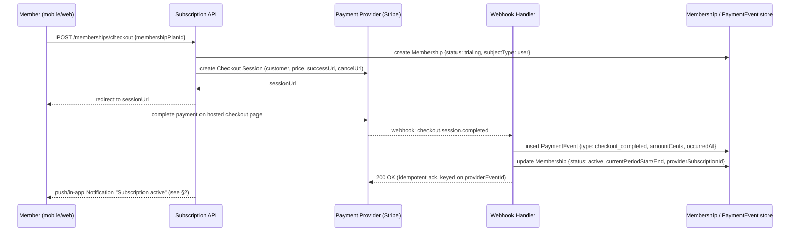

# Part 7 — Payments, Notifications, Gamification & Analytics

> **Document set:** this is Part 7 of a 13-part architecture-level PRD for the *AI-Powered Fitness
> Ecosystem*. See [`README.md`](./README.md) for the full part list and reading order. This part
> specifies the platform's revenue, engagement, and reporting layer: the billing entities Part 1
> §3.7 named but deferred (§1 below — this *is* "Part 7 §1"), the notification matrix that fires
> off events raised throughout Parts 4–6 (§2), the XP/streak/badge/referral engine that keeps
> members showing up between AI-review cycles (§3), and the KPI surfaces Admin and Super Admin see
> every morning (§4). Every tier name and entity below is the one fixed in Part 0 §3.2 and Part 1 —
> nothing here redefines them.

---

## 1. Payment & Subscription System

### 1.1 Entities

Part 1 §3.7 named `Membership`, `MembershipPlan`, and `PaymentEvent` as billing entities "detailed
in Part 7 §1" — this is that detail.

```
MembershipPlan { id, tenantId?(null = platform catalog plan available to any tenant; set = a
                 negotiated tenant-specific contract, e.g. a custom Gym Enterprise rate), name,
                 tier[free|premium|trainer|gym_enterprise], priceCents, currency,
                 billingCycle[monthly|annual|per_branch_annual], aiQuotaPerInterval, seatLimit?,
                 branchLimit?, isActive }
Membership     { id, tenantId, subjectType[user|tenant], subjectId, membershipPlanId,
                 status[trialing|active|grace_period|past_due|cancelled|expired],
                 currentPeriodStart, currentPeriodEnd, cancelAtPeriodEnd,
                 provider[stripe], providerCustomerId, providerSubscriptionId, createdAt }
PaymentEvent   { id, membershipId, type[checkout_completed|renewed|cancelled|payment_failed|
                 marked_paid_manually|refunded|ai_overage_charged|referral_credit_applied],
                 amountCents, currency, providerEventId?, occurredAt, recordedBy? }
```

`tier` reuses the exact enum already defined on `Tenant.planTier` (Part 1 §3.1) — `free`, `premium`,
`trainer`, `gym_enterprise` — rather than inventing a parallel display-cased set. `Membership`'s
`subjectType`/`subjectId` pair is what lets one entity cover all four member-facing revenue streams
in Part 0 §3.1 with a single billing model: `subjectType: user` represents an individual's Free or
Premium subscription (`subjectId` = `User.id`); `subjectType: tenant` represents a Trainer Plan seat
pool or a Gym Enterprise contract (`subjectId` = `Tenant.id`), where `MembershipPlan.seatLimit` and
`branchLimit` cap how many trainers/branches the contract covers. `aiQuotaPerInterval` is the field
that ties billing to the recommendation engine: it's the number of AI generation calls (Part 5)
included per `IntervalRule.cadenceDays` cycle before usage-based overage applies, billed as a
`PaymentEvent{type: ai_overage_charged}` against the Gym Enterprise tenant's `Membership`.
`marked_paid_manually` exists for the case Admin's capability list (Part 1 §2.3, "Manage
subscriptions & billing") implies but a webhook never covers: a gym front desk taking cash or a
bank transfer for an annual Gym Enterprise contract, recorded by a human, not a provider.

### 1.2 Checkout flow



The `Membership` row is created in `trialing` *before* the provider redirect, not after — this
gives the client something to poll/subscribe to immediately and avoids a race where a webhook
arrives before the API call that "should" have created the row. All subsequent recurring charges,
cancellations, and failures are the same shape (provider webhook → `PaymentEvent` insert →
`Membership.status` update) and are summarized as a transition table rather than a second diagram:

| Trigger | `PaymentEvent.type` | `Membership.status` becomes |
|---|---|---|
| Checkout completed | `checkout_completed` | `active` |
| Recurring charge succeeds | `renewed` | `active`, `currentPeriodEnd` extended |
| Card decline / dunning starts | `payment_failed` | `past_due` — grace clock starts (§1.3) |
| Grace window elapses, no successful retry | *(scheduled-job transition, no new provider event)* | `expired` |
| Member or Admin cancels | `cancelled` | `cancelled` (honors `cancelAtPeriodEnd` through `currentPeriodEnd`, then `expired`) |
| Admin records an offline payment | `marked_paid_manually` | `active` |
| Admin/provider issues a refund | `refunded` | unchanged or `cancelled`, per tenant refund policy |

### 1.3 Grace period and access restriction

`Tenant.gracePeriodDays` is already a first-class field on `Tenant` (Part 1 §3.1), and this is where
it's spent: when a `payment_failed` event lands, `Membership.status` moves to `past_due` and the
member (or, for a `subjectType: tenant` membership, the whole tenant) keeps access until
`currentPeriodEnd + Tenant.gracePeriodDays` — a Gym Enterprise tenant with a 10-day grace period
behaves differently from a Free-tier individual falling back to `free` defaults immediately, and
that's a deliberate per-tenant configuration point, not a hardcoded constant.

The harder design question is *how* that deadline is enforced, and this spec makes an explicit
call: **the yes/no gating decision is always computed lazily, at request time — never trusted
from a cached status field alone — while a scheduled job (assuming Part 9's service architecture
runs one, e.g. a nightly job runner) is responsible only for the status *transition* and its side
effects.**

- **Lazy check-at-auth-time (the security-critical path).** Every request that touches a gated
  feature evaluates `isEntitled = status == 'active' OR (status == 'past_due' AND now <=
  currentPeriodEnd + gracePeriodDays)` live, against the current time, not against whatever value a
  batch job last wrote. This makes correctness independent of scheduler health: if the nightly job
  is delayed, late, or down, no member gets free extra access past their real deadline, and no
  member who just paid gets locked out because a job hasn't caught up yet.
- **Scheduled job (the bookkeeping path).** A recurring job still walks `past_due` memberships past
  their grace deadline and flips them to `expired`, because that transition has no natural request
  to hook onto — nobody's HTTP call is what should cause a lapsed member's tile to disappear from
  Admin's dashboard (§4) or their `Notification` ("your grace period ends in 2 days") to fire.
  Critically, the job computes expiry using the *same* `currentPeriodEnd + gracePeriodDays` formula
  the lazy check uses — the job never gets to unilaterally "decide" a membership is expired ahead
  of what the live formula would say, which is what keeps the two paths from disagreeing.

This hybrid avoids both single-strategy failure modes: pure job-driven gating means a missed cron
run silently over-grants (or wrongly revokes) access; pure lazy computation means nothing proactively
notifies a lapsing member or updates tenant-facing dashboards, and `expired`-in-practice memberships
sit around indefinitely still nominally consuming `aiQuotaPerInterval` reservations.

### 1.4 Tier-gating enforcement

Part 0 §3.2 is explicit that tier-gating is a first-class authorization concern, "not a display
concern," and Part 1 §5's three-step enforcement pattern (authenticate → authorize by role →
authorize by scope) is where a fourth step is appended for exactly this reason: **authorize by
entitlement**. Before any gated feature's business logic runs, the same request pipeline resolves
the caller's active `MembershipPlan.tier` — via their own `Membership` for member-scoped features
(unlimited AI regenerations, wearable sync, full nutrition planning) or via their `Tenant`'s
`Membership` for tenant-scoped features (multi-branch reporting, white-label theming) — and checks
it against the feature's required tier, in the same shared policy layer every service calls into
(Part 9 §2 specifies where that layer physically lives in the service topology). AI-generation
calls specifically are additionally checked against `MembershipPlan.aiQuotaPerInterval` consumed
so far in the current `IntervalRule.cadenceDays` window (Part 5), which is why AI overage is a
metered `PaymentEvent`, not a hard block — a Gym Enterprise tenant that exceeds its quota degrades
to "billed extra," not "AI stops working."

---

## 2. Notification Engine

Every row below is a `Notification { id, userId, type, payload, channel[push|inapp|email], readAt }`
(Part 1 §3.7) instance. `type` is a fixed enum matching this matrix; `channel` defaults per type but
is user- and tenant-adjustable, within bounds Super Admin sets via "Configure notification templates
& channels" (Part 1 §2.4) — a tenant cannot invent a new notification type, only adjust delivery
channel and cadence for existing ones.

| Notification type | Trigger condition | Recipient role | Channel(s) | Fired by (upstream part/entity) |
|---|---|---|---|---|
| Workout Reminder | Current time reaches a scheduled `WorkoutDay` for today with no completion logged yet | Member (Own) | push, in-app | `WorkoutPlan.days[]` + `MemberProfile.weeklyAvailability` (Part 1 §3.4; completion state from Part 6 progress logging) |
| Meal Reminder | A `DietPlan.meals[]` entry's time window is reached with no compliance logged | Member (Own) | push, in-app | `DietPlan.meals[]` (Part 1 §3.4) + meal-compliance logging (Part 1 §2.1) |
| Water Reminder | Periodic check against `LifestyleProfile.waterIntakeTargetMl` pace for the day | Member (Own) | push | `LifestyleProfile.waterIntakeTargetMl` (Part 1 §3.2) + daily progress log (Part 6) |
| Weight Update Reminder | No `BodyMetric` recorded in the configured interval window | Member (Own) | push, email (weekly digest) | `BodyMetric` (Part 1 §3.5) |
| Weekly Check-in | `ProgressCheckIn.dueAt` reached, computed from `IntervalRule.cadenceDays` (default 7) | Member (Own) | push, in-app, email | `ProgressCheckIn.dueAt` + `IntervalRule` (Part 1 §3.5/§3.6; cross-ref Part 5 closed-loop cycle) |
| Trainer Message | New message posted in the member↔trainer thread by the currently-assigned trainer | Member (Own ↔ Assigned) | push, in-app | `TrainerAssignment.status == active` (Part 1 §3.3), thread detail in Part 4 |
| New User Assigned | A `TrainerAssignment` row is created with `status: active` for this `trainerId` | Trainer (Assigned) | push, in-app, email | `TrainerAssignment` (Part 1 §3.3), created by Admin per §2.3 |
| AI Plan Ready | `WorkoutPlan.status` or `DietPlan.status` transitions to `pending_review` for a plan whose `trainerId` matches | Trainer (Assigned) | push, in-app | `WorkoutPlan`/`DietPlan.status` (Part 1 §3.4; review queue in Part 4; generated by Part 5) |
| User Missed Workout | A scheduled `WorkoutDay` date passes with no completion logged, for a member under an active `TrainerAssignment` | Trainer (Assigned) | in-app, push (batched digest, not per-miss) | `WorkoutPlan.days[]` + progress logging (Part 6) |
| User Progress Updated | Member submits a `ProgressCheckIn` (`submittedAt` populated) | Trainer (Assigned) | in-app, push | `ProgressCheckIn.submittedAt` (Part 1 §3.5) |
| Chat Messages | New message in an assigned member's thread | Trainer (Assigned) | push, in-app | `TrainerAssignment` scope + thread (Part 4) |
| Pending Trainer Approval | New `User` row created with `role: trainer`, `status: pending_approval` | Admin (Tenant) | in-app, email | `User.status` (Part 1 §3.2, approval flow Part 1 §2.3) |
| Reported Content | New `ModerationFlag` row with `status: open` | Admin (Tenant) | in-app, email | `ModerationFlag` (Part 1 §3.8) |
| Subscription Events | `PaymentEvent.type` in `{payment_failed, cancelled}`, or `Membership.status` enters `grace_period`/`past_due` | Admin (Tenant) | in-app, email | `PaymentEvent` / `Membership.status` (this part, §1) |

Two notes worth calling out. First, **User Missed Workout** is deliberately batched into a digest
rather than fired per occurrence — a trainer with 40 assigned clients (Persona "Arjun," Part 0 §4)
does not need 40 individual pushes the moment each workout window lapses; this is the same "don't
become a bottleneck, don't become noise" tension Part 0's objective #2 names for the AI-review
queue, applied to notifications. Second, **Trainer Message** and **Chat Messages** are two
directions of the same thread (member sees a message *from* their trainer; trainer sees one *from*
an assigned member) — listed as two rows because they have different recipients and triggers, not
because they're separate entities.

---

## 3. Gamification

### 3.1 XP and leveling

XP accrues to `GamificationState { userId, xp, level, streakDays, badgeIds[] }` (Part 1 §3.7) from
a small set of logging actions, deliberately weighted toward *consistency of data capture* over any
single heroic action — this matches Part 0's framing that the closed-loop engine lives or dies on
real progress data, not just training volume:

| Action | XP |
|---|---|
| A `WorkoutDay` logged complete | +10 |
| A day's `Meal`s all logged compliant against the active `DietPlan` | +5 |
| Daily `LifestyleProfile.waterIntakeTargetMl` target met | +2 |
| A `ProgressCheckIn` submitted by its `dueAt` | +15 |
| `streakDays` reaches a 7-day milestone | +25 (one-time, per milestone) |
| `streakDays` reaches a 30-day milestone | +75 |
| `streakDays` reaches a 100-day milestone | +200 |

Worked example: in a single week, a member logs 4 workouts, hits full meal compliance on 5 days,
meets her water target on 5 days, submits her check-in on time, and that week closes her 7-day
streak: `4×10 + 5×5 + 5×2 + 15 + 25 = 40 + 25 + 10 + 15 + 25 = 115 XP`.

`level` is a denormalized cache of a superlinear curve over cumulative `xp` —
`xpRequired(level) = round(100 × level^1.5)` — recomputed from `xp` on every XP-changing write
rather than incremented ad hoc, so the stored `level` can never drift from what the formula would
say:

| Level | Cumulative XP required |
|---|---|
| 1 | 0 |
| 2 | 100 |
| 3 | 283 |
| 4 | 520 |
| 5 | 800 |
| 10 | 3,162 |

The curve is intentionally front-loaded and back-heavy: the first few levels arrive within the
first one to two weeks of consistent logging (fast enough to hook a new member before the typical
six-week abandonment window Persona "Ritika" describes in Part 0 §4), while double-digit levels
require months of sustained use — leveling rewards retention, not a single good week.

### 3.2 Streaks

A calendar day (evaluated in the member's local timezone) satisfies the streak requirement if *any
one* of the following is logged that day: a completed `WorkoutDay`, a compliant `Meal` entry, or a
submitted `ProgressCheckIn`. This is deliberately broad rather than "workout days only" — a
scheduled rest day on which the member still logs meals or a check-in should not break a streak,
since the platform cares about the member staying engaged with data capture (which feeds Part 5's
adaptive engine) more than it cares about a rest day looking like a miss.

`streakDays` breaks when a full calendar day elapses with none of the above logged *and* the
member's grace-day allowance is already spent. Each member gets one auto-consumed grace day per
rolling 7-day window — conceptually the same shape as `Tenant.gracePeriodDays` (§1.3), applied here
to engagement rather than billing, and tracked independently of it.

### 3.3 Challenges and badges

`Challenge { id, tenantId, title, description, criteria, xpReward, startAt, endAt }` is
tenant-scoped by schema (it carries a `tenantId`) and is the entity Trainer's "Assign challenges"
capability draws from (Part 1 §2.2: "drawn from the tenant's `Challenge` library") — a trainer
assigns an existing tenant challenge to their roster, they don't author ad-hoc per-member ones.
`Badge { id, key, criteria, xpValue }` carries **no** `tenantId` — by the schema Part 1 already
fixed, badges are global and platform-defined, not a per-gym customization, which is the right
split: challenges are how a gym runs its own seasonal engagement campaigns, badges are the
platform's consistent achievement vocabulary that means the same thing everywhere.

| Badge (`key`) | Unlock criteria | `xpValue` |
|---|---|---|
| First Rep (`first_workout_logged`) | Member completes their first-ever `WorkoutDay` | 20 |
| Iron Streak (`streak_30`) | `GamificationState.streakDays` reaches 30 | 150 |
| Plateau Breaker (`plan_v3_reached`) | Member's `WorkoutPlan.version` reaches 3 — they've survived two full interval-adjustment cycles (Part 5) without abandoning the plan | 100 |
| Referral Champion (`referral_3`) | 3 members referred via the member's `ReferralCode` reach an `active` `Membership` | 250 |

"Plateau Breaker" is worth calling out: it's the one badge tied directly to Part 0's core
differentiating claim (closed-loop adaptation, not one-shot generation) rather than to raw
consistency, rewarding members for staying on the adaptive engine long enough to feel it work.

### 3.4 Leaderboard

The leaderboard is explicitly **not** a stored entity — there is no `Leaderboard` row in Part 1's
canonical list, and this spec doesn't add one. It is a derived view: `ORDER BY
GamificationState.xp DESC` (or `streakDays DESC` for a "current streak" variant), joined through
`GamificationState.userId → User.tenantId`, and it is **tenant-scoped**, not global, with an
optional `Branch` slice for Gym Enterprise tenants with multiple branches. This spec makes that
scoping call for two reasons: fairness — a solo Trainer Plan tenant with three clients would never
surface on a platform-wide top-1000 list against a 50,000-member Gym Enterprise tenant, which
defeats the motivational point of ranking at all — and product framing — the persona this feature
serves ("Ritika," Part 0 §4) wants to feel part of a community she recognizes, her gym or her
trainer's roster, not compete anonymously against strangers she'll never train alongside. Whether
this is served as a live query or a short-TTL cached read-model invalidated on `GamificationState`
writes is a materialization decision left to Part 8, since it doesn't change the entity model —
only that it must never be treated as a system of record, since `GamificationState` already is one.

### 3.5 Referral program, end to end

`ReferralCode { id, ownerId, code, rewardDescription }` (Part 1 §3.7) drives a five-step loop:

1. **Issue.** A `ReferralCode` is generated for a member (`ownerId`) at first login or on request;
   `rewardDescription` is set by the platform's referral program config (Super Admin default,
   tenant-overridable for a Gym Enterprise's white-labeled referral copy).
2. **Share and redeem.** A prospect enters the code during self-serve registration. The system
   resolves `code → ReferralCode.ownerId` and stamps that attribution on the new member's record —
   this attribution reference is a schema detail Part 1 doesn't enumerate a field for yet, and is
   flagged here for Part 8 to finalize alongside the rest of the physical schema, per Part 1's own
   stated rule that a missing field is a signal to extend the spine, not invent a parallel name.
3. **Reward trigger.** The reward does not fire on signup alone (that would be trivially farmable
   with throwaway accounts). It fires once the referred member's own `Membership` first transitions
   to `status: active` — i.e., they convert, whether that's a paid tier or a configured minimum
   engagement bar for a Free-tier referral bonus.
4. **Reward application.** Two reward shapes, both driven by the same trigger: an XP credit to the
   referrer's `GamificationState.xp` (contributing toward "Referral Champion," §3.3), and/or a
   billing credit recorded as `PaymentEvent { type: referral_credit_applied }` against the
   referrer's own `Membership`, reducing their next renewal charge.
5. **Notify both sides.** The Notification Engine (§2) fires to both parties — "your friend
   joined!" to the referrer, a welcome/attribution confirmation to the new member — reusing the
   same `Notification` entity rather than a bespoke referral-specific one.

---

## 4. Analytics Dashboard

### 4.1 Admin (tenant-scoped)

Admin's "View analytics" and "Monitor platform health (tenant-scoped)" capabilities (Part 1 §2.3)
resolve to a dashboard built from at least these KPIs, all filtered `WHERE tenantId = :self`:

| KPI | Computed from |
|---|---|
| Active members | `User{role: member}` with an `active` `Membership` |
| Churn rate | `Membership` transitions to `cancelled`/`expired` this period ÷ active at period start |
| Average adherence | Mean % of scheduled `WorkoutDay`/`Meal` items logged complete (Part 6) |
| Revenue (MRR) | Sum of `PaymentEvent.amountCents` for `renewed`/`checkout_completed` this period |
| Trainer utilization | Assigned-member count per active `TrainerAssignment` vs. each trainer's configured capacity |
| Pending trainer approvals | Count of `User{role: trainer, status: pending_approval}` |
| Open moderation items | Count of `ModerationFlag{status: open}` |
| AI plan review turnaround | Median hours from `WorkoutPlan`/`DietPlan.status: pending_review` to `approved`/`rejected` (Part 0 objective #2) |
| Referral conversion rate | `ReferralCode` redemptions reaching an `active` `Membership` ÷ total redemptions |
| Wearable connection rate | % of members with a `WearableConnection{status: connected}` |

### 4.2 Super Admin (platform-wide)

Super Admin's KPIs cross tenant boundaries by design (Part 1 §1.1's "Global" scope) and are
platform-health rather than any single gym's business metrics:

| KPI | Computed from |
|---|---|
| Cross-tenant growth | New `Tenant`s and `User`s platform-wide; tier mix trend across `free`/`premium`/`trainer`/`gym_enterprise` |
| AI cost per active user | Aggregate AI provider spend (Part 5) ÷ platform monthly active users |
| Provider uptime / fallback-trigger rate | % of AI generation calls served by the primary provider vs. a configured fallback (Part 5 §7), plus raw provider uptime |
| Platform MRR/ARR and net revenue retention | `PaymentEvent` roll-up across every tenant |
| Tenant health score | Composite of adherence, payment health (`past_due`/grace-period incidence), and moderation volume, used to flag at-risk contracts before they churn |
| Feature flag rollout health | Error/opt-out rate per `FeatureFlag` during a percentage or tenant-targeted rollout |
| Audit log volume/anomaly rate | Spikes in `Global`-scope `AuditLogEntry` actions (Part 9) |

### 4.3 Example layout: the Gym Admin dashboard

Above the fold: a KPI strip of four stat tiles — Active Members, MRR, Churn Rate, and a badge-style
count of Pending Approvals — each with a trend delta against the prior period, no chart chrome
needed at this density. Below that, a two-column layout: on the left, a "Needs Attention" feed —
pending trainer approvals, open `ModerationFlag`s, and recent `payment_failed` events, newest
first, each with a one-click resolve action, giving Meena (Part 0 §4) the "checks every morning"
view she needs without hunting; on the right, an adherence trend line over the trailing eight
weeks, broken out per `Branch` for a multi-branch tenant. Nothing on this first screen is a
dead-end: clicking the Churn Rate tile drills into the list of `Membership`s that cancelled this
period with reason codes; clicking a branch's line in the adherence chart drills into that branch's
trainer roster and per-trainer utilization; the full `PaymentEvent` ledger and the manual-payment
recording action live one tab away, deliberately not above the fold, since they're a
weekly-or-less action rather than a daily glance.

---

**Previous:** [Part 6 — Exercise & Meal Libraries, Progress Tracking & Wearables](./06-exercise-meal-libraries-progress-wearables.md)
**Next:** [Part 8 — Database Architecture](./08-database-architecture.md)
