# Part 8 — Database Architecture

> **Document set:** this is Part 8 of a 13-part architecture-level PRD for the *AI-Powered Fitness
> Ecosystem* — the full enterprise vision (mobile + web + trainer portal + admin + super admin + AI
> recommendation engine + microservice backend) as scoped in the 2026-08-01 ecosystem brief. This
> part specifies the physical data layer beneath the canonical entities of
> [Part 1](./01-rbac-and-data-model.md): storage technology, multi-tenancy isolation, indexing for
> the platform's hottest queries, and retention. See [`README.md`](./README.md) for the full part
> list, reading order, and how this vision relates to the BarBellix codebase that exists today.

---

## 1. From Vocabulary to Storage

Part 1 gave every entity in the Platform a name, a set of fields, and a scope (Own/Assigned/Tenant/
Global). It deliberately stopped short of committing to a storage technology, describing itself as
"not the physical schema... it's the vocabulary." This part makes that commitment. Three questions
drive almost every decision below, because they recur across most of Part 1 §3:

1. **Does this entity participate in a financial or authorization decision?** `Membership`,
   `PaymentEvent`, `TrainerAssignment`, and `AuditLogEntry` all gate either money or access to
   another person's data. A store that can silently drop a write, apply one twice, or let two
   writers race on the same row is not an option for any of them.
2. **Does this entity form a version chain that must never fork silently?** `WorkoutPlan` and
   `DietPlan` carry a `previousVersionId` pointer; the entire closed-loop programming model
   (Part 0 §1) depends on that chain being a single unbroken line per member — never two rows both
   claiming the same predecessor.
3. **Does this entity need to prove, after the fact, that it was never altered?** Only
   `AuditLogEntry` needs this property in the strong, tamper-evident sense (§6), but the
   requirement shapes storage choices for anything that produces or consumes it.

All three questions point the same direction: a single, strongly consistent, relational system of
record for the entities that carry these guarantees, with narrowly scoped secondary stores bolted
on only for the things a relational database is genuinely a poor fit for — ephemeral
session/rate-limit state and large binary media.

## 2. Entity-Relationship Overview

The diagram below covers the entities named explicitly in Part 1 §3 that sit on the platform's hot
paths, plus the directly-connected entities needed to make the cardinalities meaningful
(`MedicalProfile`, `LifestyleProfile`, `GymPreference` hang off `MemberProfile`'s owner;
`MembershipPlan` and `PaymentEvent` hang off `Membership`; `WearableSample` off
`WearableConnection`; `ChatMessage` off `ChatConversation`). Entities that are purely
configuration or content (`FeatureFlag`, `AIPromptTemplate`, `ContentArticle`, `Sponsor`,
`Challenge`, `Badge`, and similar) are out of scope for this diagram — their ownership is a
service-boundary question, addressed in Part 9 §2, not a hot-path storage question.

```mermaid
erDiagram
    TENANT ||--o{ BRANCH : has
    TENANT ||--o{ USER : hosts
    BRANCH |o--o{ USER : hosts
    USER ||--o| MEMBERPROFILE : "has (member role only)"
    USER ||--o| MEDICALPROFILE : has
    USER ||--o| LIFESTYLEPROFILE : has
    USER ||--o| GYMPREFERENCE : has
    USER ||--o{ TRAINERASSIGNMENT : "is member in"
    USER ||--o{ TRAINERASSIGNMENT : "is trainer in"
    TENANT ||--o{ WORKOUTPLAN : scopes
    USER ||--o{ WORKOUTPLAN : "is member of"
    USER |o--o{ WORKOUTPLAN : "reviews as trainer"
    WORKOUTPLAN |o--o| WORKOUTPLAN : supersedes
    TENANT ||--o{ DIETPLAN : scopes
    USER ||--o{ DIETPLAN : "is member of"
    USER |o--o{ DIETPLAN : "reviews as trainer"
    DIETPLAN |o--o| DIETPLAN : supersedes
    TENANT |o--o{ EXERCISE : "owns (null = global)"
    WORKOUTPLAN }o--o{ EXERCISE : references
    TENANT |o--o{ MEAL : "owns (null = global)"
    DIETPLAN }o--o{ MEAL : references
    USER ||--o{ PROGRESSCHECKIN : submits
    USER ||--o{ BODYMETRIC : logs
    USER ||--o{ WEARABLECONNECTION : connects
    WEARABLECONNECTION ||--o{ WEARABLESAMPLE : streams
    USER ||--o{ CHATCONVERSATION : starts
    CHATCONVERSATION ||--o{ CHATMESSAGE : contains
    MEMBERSHIPPLAN ||--o{ MEMBERSHIP : defines
    USER ||--o{ MEMBERSHIP : subscribes
    MEMBERSHIP ||--o{ PAYMENTEVENT : generates
    TENANT ||--o{ AUDITLOGENTRY : scopes
    USER ||--o{ AUDITLOGENTRY : "acts as"

    TENANT {
        string id PK
        string name
        string planTier
        jsonb brandingConfig
        int gracePeriodDays
        timestamp createdAt
    }
    BRANCH {
        string id PK
        string tenantId FK
        string name
        string address
        string timezone
    }
    USER {
        string id PK
        string tenantId FK
        string branchId FK
        string role
        string email
        string phone
        string passwordHash
        string status
        timestamp createdAt
    }
    MEMBERPROFILE {
        string userId PK
        date dob
        string gender
        decimal heightCm
        decimal currentWeightKg
        decimal targetWeightKg
        decimal bodyFatPct
        text_array goals
        string experienceLevel
        string workoutSplitPreference
        jsonb weeklyAvailability
    }
    TRAINERASSIGNMENT {
        string id PK
        string memberId FK
        string trainerId FK
        string assignedBy FK
        timestamp assignedAt
        timestamp expiresAt
        string membershipType
        string status
    }
    WORKOUTPLAN {
        string id PK
        string memberId FK
        string tenantId FK
        string trainerId FK
        string goal
        int daysPerWeek
        jsonb days
        int version
        string previousVersionId FK
        string status
        string generatedBy
        string source
        timestamp createdAt
    }
    DIETPLAN {
        string id PK
        string memberId FK
        string tenantId FK
        string trainerId FK
        jsonb dailyTargets
        jsonb meals
        int version
        string previousVersionId FK
        string status
        string generatedBy
        string source
        timestamp createdAt
    }
    EXERCISE {
        string id PK
        string tenantId FK
        string name
        string bodyPart
        text_array equipment
        string difficulty
        string category
        jsonb media
        text_array tags
        string createdBy FK
    }
    MEAL {
        string id PK
        string tenantId FK
        string name
        string mealType
        jsonb ingredients
        int calories
        decimal proteinG
        decimal carbsG
        decimal fatG
        jsonb media
        string createdBy FK
    }
    PROGRESSCHECKIN {
        string id PK
        string memberId FK
        int intervalNumber
        timestamp dueAt
        timestamp submittedAt
        decimal weightKg
        decimal bodyFatPct
        text_array photos
        int energyLevel
        int recoveryScore
        int sleepQuality
    }
    WEARABLECONNECTION {
        string id PK
        string memberId FK
        string provider
        string status
        timestamp lastSyncAt
        text_array scopes
    }
    MEMBERSHIPPLAN {
        string id PK
        string tier
        decimal priceAmount
        string billingCycle
    }
    MEMBERSHIP {
        string id PK
        string userId FK
        string membershipPlanId FK
        string status
        date currentPeriodEnd
    }
    PAYMENTEVENT {
        string id PK
        string membershipId FK
        string type
        decimal amount
        string status
        timestamp occurredAt
    }
    AUDITLOGENTRY {
        string id PK
        string actorId FK
        string actorRole
        string action
        string targetType
        string targetId
        string tenantId FK
        jsonb beforeState
        jsonb afterState
        string ip
        timestamp createdAt
    }
```



Three things this diagram makes explicit that a plain entity list cannot:

- **`WorkoutPlan` and `DietPlan` are self-referencing.** The `previousVersionId` edge is a foreign
  key from a plan to itself, not to a separate history table. A member's plan history is a linked
  list of rows inside the same table, which is why §5 treats "get the current version" and "walk
  the version chain" as two distinct query shapes needing two distinct indexes, not one.
- **`Exercise` and `Meal` are many-to-many with `WorkoutPlan`/`DietPlan`, and their tenant edge is
  nullable on purpose.** `Exercise.tenantId` and `Meal.tenantId` are nullable — a `null` tenant
  means the global library (Part 1 §3.4) — so a gym's trainers write custom rows into the same
  table that also holds the platform's shared library, with row-level security (§4) guaranteeing
  they only ever see their own tenant's rows plus the global set, never another gym's.
- **`AuditLogEntry` hangs off `Tenant` and off `User`-as-actor, never off the business entities it
  describes.** `targetType`/`targetId` are typed references, not foreign keys, precisely because an
  audit row must remain writable and queryable even after the record it describes has been
  archived or anonymized (§6) — a foreign key would force the audit trail to disappear along with
  the record it was written to hold accountable.

A physical-schema note the logical model in Part 1 doesn't need to settle: `WorkoutDay.exercises[]`
and `DietPlan.meals[]` are presented in Part 1 as nested arrays because that's the shape a client
consumes over the API. At the storage layer this spec normalizes them into child tables
(`workout_plan_exercise(workoutPlanId, exerciseId, dayLabel, sets, reps, tempo, restSec, notes)` and
an equivalent `diet_plan_meal`) rather than storing the array as an opaque JSONB blob. The
API layer reassembles the nested shape on read. The reason is query-ability in the other direction:
"which active plans reference `Exercise: barbell-back-squat`" is a real operational query (a
trainer deprecates an unsafe exercise variant and needs to find every plan using it) that a JSONB
array can only answer with a full-table scan, while a normalized child table answers it with an
index on `exerciseId`.

## 3. Why PostgreSQL as the Primary Store

| Requirement | PostgreSQL | Document store (e.g. MongoDB) |
|---|---|---|
| Multi-row transactions (approve a plan, write an `AuditLogEntry`, enqueue a `Notification`, atomically) | Native, single transaction | Multi-document transactions exist but are commonly avoided for performance; requires discipline everywhere they're needed |
| Referential integrity (`TrainerAssignment.trainerId` must reference a real, existing `User`) | Enforced by the database | Enforced only in application code; one missed check anywhere creates an orphaned row |
| Row-Level Security for tenant isolation (§4) | Built in, enforced below the application layer | No equivalent primitive; isolation is 100% application-code discipline |
| Complex relational joins (a trainer's roster × active assignment × member profile × latest plan version, in one query) | Native SQL joins, query planner optimizes | Denormalization (staleness risk) or multiple application-side round trips |
| Variable-shape sub-documents (`WorkoutDay.exercises[]`, `MedicalProfile.injuries[]`, `Exercise.media{}`) | JSONB columns inside an otherwise rigid schema | Native, but at the cost of losing every guarantee above for the *entire* record, not just the flexible part |

PostgreSQL is the primary system of record for every entity in Part 1 §3. The domain reasoning is
specific to this platform, not generic database dogma: gyms buy this product to run a business —
billing, trainer accountability, medically-relevant disclosures — where "eventually consistent" or
"best-effort foreign key" is not an acceptable answer for a `PaymentEvent` or a `TrainerAssignment`.
Scope enforcement itself (Part 1 §5) is a relational join in disguise — a trainer's roster query
*is* `SELECT ... FROM trainer_assignment WHERE trainerId = :self AND status = 'active'` joined to
`User` — so choosing a document store would push that join into every service's application code,
reimplemented once per service, which is exactly the kind of scope check Part 1 §5 warns is "the
one most often skipped in practice." Meanwhile PostgreSQL's JSONB columns absorb the schema
flexibility a NoSQL choice is usually made for — `WorkoutDay`'s embedded structure,
`MedicalProfile`'s arrays, `media{}` objects, `dailyTargets{}` — without giving up relational
guarantees for the columns that need them. The `pgvector` extension additionally lets the AI
Recommendation Service (Part 5, Part 9 §2) store exercise/meal embeddings for semantic similarity
search inside the same cluster, rather than standing up a dedicated vector database: one fewer
moving part, and one fewer place tenant isolation has to be re-implemented from scratch.

**Where a secondary store still earns its place:**

- **Redis** — session and refresh-token state, per-tier rate-limit counters enforced at the API
  Gateway (Part 9 §3), the AI Chat Coach's daily-message-cap counter (Part 0 §3.2 tier gating), and
  a short-TTL cache of `FeatureFlag` evaluations (read on nearly every request, tolerant of a few
  seconds of staleness). None of this is data anyone needs to survive a restart in its exact form —
  it is reconstructible session/counter state, which is precisely Redis's design center.
- **Object storage (Azure Blob / AWS S3)** — every media blob referenced from a Postgres row:
  `Exercise.media{images[],videos[],gifs[]}`, `Meal.media{images[],videos[]}`,
  `ProgressCheckIn.photos[]`. Postgres stores only the object key/URL, never the bytes. This keeps
  the transactional store's I/O path free of multi-megabyte writes and keeps Super Admin's
  backup/restore obligation (Part 1 §2.4, a two-person-confirmed action) fast enough to actually
  test on a schedule, rather than a multi-hour operation nobody dares run.
- **Message Queue (RabbitMQ / Azure Service Bus)** is not a data store in this architecture at all —
  it is transient plumbing between services (fully specified in Part 9 §6). Nothing is durably
  held only in the queue; every event it carries is a notification that a Postgres row already
  changed, not the system of record for that change.

## 4. Multi-Tenancy Strategy

| Strategy | Isolation strength | Cost at thousands of tenants | Cross-tenant reporting (Super Admin) | Verdict |
|---|---|---|---|---|
| Shared schema + `tenantId` + Row-Level Security | Strong, database-enforced | Low — one schema, one migration path, one connection pool | Native, via a `BYPASSRLS` role | **Chosen default** |
| Schema-per-tenant | Strong, physical | High — every migration fans out to every schema; connection pooling degrades past a few hundred schemas | Requires cross-schema `UNION` queries | Rejected as default |
| Database-per-tenant | Strongest, physical + connection | Very high — one instance/cluster per tenant is unworkable at "many small gyms" scale | Requires a federated query layer or a separate analytics pipeline | Rejected as default; reserved as a contractual exception |

Part 0 §3.3 establishes a bimodal tenant population: an independent trainer with no gym affiliation
is modeled as a tenant of one, meaning the realistic long-run count is tens of thousands of small
tenants, alongside a handful of Gym Enterprise franchises running 8+ branches (Persona "Aditi," Part
0 §4). Schema-per-tenant and database-per-tenant are priced for the second population and collapse
under the first: a platform cannot run tens of thousands of schema migrations on every deploy, or
keep tens of thousands of idle connection pools warm for tenants that might see ten queries a day.
**Shared schema plus a `tenantId` column, with Postgres Row-Level Security as the enforcement
mechanism, is the only strategy whose operational cost stays roughly flat as tenant count grows —
and it is the call this spec makes for the platform's default path.**

The tradeoff being accepted: every tenant's rows physically coexist in the same tables, so a defect
in an RLS policy — not application code, the database policy itself — becomes the last line of
defense against a cross-tenant leak, which is exactly the failure Devraj (Part 0 Persona 4) would
escalate over at 2 a.m. This is treated as an acceptable, well-understood risk specifically because
RLS is enforced by the database engine rather than per-service application logic: every
tenant-scoped table carries `tenantId UUID NOT NULL` (except the entities Part 1 explicitly marks
nullable-for-global — `Exercise.tenantId`, `Meal.tenantId`, `Sponsor.tenantId`,
`IntervalRule.tenantId`), and every such table gets a policy of this shape:

```sql
CREATE POLICY tenant_isolation ON workout_plan
  USING (tenant_id = current_setting('app.current_tenant_id')::uuid);
```

Every service sets `app.current_tenant_id` as the first statement of every request-scoped
transaction, immediately after the caller's token is verified at the API Gateway (Part 9 §3) — so
even application code that forgets a `WHERE tenantId = …` clause cannot return another tenant's
rows; the database refuses on its own. Super Admin's Global scope (Part 1 §2.4) is not modeled as
"no tenant filter" — it runs under a distinct database role granted `BYPASSRLS`, used only by the
Admin Service's super-admin code path, and every query executed under that role is paired with a
mandatory `AuditLogEntry` write. Crossing the tenant boundary stays possible for the one role that
legitimately needs it, and provable after the fact for every other role.

For the small number of Gym Enterprise contracts that demand physical data-residency guarantees the
shared model can't offer, the escape hatch is a **dedicated schema** — not a dedicated database —
inside the same PostgreSQL cluster, reached via `search_path`. Table definitions and RLS policy
authoring stay identical; only cluster placement for that one tenant differs. This is deliberately
not the default path; it exists for a handful of tenants across the platform's life, not a general
pattern to design every query around.

## 5. Indexing Strategy for the Hot Paths

| Hot path | Query shape | Index |
|---|---|---|
| Trainer roster lookup | `WHERE trainerId = :id AND status = 'active'` (Part 1 §2.2: this exact predicate, never a tenant-wide scan) | Partial composite `(trainerId, status) WHERE status = 'active'` — partial because only the active subset is ever read on this path, keeping the index small as `expired` history accumulates |
| Plan version — "what's current" | `WHERE memberId = :id AND status = 'active'` on `WorkoutPlan`/`DietPlan` | Partial composite `(memberId, status) WHERE status = 'active'` — exactly one hit by construction (Part 1 §3.4) |
| Plan version — "walk the history" | Recursive CTE over `previousVersionId` | B-tree on `previousVersionId` (child-lookup direction; parent-lookup is already free via the primary key) plus a covering `(memberId, version DESC)` index for "list all versions, newest first" without touching the chain pointer |
| Audit log — tenant + actor + time range | `WHERE tenantId = :t AND actorId = :a AND createdAt BETWEEN :from AND :to` | Composite B-tree `(tenantId, actorId, createdAt DESC)` |
| Audit log — tenant-wide time range | `WHERE tenantId = :t AND createdAt BETWEEN ...` (Super Admin browsing one tenant's history without an actor filter) | Composite B-tree `(tenantId, createdAt DESC)`, plus a BRIN index on `createdAt` alone as a low-storage supplement for full-range scans — audit rows are append-only and naturally correlated with insertion order, exactly what BRIN is built for |
| Audit log — "history of this one record" | `WHERE targetType = :t AND targetId = :id` (e.g., a disputed `PaymentEvent`) | Composite B-tree `(targetType, targetId, createdAt DESC)` |

The `WorkoutPlan` and `DietPlan` indexing pattern is identical across both entities, deliberately —
they share the same version-chain shape and the same two query patterns, so the same two-index
approach applies without modification.

Two tables in this model are both high-volume and time-correlated: `AuditLogEntry` and
`WearableSample`. Both are declared as native PostgreSQL range-partitioned tables on
`createdAt`/`recordedAt` respectively, with monthly partitions. Partitioning here serves two
purposes beyond query speed: it keeps each partition's indexes small enough to stay
memory-resident even as the table's lifetime total grows into the billions of rows, and it turns
"drop data older than the retention window" (§6) into a partition **detach** — a metadata
operation — instead of a row-by-row `DELETE` that would otherwise hold long locks on a hot table
and, worse, generate its own multi-million-row wave of `AuditLogEntry` writes if delete operations
were themselves audited at that granularity.

## 6. Retention, Soft Delete & Why the Audit Log Is Different

The default across this entire model is: **no hard delete from any API path.** Two mechanisms cover
almost every entity:

- **Status-based soft delete**, for entities that already carry a lifecycle enum in Part 1:
  `User.status → suspended`, `TrainerAssignment.status → expired`, `WorkoutPlan`/`DietPlan`.status
  `→ superseded`. "Deleting" is a state transition the entity already models — no separate
  mechanism is introduced.
- **A `deletedAt` timestamp**, added at the physical layer (not part of Part 1's logical model,
  which stays focused on business meaning) for entities with no natural lifecycle enum — a
  retracted `ContentArticle`, an ended `Sponsor` relationship. Filtered out of default queries,
  retained for audit reconstruction and, if needed, un-delete.

Right-to-erasure requests (the compliance obligation itself is Part 10's territory) are handled as
targeted **anonymization**, never row deletion: `MemberProfile`/`MedicalProfile` PII fields are
overwritten with tombstone values while the row's `userId` and its foreign-key relationships stay
intact, because a `WorkoutPlan` or `PaymentEvent` referencing that `userId` cannot lose its parent —
billing history and audit history must survive the member who generated them.

| Entity / class | Hot retention | Beyond the hot window |
|---|---|---|
| `WearableSample` (raw) | 13 months, partitioned hot table | Rolled up into daily aggregates; raw partitions dropped via detach |
| `ChatMessage` | Per tier / gym contract setting | Archived to object storage as an export; row `deletedAt` set |
| `ProgressCheckIn` / `BodyMetric` | Indefinite — this *is* the member's progress history and the product's core value proposition (Part 0 §1) | Never purged absent an explicit erasure request |
| `PaymentEvent` | 7 years, financial-regulatory default | Archived, never deleted, beyond the window pending Admin/Super Admin sign-off |
| `AuditLogEntry` | Indefinite | Never purged, never archived-out |

`AuditLogEntry` is the one entity in this document set where "soft delete" isn't merely unavailable
at the API layer — it must not exist at *any* layer, including direct database access, because its
entire purpose (Part 1 §2.4: an immutable audit trail, "read-only even for Super Admin") collapses
the moment an editable audit row can no longer be trusted as a record of what actually happened.
Three deliberately redundant enforcement layers:

1. **Application layer** — no service exposes an update or delete route for `AuditLogEntry`. The
   entity has no status enum to transition and no `deletedAt` column; there is nothing to write to
   this table except `INSERT`.
2. **Database layer** — the role every service connects with is granted `INSERT, SELECT` only on
   `audit_log_entry`; `UPDATE` and `DELETE` are revoked platform-wide, so a compromised service
   credential cannot rewrite history even if application-layer checks are bypassed entirely.
3. **Tamper-evidence layer** — each row carries a `prevHash` (a hash of the previous row's canonical
   fields plus its own hash) and an `entryHash`, forming a hash chain across the table (or a
   per-tenant chain, for parallel-write throughput at scale). A periodic verification job walks the
   chain and recomputes hashes; a mismatch anywhere means a row was altered outside the normal
   `INSERT` path — by definition, since no legitimate path ever revisits an existing row — and that
   mismatch is itself a security incident, not a data-quality warning to triage later.

This is deliberately more defense than any other entity in this model receives, because
`AuditLogEntry` is what proves every other guarantee in this document — RLS enforcement, scope
checks, Super Admin's global-bypass discipline — actually held in production, not merely on paper
in this spec.

---

**Previous:** [Part 7 — Payments, Notifications, Gamification & Analytics](./07-payments-notifications-gamification-analytics.md)
**Next:** [Part 9 — Microservice Architecture & API Specifications](./09-microservice-architecture-and-apis.md)
