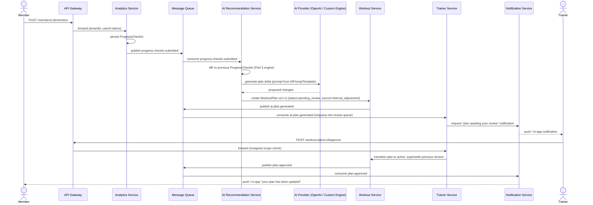
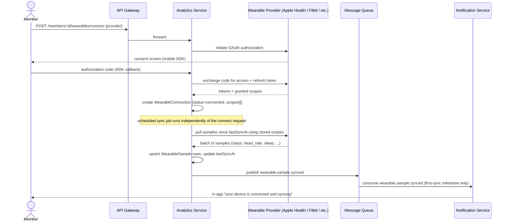

# Part 9 — Microservice Architecture & API Specifications

> **Document set:** this is Part 9 of a 13-part architecture-level PRD for the *AI-Powered Fitness
> Ecosystem*. Where [Part 8](./08-database-architecture.md) fixed the data layer, this part fixes
> the service topology and the API surface above it: which of the thirteen services in the original
> brief's diagram owns which [Part 1](./01-rbac-and-data-model.md) entity, how the API Gateway
> mediates every client request — including, non-negotiably, every request that reaches an AI
> provider — and the message-queue events that let services react to each other without becoming a
> single point of failure. See [`README.md`](./README.md) for the full part list and reading order.

---

## 1. From a Pipeline to a Service Graph

The original ecosystem brief drew the backend as a straight line: Mobile App → API Gateway →
{Auth, User, Trainer} → AI Recommendation → Workout → Meal Planning → Exercise Library → Video
Management → Notification → Analytics → Admin → Payment → Chat → the data layer. Read literally,
that implies a request-response chain in which, say, submitting a progress check-in passes through
Meal Planning and Video Management on its way to a notification. It doesn't. Specifying this
backend properly means replacing that pipeline with what it actually is: **thirteen independently
deployable services sitting behind one gateway**, most of which never call most of the others,
sharing one PostgreSQL cluster (Part 8 §3–4) rather than one database per service — because Part 8
already established that cross-entity transactional integrity (approving a plan updates
`WorkoutPlan`, writes an `AuditLogEntry`, and enqueues a `Notification` as one logical operation)
matters more here than deployment independence at the storage layer.

"Owns," in the table below, means *is the sole business-logic authority and write path for* — not
*has a private database*. A service other than the owner never writes to that entity's table
directly; it either calls the owning service's API or reacts to an event the owner published (§6).
This is what keeps thirteen services from becoming thirteen copies of the same scope-check logic
scattered across the codebase, which is precisely the failure mode Part 1 §5 warns about.

## 2. Service Boundaries

| Service | Responsibility | Entities owned (Part 1 §3) | Calls downstream |
|---|---|---|---|
| **Auth Service** | Authenticate every identity, issue and rotate tokens, hold the RBAC matrix as data | `User` (credentials, session, status transitions), the role/permission matrix (Part 1 §2 as data, Part 1 §2.4) | User Service (bootstrap a blank profile on register), Notification Service (verification/welcome messages) |
| **User Service** | Own the member's profile surface collected at onboarding | `User` (profile fields), `MemberProfile`, `MedicalProfile`, `LifestyleProfile`, `GymPreference`, `ReferralCode` | Notification Service (profile-completion nudges), Analytics Service (onboarding-complete signal for gamification) |
| **Trainer Service** | Own the trainer-member relationship and everything gated by "Assigned" scope | `TrainerAssignment`, `WorkoutTemplate`, `PlanRevisionRequest` | AI Recommendation Service (request a regeneration), Workout Service & Meal Planning Service (apply an approved/rejected plan transition), Notification Service, Message Queue |
| **AI Recommendation Service** | Mediate every call into the AI Layer; the only service permitted to hold AI-provider credentials | `AIPromptTemplate`, `IntervalRule` | OpenAI / Custom Recommendation Engine (external), Exercise Library Service & Meal Planning Service (ground generation in real catalog data), Workout Service & Meal Planning Service (persist generated draft versions), Message Queue |
| **Workout Service** | Own the workout-plan version chain | `WorkoutPlan` (incl. embedded `WorkoutDay`) | Exercise Library Service (resolve/validate `exerciseId` references), Notification Service, Message Queue |
| **Meal Planning Service** | Own the diet-plan version chain and the meal catalog | `DietPlan`, `Meal` | Notification Service, Message Queue |
| **Exercise Library Service** | Own the exercise catalog, tenant-authored and global | `Exercise` | Video Management Service (resolve media URLs), Admin Service (route `pending_approval` trainer-authored content) |
| **Video Management Service** | Own the media pipeline — upload, transcode, CDN issuance — for every entity with a `media{}` field | *(infrastructure service; no Part 1 entity of its own — owns the object-storage lifecycle behind `Exercise.media`, `Meal.media`, `ProgressCheckIn.photos[]`)* | Object storage (Azure Blob / AWS S3), CDN |
| **Notification Service** | Own delivery of every user-facing notification across channels | `Notification` | Push/email/SMS providers (external) |
| **Analytics Service** | Own progress, wearables, and gamification state | `ProgressCheckIn`, `BodyMetric`, `WearableConnection`, `WearableSample`, `GamificationState`, `Challenge`, `Badge` | Wearable providers (Apple Health, Google Health Connect, Fitbit, Garmin, Samsung Health — external), AI Recommendation Service (progress data feeds regeneration via events, §6), Trainer Service (adherence alerts) |
| **Admin Service** | Own tenant/branch administration, moderation, and CMS; surface Super Admin's Global-scope consoles | `Tenant`, `Branch`, `ModerationFlag`, `ContentArticle`, `Sponsor`, `FeatureFlag` | Payment Service (tenant billing views), User Service, Trainer Service (approve/suspend), Auth Service (RBAC console) |
| **Payment Service** | Own billing, subscriptions, and the payment-provider integration | `Membership`, `MembershipPlan`, `PaymentEvent` | Stripe (external, PCI-compliant processor per Part 0 §2), Notification Service, Message Queue |
| **Chat Service** | Own the AI Chat Coach conversation surface | `ChatConversation`, `ChatMessage` | AI Recommendation Service (server-mediated AI reply, §3), Trainer Service (`escalatedToTrainer` handoff) |

Two entities are deliberately cross-cutting rather than single-owned. **`AuditLogEntry`** is written
by *every* service — via a shared audit-write library each service links against, not a network
call — while Admin Service owns only the *query/console* surface Super Admin uses to read it (Part
1 §2.4). **`FeatureFlag`** and **`AIPromptTemplate`**/**`IntervalRule`** are edited exclusively
through Super Admin's Global-scope routes in Admin Service's console, but the underlying rows live
in the service that actually consumes them at runtime (Admin Service for `FeatureFlag`, since it
gates admin/tenant feature rollout; AI Recommendation Service for the prompt library and interval
cadence, since regeneration logic reads them on every cycle) — editing and owning are different
questions, and this spec keeps them separate on purpose so a prompt rollback (Part 1 §2.4: "a
version pointer flip, not a redeploy") never requires touching Admin Service's deploy at all.

## 3. API Gateway Responsibilities

The gateway is the only network-reachable entry point for client traffic; no service in §2 accepts
a connection directly from a mobile app, web client, or third party. Four responsibilities:

**Token verification and passthrough.** The gateway verifies the signature and expiry of every
access token issued by Auth Service, decodes its `userId`/`role`/`tenantId` claims, and passes them
downstream as trusted, signed internal headers. Services never re-verify the token signature
themselves — they trust the gateway boundary — which is exactly why the gateway must be the one
component every request provably passes through, and why a client-side or direct-to-service call
that skipped it would break every scope check described in Part 1 §5.

**Per-tier rate limiting.** The gateway enforces coarse request-rate limits keyed by the caller's
subscription tier (Free / Premium / Trainer / Gym Enterprise, Part 0 §3.2) using a Redis
token-bucket per tenant and tier (Part 8 §3). This is deliberately coarse — it protects the platform
from abusive request volume, not from a Free-tier member exceeding their "1 AI generation per
interval cycle" quota, which the gateway has no domain knowledge of. Fine-grained, domain-specific
caps (the interval-cycle quota, the AI Chat Coach's daily message cap) are enforced inside AI
Recommendation Service and Chat Service against the member's actual usage counters, not at the
gateway.

**Request routing.** A path-prefix routing table maps each incoming path to exactly one owning
service — `/auth/*` → Auth Service, `/members/*/workout-plans/*` → Workout Service,
`/superadmin/*` → Admin Service's Global-scope routes, and so on for every service in §2. The
gateway does not fan a single client request out to multiple services; each request resolves to
one owning service, which then makes whatever downstream calls its own logic requires (§2's "calls
downstream" column).

**AI provider isolation — a hard security requirement, not a performance optimization.** No AI
provider (OpenAI, or the custom recommendation engine) is ever reachable from a client directly,
under any circumstance. Every path that produces an AI output — `WorkoutPlan`/`DietPlan` generation,
`ChatMessage` assistant replies — is `Client → API Gateway → a domain service (Workout Service, Meal
Planning Service, or Chat Service) → AI Recommendation Service → the AI provider`, never
`Client → AI Recommendation Service` and never `Client → provider` directly. Four reasons, all
load-bearing:

1. **Credential custody.** API keys for the AI provider live only in AI Recommendation Service's
   runtime secrets store, never shipped inside a mobile or web client binary where they could be
   extracted.
2. **Prompt confidentiality.** `AIPromptTemplate` content (Part 1 §3.6) is the platform's actual
   prompt-engineering work product. It never leaves the server, where a competitor — or a curious
   member inspecting network traffic — could otherwise extract it verbatim.
3. **Attribution and billing.** Every AI call must be attributable to a `tenantId` for
   usage-based-overage billing (Part 0 §3.1) and checked against the caller's tier quota before the
   platform incurs a token cost it can't recover.
4. **Safety gating.** Fallback-provider ordering and safety thresholds (Part 5 §7) must run before a
   response ever reaches a member, which is only enforceable if every response is forced through the
   one service that owns that logic.

This boundary is a hard security requirement carried into Part 10's threat model (prompt injection
via user-supplied check-in notes or chat input, API-key exfiltration, and why any client-side path
to the AI layer would defeat every one of the four protections above).

## 4. REST API Surface

The table below is representative, not exhaustive — it covers every capability named in Part 1 §2's
permission matrix that has a corresponding client-facing action, grouped by owning service, with
auth scope expressed as **Role — Scope** per Part 1 §1.1 (Own/Assigned/Tenant/Global).

| Service | Method | Path | Auth scope | Purpose |
|---|---|---|---|---|
| Auth | POST | `/auth/register` | Public | Create a new `User` account (member self-serve, or a trainer application entering `pending_approval`) |
| Auth | POST | `/auth/login` | Public | Authenticate with email + password, issue an access/refresh token pair |
| Auth | POST | `/auth/refresh` | Member/Trainer/Admin/Super Admin — Own | Rotate an access token using a valid, unexpired refresh token |
| Auth | POST | `/auth/qr-pair` | Member — Own | Complete first-login device activation via QR pairing code (Part 1 §2.1) |
| User | GET | `/users/me` | Member/Trainer/Admin — Own | Fetch the caller's own `User` record plus profile bundle |
| User | PUT | `/users/me/profile` | Member — Own | Edit `MemberProfile` fields (goals, experience level, split preference, weekly availability) |
| User | PUT | `/users/me/medical-profile` | Member — Own | Edit `MedicalProfile` (injuries, surgeries, chronic conditions, allergies, medications) |
| User | PUT | `/users/me/lifestyle` | Member — Own | Edit `LifestyleProfile` and `GymPreference` |
| Trainer | POST | `/trainer-requests` | Member — Own | Request a new trainer assignment or a change of assigned trainer |
| Trainer | POST | `/trainer-requests/:id/approve` | Admin — Tenant | Fulfill a member's request: end the prior assignment, create the new `active` `TrainerAssignment` |
| Trainer | GET | `/trainers/:trainerId/roster` | Trainer — Assigned | List members with an `active` `TrainerAssignment` to this trainer — never a tenant-wide query (Part 1 §2.2) |
| Trainer | GET | `/trainer-assignments/:id` | Trainer/Admin — Assigned/Tenant | Get a single assignment's detail and status history |
| Workout | POST | `/members/:memberId/workout-plans/generate` | Member/Trainer — Own/Assigned | Trigger AI generation of a new `WorkoutPlan` version (`source`: initial, interval_adjustment, or manual_request) |
| Workout | GET | `/members/:memberId/workout-plans` | Member/Trainer — Own/Assigned | List a member's `WorkoutPlan` versions, newest first |
| Workout | GET | `/workout-plans/:id` | Member/Trainer — Own/Assigned | Get one `WorkoutPlan` version including its `days[]` |
| Workout | POST | `/workout-plans/:id/approve` | Trainer — Assigned | Approve a `pending_review` plan; transitions it to `active` and marks the prior version `superseded` |
| Workout | POST | `/workout-plans/:id/reject` | Trainer — Assigned | Reject a `pending_review` plan with notes; routes back to AI Recommendation Service |
| Meal Planning | POST | `/members/:memberId/diet-plans/generate` | Member/Trainer — Own/Assigned | Trigger AI generation of a new `DietPlan` version |
| Meal Planning | GET | `/members/:memberId/diet-plans` | Member/Trainer — Own/Assigned | List a member's `DietPlan` versions |
| Meal Planning | GET | `/diet-plans/:id` | Member/Trainer — Own/Assigned | Get one `DietPlan` version including `dailyTargets` and `meals[]` |
| Meal Planning | POST | `/meals` | Trainer — Own tenant library | Create a tenant-authored `Meal` |
| Meal Planning | GET | `/meals/:id` | Member/Trainer — Tenant + Global | Get one `Meal`'s detail, including macros and `media{}` |
| Meal Planning | PUT | `/meals/:id` | Trainer/Admin — Own tenant library / Tenant | Edit a `Meal` |
| Meal Planning | DELETE | `/meals/:id` | Admin — Tenant | Soft-delete a tenant `Meal` |
| Exercise Library | POST | `/exercises` | Trainer — Own tenant library | Create a tenant-authored `Exercise` (enters `pending_approval` if the tenant requires review) |
| Exercise Library | GET | `/exercises` | Member/Trainer — Tenant + Global | Browse the exercise library (tenant-scoped rows plus the global library) |
| Exercise Library | GET | `/exercises/:id` | Member/Trainer — Tenant + Global | Get one `Exercise`'s detail, including `media{}` |
| Exercise Library | PUT | `/exercises/:id` | Trainer/Admin — Own tenant library / Tenant | Edit a tenant-owned `Exercise` |
| Exercise Library | DELETE | `/exercises/:id` | Admin — Tenant | Soft-delete a tenant `Exercise` (never affects the global library) |
| Analytics | POST | `/members/:memberId/checkins` | Member — Own | Submit a `ProgressCheckIn` for the current interval |
| Analytics | GET | `/members/:memberId/checkins` | Member/Trainer — Own/Assigned | Progress check-in history for a member |
| Analytics | POST | `/members/:memberId/wearables/connect` | Member — Own | Create a `WearableConnection` (OAuth handoff to the provider) |
| Analytics | POST | `/wearables/:connectionId/sync` | Member — Own | Trigger, or report the result of, a background `WearableSample` sync batch |
| Chat | POST | `/chat/conversations/:id/messages` | Member — Own | Send a `ChatMessage` to the AI Coach (server-mediated, §3) |
| Notification | GET | `/notifications` | Member/Trainer/Admin — Own | List the caller's `Notification` records |
| Notification | POST | `/notifications/:id/read` | Member/Trainer/Admin — Own | Mark a `Notification` as read |
| Admin | POST | `/admin/trainers/:id/approve` | Admin — Tenant | Approve a `pending_approval` trainer account, unlocking `TrainerAssignment` eligibility |
| Payment | POST | `/payments/checkout` | Member/Admin — Own/Tenant | Create a checkout session against a `MembershipPlan` |
| Payment | POST | `/payments/webhook` | Public (provider-signed) | Ingest a `PaymentEvent` from the payment provider's webhook |
| Super Admin | GET | `/superadmin/feature-flags` | Super Admin — Global | List/inspect `FeatureFlag` rollout configuration |
| Super Admin | PUT | `/superadmin/feature-flags/:key` | Super Admin — Global | Update a `FeatureFlag`'s `rolloutMode` |
| Super Admin | PUT | `/superadmin/prompt-library/:key` | Super Admin — Global | Publish a new `AIPromptTemplate` version (rollback is a version-pointer flip, Part 1 §2.4) |
| Super Admin | GET | `/superadmin/audit-logs` | Super Admin — Global | Query `AuditLogEntry` across every tenant |

Forty-three endpoints across twelve services; Video Management Service is deliberately absent from
this table because it exposes no member/trainer/admin-facing route of its own — every media
operation is reached indirectly through an `Exercise`, `Meal`, or `ProgressCheckIn` upload URL that
Video Management issues on the owning service's behalf.

Three conventions apply uniformly across every route above, omitted from the table for
readability but binding on every service's implementation:

- **Versioning.** Every path is served under a `/v1/` prefix. A breaking change to one resource's
  shape ships as `/v2/` for that resource alone, not a platform-wide cutover — consistent with Part
  0's "four cockpits, one platform" principle, an old mobile build keeps working against `/v1/`
  while a newer client adopts `/v2/` for the one resource that changed, with no forced simultaneous
  release across mobile, web, trainer, and admin clients.
- **Pagination.** List endpoints (`GET /members/:memberId/workout-plans`,
  `GET /trainers/:trainerId/roster`, `GET /notifications`, `GET /superadmin/audit-logs`) use
  cursor-based pagination (`?cursor=…&limit=…`) rather than offset-based. Several of these lists are
  high-cardinality and append-heavy — `AuditLogEntry` most of all — and offset pagination against a
  table still being written to produces skipped or duplicated rows across pages; a cursor anchored
  on `(createdAt, id)` doesn't have that failure mode.
- **Idempotency.** `POST /members/:memberId/workout-plans/generate`,
  `POST /members/:memberId/diet-plans/generate`, and `POST /payments/checkout` all require a
  client-supplied `Idempotency-Key` header, because all three are retryable from a flaky mobile
  connection or a double-tapped button, and none of the three should ever fire twice by accident —
  a second `WorkoutPlan` version silently generated, or a member double-charged. The owning service
  persists a short-lived key-to-response mapping in Redis (Part 8 §3) and replays the original
  response for a duplicate key rather than repeating the underlying side effect.

## 5. Sequence Diagrams

### 5.1 Interval check-in → AI regeneration → trainer review

This is the platform's signature loop (Part 0 §1: "closed-loop programming, not one-shot
generation"). A member's check-in eventually reaches a trainer's review queue with no synchronous
call spanning more than one hop — every service boundary in the middle is crossed via the Message
Queue, so a slow or unavailable AI Recommendation Service degrades to a delayed regeneration, never
a failed check-in submission.

### 5.2 Wearable connect + first background sync

Connection setup is synchronous (the member is waiting on it); sample ingestion is not — the first
sync happens on a scheduler, independent of the connect request, so a slow provider API never blocks
the UI that just confirmed the connection.

## 6. Event Catalog (Message Queue)

Every event below carries `tenantId` and the relevant entity id in its payload, so a consumer can
re-derive full context without a synchronous callback to the producer — the point of the queue is
that producer and consumer never need to be online at the same instant.

| Event | Producer | Consumer(s) | Fires when |
|---|---|---|---|
| `progress.checkin.submitted` | Analytics Service | AI Recommendation Service | A member submits a `ProgressCheckIn` for the current interval |
| `ai.plan.generated` | Workout Service, Meal Planning Service | Trainer Service, Notification Service | AI Recommendation Service persists a new `pending_review` plan version |
| `plan.approved` | Workout Service, Meal Planning Service | Notification Service, Analytics Service | A trainer transitions a plan to `active` (or auto-approval logic does, for unassigned Free-tier members, per Part 0 §1) |
| `plan.rejected` | Workout Service, Meal Planning Service | AI Recommendation Service, Notification Service | A trainer rejects a `pending_review` plan with notes |
| `trainer.assignment.changed` | Trainer Service | Notification Service, Chat Service, Analytics Service | A `TrainerAssignment` is created, ended, or moves to `change_requested` |
| `payment.subscription.renewed` | Payment Service | Notification Service, Admin Service | A `PaymentEvent` of type renewal succeeds against an active `Membership` |
| `payment.subscription.failed` | Payment Service | Notification Service, Admin Service | A renewal charge fails; starts the tenant's `gracePeriodDays` countdown (Part 1 §3.1) |
| `trainer.approval.requested` | Auth Service | Admin Service, Notification Service | A new trainer account is created in `pending_approval` status |
| `moderation.flag.raised` | Any content-accepting service | Admin Service | A `ModerationFlag` is created against uploaded content or a message |
| `wearable.sample.synced` | Analytics Service | Notification Service (first-sync milestone only), Analytics Service (gamification/streak update) | A background sync batch persists new `WearableSample` rows |

Chat Service's `ChatMessage.escalatedToTrainer` path is deliberately **not** event-driven: an
escalation is a direct, synchronous call from Chat Service to Trainer Service, because a member who
just told the AI Coach about a sharp pain mid-set needs the assigned trainer notified with the same
urgency guarantee as any other real-time message, not best-effort delivery on a queue that could be
backed up behind a batch of `wearable.sample.synced` events.

## 7. Independent Scaling & Failure Isolation

Splitting one backend into thirteen services only pays for itself if a slow or failed service stays
contained to the capability it owns, rather than taking the rest of the platform down with it. The
event-driven boundaries in §6 exist largely for this reason — a synchronous call graph as deep as
§5.1's would mean an AI provider outage blocks check-in submission itself, not just the
regeneration that follows it.

| Service | Primary scaling driver | What happens when it's unavailable |
|---|---|---|
| API Gateway, Auth Service | Every authenticated request on the platform | Platform-wide outage — the one failure mode with no acceptable degraded state, which is why these two are the exception to "independent failure domains" rather than the rule, and why Part 10 specifies multi-region redundancy specifically for them |
| AI Recommendation Service | AI provider latency (seconds, not milliseconds) and the platform's costliest calls | Generation requests queue rather than fail; regenerations arrive late and `ai.plan.generated` fires late, but no caller ever blocks on it past the check-in submission response, because everything past Analytics Service's initial write is queue-mediated (§5.1) |
| Workout Service, Meal Planning Service | Write volume roughly proportional to active regenerations plus manual trainer authoring | A short outage delays plan finalization; queued `ai.plan.generated` / `plan.approved` events replay once the service recovers, since the Message Queue retains unacknowledged messages rather than dropping them |
| Chat Service | Concurrent conversation volume, tier-gated message caps | Members see a "coach temporarily unavailable" state; `WorkoutPlan`/`DietPlan`/billing state are entirely unaffected, since Chat Service's entities don't gate anything outside themselves |
| Video Management Service | Upload/transcode throughput, bursty around content-authoring pushes | New uploads fail visibly to the uploader at the time of upload; media already persisted to object storage keeps serving from the CDN regardless |
| Payment Service | Webhook volume plus checkout session creation | Must never silently drop a webhook: Payment Service acknowledges provider webhooks synchronously inside the request and persists the resulting `PaymentEvent` in the same transaction, with the provider's own retry-on-failure guarantee as the backstop rather than the Message Queue |

The pattern across every row above is the same one Part 8 §4 used for tenant isolation: push the
guarantee down to the layer built to hold it — the Message Queue's redelivery guarantee for
service-to-service events, the payment provider's webhook-retry guarantee for billing, the CDN's
own availability for already-published media — rather than each service re-implementing its own
retry and backoff logic against every other service it calls.

---

**Previous:** [Part 8 — Database Architecture](./08-database-architecture.md)
**Next:** [Part 10 — Security & Compliance](./10-security-and-compliance.md)
