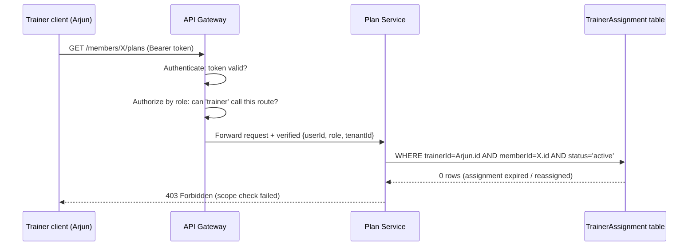
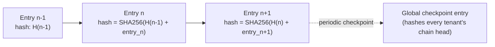

# Part 10 — Security & Compliance

> **Document set:** this is Part 10 of a 13-part architecture-level PRD for the *AI-Powered Fitness
> Ecosystem*. It specifies the security, privacy, and compliance posture every other part is
> written against: the enforcement pattern of Part 1 §5, the `AuditLogEntry`/`ModerationFlag`
> entities of Part 1 §3.8, the health-data obligations Part 6 §4.4 defers here, and the
> "Full Part 10 treatment" Part 12 assumes exists. See [`README.md`](./README.md) for the full part
> list and reading order. This part assumes Part 8's shared-schema-plus-`tenantId` PostgreSQL model
> and Part 9's 13-service architecture behind an API Gateway, message queue, and object storage,
> and does not redefine either.

---

## 1. RBAC Enforcement: Gateway and Per-Service Responsibilities

Part 1 §5 defines three checks every route handler applies, in order: **authenticate**,
**authorize by role**, **authorize by scope**. These do not all happen in one place, and knowing
which layer owns which check is itself a security control — a service that assumes the Gateway
already finished the job, when the Gateway only did *part* of it, is exactly how a scope leak
ships to production.

**At the API Gateway (Part 9):**

1. **Authenticate.** The Gateway terminates TLS and validates the caller's access token (signature,
   expiry, revocation) before anything else runs. An invalid or expired token never reaches a
   service — the Gateway returns 401 directly.
2. **Authorize by role, coarsely.** The Gateway holds a route-level policy table (`role` → allowed
   route patterns) and rejects a call that a role can *never* make — a `member` token hitting
   `POST /admin/trainers/approve` gets a 403 at the edge, no service involved. This is a coarse,
   route-shape check only: "can this role ever call this kind of endpoint," never "can this caller
   touch this record."
3. **Attach verified identity.** On a pass, the Gateway injects the token's verified `userId`,
   `role`, and `tenantId` as signed, internal-only context (never trusted from client-supplied
   headers) onto the downstream request, so services never re-verify the token themselves.

**At the owning service (Part 9):**

4. **Authorize by scope — the check the Gateway structurally cannot make.** Whether an `Own`,
   `Assigned`, `Tenant`, or `Global` relationship holds for *this specific record* depends on domain
   data the Gateway does not have — an active `TrainerAssignment` row, a `tenantId` column on the
   target, a `MedicalProfile.userId` match. This lives inside the service that owns the resource,
   at the data-access layer, on every read and write — never cached from a prior authorization,
   never inferred from tenant membership alone.

### Worked example: a role-check pass that must still fail on scope

Arjun (Part 0's trainer persona) calls `GET /members/:memberId/plans` for a member, `X`, at his
own gym. Walk the three checks:

1. **Authenticate** — Arjun's token is valid, unexpired, unrevoked. Pass.
2. **Authorize by role** — `trainer` is a role that is allowed to call this route shape at all
   (Part 1 §2.2, "View / review AI-generated workout & meal plans"). Pass, at the Gateway.
3. **Authorize by scope** — the Plan Service, which owns `WorkoutPlan`/`DietPlan`, runs the query
   Part 1 §2.2 mandates for this exact capability: `WHERE trainerId = Arjun.id AND memberId = X.id
   AND status = 'active'` against `TrainerAssignment`. Suppose `X` was reassigned to a different
   trainer last month — the row for Arjun now has `status: expired` or `status: change_requested`,
   and the currently `active` row points at someone else. No qualifying row exists. **Scope check
   fails. 403, even though Arjun and `X` share a `tenantId`.**

That last clause is the entire point of Part 1 §2.2's warning against `WHERE tenantId =
:self.tenantId` as a trainer-roster query: tenant membership is necessary but never sufficient.
Part 3 §1 makes the same point client-side — a trainer editing the DOM to reveal a hidden
"all members" view still gets a 403, because enforcement is server-side and per-record.



---

## 2. The Audit Trail: What Gets Logged, and Why It Can't Be Edited

`AuditLogEntry` (Part 1 §3.8: `{ id, actorId, actorRole, action, targetType, targetId, tenantId,
beforeState?, afterState?, ip, createdAt }`) is the platform's single source of truth for "who did
what, to what, when" — and it is the thing Devraj (Part 0's Super Admin persona) says would make
him escalate to engineering at 2 a.m. if it ever had a gap in it.

### 2.1 What must write an entry

Per Part 1 §1.1, **any Global-scope action is always audited** — that is the baseline rule, not an
exception. On top of that baseline, this part requires an entry for every action below, regardless
of which service handles it:

| Action | Actor / scope | Source |
|---|---|---|
| Role changes on a `User` | Super Admin, Global | Part 1 §2.4 |
| Trainer account approval / suspension | Admin, Tenant | Part 1 §2.3; Part 3 Trainer Management |
| `TrainerAssignment` creation, esp. resolving `change_requested` | Admin, Tenant | Part 1 §3.3, "never a silent overwrite" |
| AI plan approval, edit, override, or rejection | Trainer, Assigned | Part 1 §2.2 |
| `ModerationFlag` actioned / dismissed | Admin or Super Admin, Tenant / Global | Part 1 §2.3, §3.11; Part 3 Meal/Exercise Approval |
| Payment refunds and subscription cancellations | Admin (Tenant) or Super Admin (Global) | Part 1 §2.3, §2.4 |
| Feature-flag changes | Super Admin, Global | Part 1 §2.4, §3.6 `FeatureFlag` |
| AI Prompt Library edits (publish/rollback) | Super Admin, Global | Part 1 §2.4, §3.6 `AIPromptTemplate` |
| Backup / restore triggers | Super Admin, Global | Part 1 §2.4, two-person-confirmed |
| Any Super Admin action crossing a tenant boundary | Super Admin, Global | Part 1 §1.1 blanket rule |

Every entry captures `beforeState`/`afterState` where the action mutates a record, so an
investigator can see the actual delta, not just that "something changed."

### 2.2 Append-only, by design

`AuditLogEntry` has no update or delete path at the API layer, in the schema, or in any service's
data-access code — Part 1 §2.4 states this as flatly as a permission matrix can: audit entries are
"never editable or deletable by any role," including Super Admin, who can only ever *read* the log
(Global scope, read-only). This is deliberate: the value of an audit trail is that it is
independent evidence, evidence that survives even if the account that performed the action is
later compromised, and evidence a regulator or a member in a billing dispute can be shown without
also having to trust that nobody edited it afterward. A log editable by the roles it's meant to
hold accountable is not an audit log — it's a diary.

### 2.3 Hardening beyond insert-only: hash-chaining

Insert-only at the application layer is necessary but not sufficient — it stops an ordinary API
call from mutating history, but doesn't prove no row was altered by a direct database operation (a
compromised credential, a bad migration, a `DBA`-privileged insider). The recommended hardening is
**hash-chaining each entry to the one before it**:

```
entryHash[n] = SHA-256( entryHash[n-1] || canonical_serialize(entry[n] minus entryHash) )
```

Each `AuditLogEntry` stores its own `entryHash` alongside a pointer to the previous entry's hash.
Altering, reordering, or deleting any historical row breaks the chain from that point forward, and
a periodic background verification job — owned by the Platform Admin & Audit Service (Part 9) —
recomputes hashes to confirm nothing drifted. A mismatch pages the on-call security rotation
immediately as a suspected integrity breach (§7.2) — "the audit log itself might be lying" is
exactly the failure mode this hardening exists to catch.

Because the platform is multi-tenant (Part 8's shared-schema-plus-`tenantId` model), chain the log
**per tenant** rather than as one global sequence — a single global chain would let any tenant
infer another tenant's audit volume from gaps in shared sequence numbers, an avoidable
cross-tenant leak. The Platform Admin & Audit Service then writes a periodic **global checkpoint
entry** — itself an `AuditLogEntry` with `actorRole: superadmin` and `tenantId: null` — whose
`afterState` records every tenant's current chain-head hash. Verifying one checkpoint confirms no
tenant's chain has been tampered with since the last one, without exposing any tenant's sequence to
another.



---

## 3. Secrets Management: AI Provider Keys Never Leave the Server

**No AI provider key of any kind — Anthropic, OpenAI, or any other configured provider — is ever
present in a mobile build, a web bundle, or any client-executable artifact.** Every call to an LLM
provider is proxied through the AI Recommendation Service (Part 9); only that service (and, for
chat specifically, the AI Chat Coach Service) holds provider credentials, injected at runtime from
a server-side secret store (Azure Key Vault in this document set's primary cloud target — see Part
11 — with AWS Secrets Manager as the portable equivalent), never from a build-time environment file
baked into a client package.

This is a hard architectural boundary, not a coding-standard reminder, because it is a proven,
hard-won lesson in this exact product family: an earlier real build in the BarBellix lineage
shipped an AI provider key directly inside a client build and had to catch and fix it before
launch. That failure mode is easy to reintroduce by accident — a key hard-coded "temporarily" into
a build config, a bundler inlining an `.env` value into a public JS chunk — and code review alone
isn't reliable against it, because the mistake compiles and looks correct in a demo. The control
that holds is architectural: **the client applications have no code path that calls an AI provider
directly, at all**, so there is no configuration surface where a key could land even by mistake.
Every AI Chat Coach message and plan-generation request is a call to the platform's own API
Gateway, routed to the AI Recommendation Service or AI Chat Coach Service; the client never learns
which provider, model, or credential served it.

Supporting practices, all server-side:

- **Least privilege and rotation** — provider keys are scoped to only the operations the calling
  service needs, rotated on a fixed schedule and immediately on any suspected exposure.
- **Managed identity over static secrets** where the cloud platform supports it — an AKS workload
  identity or IAM role assumption beats a static key in a secret store, wherever the SDK allows it.
- **No secrets in logs or `AuditLogEntry`** — `beforeState`/`afterState` on any entry touching AI
  configuration (`AIPromptTemplate`, provider/model selection, Part 1 §2.4) is redacted of
  credential material, and no service logs a full authorization header at any log level.
- **CI/CD secret scanning** (Part 11 §3) exists specifically to catch a regression of this exact
  failure mode before it reaches a build artifact.

---

## 4. Data Protection, Health Data & Regulatory Compliance

### 4.1 What counts as sensitive here

`MedicalProfile` (`injuries[], surgeries[], chronicConditions[], allergies[], medications[]`,
Part 1 §3.2), the measurement/photo fields on `ProgressCheckIn`/`BodyMetric` (Part 1 §3.5), and
synced `WearableSample` health metrics (Part 1 §3.5, Part 6 §4) are sensitive personal data under
any regime, treated as such uniformly. The Platform is **not a HIPAA-covered entity** in the US
healthcare-provider/business-associate sense — it does not diagnose, treat, or bill insurance
(Part 0 §2's non-goal) — but every medical field gets HIPAA-equivalent-care handling regardless:
the encryption posture of §5, the tightened `Own`/`Assigned`-only scope of §1 with no `Tenant`-scope
read path for medical fields, and access logged as sensitively as any Global-scope action.

### 4.2 GDPR, DPDP, and CCPA — overlapping obligations, one pipeline

Three regimes govern this data given the Platform's stated user base — notably Ritika, Part 0's
member persona, based in Bengaluru:

- **GDPR (EU).** Applies to any EU-resident member regardless of Platform headquarters. Requires a
  documented lawful basis for `MedicalProfile` processing (explicit consent, given its
  special-category status under Art. 9), a Data Protection Impact Assessment before health-data
  processing goes live, and the full Art. 15–21 rights: access, rectification, erasure,
  restriction, portability, objection.
- **India's DPDP Act 2023** — most directly relevant given Ritika's Bengaluru base. The Platform is
  a **Data Fiduciary**, Ritika a **Data Principal**. DPDP has no separate "sensitive personal data"
  tier as GDPR does — but its **Significant Data Fiduciary** designation weighs volume and
  sensitivity of data processed, and health-adjacent data is a named example in that provision's
  framing. This part treats `MedicalProfile` with GDPR-equivalent rigor under DPDP as policy, not
  because the Act mandates a separate tier. Rights include access, correction, erasure, and
  grievance redressal, escalating to the **Data Protection Board of India** if unresolved.
- **CCPA/CPRA (California).** Classifies health information as **sensitive personal information**,
  distinct from ordinary personal data. Grants rights to know/access, delete, correct, opt out of
  sale/sharing, and limit use of sensitive information. The Platform doesn't sell data or broker
  it — Marketplace/Sponsorship (Part 0 §3.1) is placement-based, not a data sale — but every other
  right is honored regardless.

Because the three regimes' rights overlap heavily (access/export and erasure are the common core
across all three), the Platform implements **one Data Subject Rights (DSR) pipeline**, owned by the
Platform Admin & Audit Service, rather than three regime-specific ones:

- **Right to access / export.** A DSR export fans out across every service owning a slice of the
  member's data under Part 8's shared-schema-plus-`tenantId` model — `MemberProfile`,
  `MedicalProfile`, `LifestyleProfile`, `GymPreference`, every `ProgressCheckIn`/`BodyMetric` row,
  the full `WorkoutPlan`/`DietPlan` version history, `ChatConversation`/`ChatMessage`,
  `WearableConnection`/`WearableSample`, `PaymentEvent`, `Notification`, `GamificationState` — and
  compiles one structured export, fulfilling GDPR Art. 15/20, DPDP's access right, and CCPA's
  right-to-know/portability in a single code path.
- **Right to erasure** — covered in §4.3, because what erasure actually *does* is where these
  rights collide with the Platform's own audit obligations.

### 4.3 What erasure actually does — and the tension it creates

An erasure request hard-deletes the member's PII from every profile and content table it appears
in — `MemberProfile`, `MedicalProfile`, `LifestyleProfile`, `GymPreference`, `ChatMessage`
content — and purges progress photos and other media from object storage (Part 9). It also revokes
every `WearableConnection` and deletes its `WearableSample` history rather than merely marking the
connection `revoked` (fulfilling the "right-to-revoke and associated data deletion" requirement
Part 6 §4.4 defers to this part).

**`AuditLogEntry` rows that reference the deleted user are anonymized, not deleted.** The
`actorId`/`targetId` fields on any historical entry are replaced with a stable, per-deletion
pseudonymous placeholder, and any PII embedded inside `beforeState`/`afterState` JSON is redacted,
but the entry itself — its `action`, `targetType`, `tenantId`, and `createdAt` — is preserved.

This is a deliberate tension, worth stating plainly: **erasure rights are not absolute under any of
the three regimes.** GDPR Art. 17(3) exempts erasure that conflicts with a controller's own legal
obligations or the defense of legal claims; DPDP and CCPA similarly let a fiduciary/business's own
record-keeping obligations override an erasure request for specific record types. Two Platform
obligations pull that way: **audit integrity** — removing an entry from the hash chain (§2.3)
breaks the chain for every entry after it, worse for every other member's audit trail than
anonymizing the one row in place — and **financial retention** — `PaymentEvent`-linked entries
carry independent retention obligations, typically around seven years, regardless of an erasure
request.

The resolution: **the member's own profile, content, and media are fully deleted; the fact that an
action occurred, against an anonymized placeholder, is preserved.** A member exercising erasure
loses their data; the evidentiary record of what happened to their account does not disappear,
because it protects the audit system every other member and regulator relies on.

---

## 5. Encryption

**At rest.** The managed PostgreSQL instance (Part 8, Part 11) is encrypted at the disk/volume
level by the cloud provider's managed-database encryption. `MedicalProfile` fields additionally get
application-layer envelope encryption — a KMS-backed data key wraps the sensitive columns before
they reach the database, so a database-credential compromise or misconfigured read-replica doesn't
expose plaintext medical data on its own. Object storage (Azure Blob / AWS S3, Part 11) holding
progress photos and exercise/meal media is encrypted server-side with provider- or
customer-managed keys.

**In transit.** TLS 1.2+ is mandatory everywhere — client-to-Gateway, and, the part most often
skipped, Gateway-to-service and service-to-service inside the cluster too. Service-to-service calls
run over mutual TLS within the container orchestrator's service mesh (Part 11), and every
connection to Postgres, Redis, or the message queue enforces TLS at the driver level rather than
relying on network isolation alone.

---

## 6. Content Moderation

`ModerationFlag` (Part 1 §3.8: `{ id, reporterId, targetType, targetId, reason, status[open|
actioned|dismissed] }`) is how a member or trainer reports content — an `Exercise`, a `Meal`, or
other already-live content. Part 3 already specifies the two admin-facing queues this flows into:
the Admin Portal's **Exercise Approval** and **Meal Approval** screens, where an `open` flag is
scoped to the reporting member's tenant, links to a live preview of the flagged content, and
resolves to `actioned` (content un-published or edited in the same step) or `dismissed` — both
writing an `AuditLogEntry` (§2.1), neither ever silently reopening once resolved. Content owned by
the *global* library (a `null`-tenant `Exercise`/`Meal`, or the global `ContentArticle` editorial
feed, Part 1 §2.4) routes to the Super Admin Portal at Global scope instead.

What this part adds — an SLA target, which Part 3 does not specify:

| Flag category | Target time to action |
|---|---|
| Safety-critical (an AI Chat Coach response contradicting a disclosed injury/medical condition, a dangerous exercise/meal instruction) | **4 business hours** |
| General abuse, spam, harassment, or inaccurate content | **24 hours** |
| Global-scope / platform-library content (lower volume, broader blast radius) | **48 hours** |

A flag unactioned past its SLA auto-escalates — visibility and urgency increase in the reviewing
portal's queue rather than the flag silently aging out — because an unreviewed safety-critical
flag is exactly the kind of gap Devraj's persona (Part 0 §4) treats as a 2 a.m. problem.

---

## 7. Abuse Prevention & Incident Response

### 7.1 Rate limiting on AI endpoints

The AI Chat Coach and plan-generation endpoints are the two most cost- and abuse-exposed surfaces
in the platform, and their limits are the same tier quotas Part 0 §3.2 already defines as product
policy, enforced here as a security control:

- **Free tier:** the daily AI Chat Coach message cap and the one-plan-generation-per-interval-cycle
  limit (Part 0 §3.2) are hard request-count ceilings.
- **Premium tier:** "unlimited" AI regenerations and Chat Coach messages still carry a generous
  soft ceiling with alerting rather than a hard block — unlimited-as-advertised should never mean
  unlimited-as-exploitable, and a soft ceiling catches account-takeover or scripted abuse without
  degrading the honest power user's experience.
- **Gym Enterprise tier:** a dedicated per-tenant AI usage quota (Part 0 §3.2), with usage beyond
  it metered as the Usage-based AI overage stream (Part 0 §3.1) rather than blocked outright.

Enforcement is layered: the Gateway applies a first-pass token-bucket / sliding-window limit per
`userId` + tier, cheaply protecting infrastructure from raw volume; the AI Recommendation Service
and AI Chat Coach Service then independently re-check the caller's actual entitlement against
their live tier record before spending an LLM call — because Part 0 §3.2 names exactly this
failure mode, "storing the tier without ever checking it," as the anti-pattern to avoid.

### 7.2 Incident response

Two scenarios get named on-call paths, because both are things Devraj's persona (Part 0 §4)
explicitly says would escalate to engineering at 2 a.m.:

- **AI provider outage.** The AI Recommendation Service's on-call rotation is paged first; the
  service fails over through its configured provider/model fallback order (Part 1 §2.4) rather
  than surfacing a raw error, and requests degrade to a queued/retry state with member-facing
  messaging instead of a hard failure. Sustained elevated errors auto-escalate to platform
  operations/Super Admin.
- **Suspected tenant-boundary breach** — cross-tenant data observed in a response, an `Assigned` or
  `Tenant` scope check apparently bypassed. Sev-1 immediately: security on-call and Super Admin are
  paged together, the implicated endpoint is frozen via a `FeatureFlag` kill switch (Part 1 §3.6)
  rather than waiting for a deploy, and `AuditLogEntry` plus access logs for the window are pulled
  for the hash-chain verification of §2.3. Once scope is confirmed, breach notification follows
  each regime's timeline in parallel — GDPR's 72-hour authority notice, DPDP's Data Protection
  Board notice, CCPA's breach-notice obligations — since one incident can trigger all three.

---

**Previous:** [Part 9 — Microservice Architecture & API Specifications](./09-microservice-architecture-and-apis.md)
**Next:** [Part 11 — Deployment Architecture & Tech Stack](./11-deployment-architecture-and-tech-stack.md)
