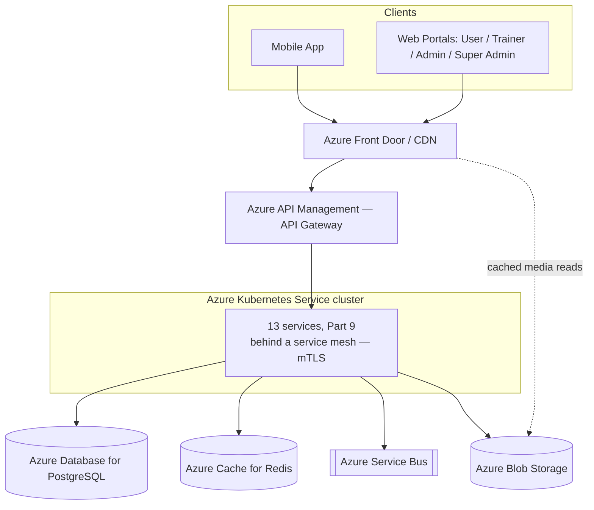
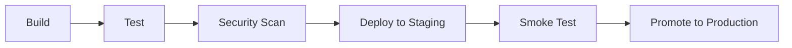

# Part 11 — Deployment Architecture & Tech Stack

> **Document set:** this is Part 11 of a 13-part architecture-level PRD for the *AI-Powered Fitness
> Ecosystem*. It picks the concrete cloud topology, environment strategy, CI/CD pipeline, and
> technology stack for Part 9's 13-service architecture and Part 8's PostgreSQL data platform, and
> resolves the stack decisions earlier parts explicitly deferred here — the mobile framework choice
> (Part 2 §1) and the CI/CD promotion gates Part 12 assumes exist. See [`README.md`](./README.md)
> for the full part list and reading order. Every security control this part's topology must carry
> — server-side-only AI provider keys, TLS everywhere, encryption at rest — is specified in Part 10
> and is not redefined here.

---

## 1. Cloud Architecture

**Azure is the primary target**, matching the original brief's Azure Blob/Azure Service Bus
starting point; an AWS-equivalent service is named in parentheses at every mention so the
architecture stays portable and no part of this document set depends on an Azure-only primitive.
Portability is enforced structurally, not just documented: infrastructure is defined as code
(Bicep, with the same topology expressible in Terraform for an AWS target — Part 11 §4's `/infra`
folder), and every managed service chosen has a direct one-to-one AWS counterpart with equivalent
semantics — no Azure-exclusive PaaS feature (e.g., a proprietary serverless binding) is load-bearing
anywhere in this design. A gym-franchise enterprise buyer with an existing AWS commitment (Part 0
§4's "Aditi" persona) is therefore a re-target of the Terraform layer, not a re-architecture.

| Layer | Azure (primary) | AWS equivalent |
|---|---|---|
| Edge / CDN | Azure Front Door | Amazon CloudFront |
| API Gateway | Azure API Management | Amazon API Gateway / Kong |
| Container orchestrator | Azure Kubernetes Service (AKS) | Amazon EKS |
| Managed database | Azure Database for PostgreSQL – Flexible Server | Amazon RDS for PostgreSQL / Aurora PostgreSQL |
| Managed cache | Azure Cache for Redis | Amazon ElastiCache for Redis |
| Managed message queue | Azure Service Bus | Amazon SQS / RabbitMQ |
| Object storage | Azure Blob Storage | Amazon S3 |
| Secret store | Azure Key Vault | AWS Secrets Manager |
| Observability | Azure Monitor + Application Insights | Amazon CloudWatch |

**Topology, edge to data:** client traffic (mobile, and the four web portals — User, Trainer,
Admin, Super Admin, Part 3) hits Azure Front Door first, which serves cached exercise/meal media
and progress-photo reads straight from its CDN edge and forwards everything else to Azure API
Management. The Gateway does authentication and coarse role authorization (Part 10 §1) and routes
to whichever of Part 9's 13 services owns the resource, each running as an independent deployment
inside one AKS cluster, communicating over a service mesh that terminates mutual TLS between pods
(Part 10 §5). Services share one managed PostgreSQL instance under Part 8's
shared-schema-plus-`tenantId` model, a managed Redis instance for caching and rate-limit counters,
and a managed Service Bus for everything asynchronous: interval check-in triggers, AI
plan-regeneration jobs, notification fan-out, and wearable-sync ingestion. Object storage holds
exercise/meal media and progress photos, with Front Door's CDN layer in front of it for read-heavy
media delivery.



**Scaling.** Each of the 13 services scales independently via Kubernetes Horizontal Pod Autoscaler,
on different signals — most services scale on CPU/memory like any request/response API, but the AI
Recommendation Service and AI Chat Coach Service scale on **in-flight request count** instead,
since their bottleneck is LLM provider latency, not local CPU; a pod handling a slow upstream call
looks idle by CPU metrics while still holding a client connection open. This is also where Part 10
§7.1's tier-based rate limiting and this layer's autoscaling meet: the Gateway's token-bucket limit
caps how much load ever reaches the AI services, and the HPA then absorbs whatever load is admitted
within that cap, rather than the two mechanisms fighting each other.

**Networking.** The AKS cluster, PostgreSQL instance, Redis instance, and Service Bus namespace all
sit inside a private Azure Virtual Network with no public endpoint on the data layer — only the API
Gateway and the CDN are internet-facing. Service-to-data-store traffic reaches Postgres and Redis
over private endpoints rather than the public internet, which is what makes the TLS-everywhere
requirement of Part 10 §5 a defense-in-depth layer on top of network isolation rather than the only
control. AKS node pools span multiple availability zones in production (Part 11 §2's environment
table), and the managed PostgreSQL instance runs with automated backups and point-in-time restore
enabled — the underlying mechanism behind the two-person-confirmed restore capability Part 1 §2.4
grants Super Admin, which is a workflow/authorization control layered on top of this
infrastructure capability, not a replacement for it.

**Disaster recovery.** Production PostgreSQL replicates to a paired Azure region, and object
storage is geo-redundant, so a regional outage does not itself constitute data loss. Recovery is
tested, not assumed: a scheduled restore drill runs against a non-production project on a fixed
cadence, exercising the same two-person-confirmed restore path (Part 1 §2.4) that a real incident
would use, so the first time that path is exercised for real is not during an actual outage.

---

## 2. Environment Strategy

Three environments — dev, staging, production — differing in AI provider configuration, feature
flag defaults, data scale, and infrastructure sizing, not in architecture:

| Aspect | Dev | Staging | Production |
|---|---|---|---|
| AI provider / model | Sandbox / cheapest model (Claude Haiku 4.5) for fast, low-cost iteration | Production model, capped budget/quota for load-testing without runaway spend | Production model (Claude Sonnet 5 primary), full configured fallback order (Part 1 §2.4, Part 10 §7.2) |
| Feature flags | Default **on** for the tenant under active development | Default **off**, flipped on per-flag to rehearse a rollout before it reaches prod | Default **off** platform-wide until explicitly enabled via `FeatureFlag.rolloutMode` (Part 1 §3.6) |
| Data | Synthetic/seeded, reset freely | Synthetic at production-like scale, or an anonymized copy | Real member data, full compliance controls (Part 10 §4) |
| Rate limits / quotas | Relaxed | Production-equivalent, so load tests are representative | Full tier enforcement (Part 10 §7.1) |
| Infrastructure sizing | Single small AKS node pool, shared namespace | Mirrors production topology at reduced scale | Multi-AZ AKS node pools, Postgres, and Redis |

Staging exists specifically to catch what dev cannot: a feature flag's default-off behavior, a
rate limit under realistic load, and a smoke test against the real (not mocked) AI provider path
before anything reaches a paying tenant.

**Configuration and secrets differ by environment, never by code path.** Each environment has its
own Azure Key Vault instance and its own AI provider credentials (Part 10 §3), injected into the
same container image via environment-specific Kubernetes secrets — the application code that calls
the AI Recommendation Service never branches on which environment it's running in; only the
injected model name and credential differ. This is deliberate: a code path that says "if
production, do X" is a code path that can silently diverge from what staging actually tested. The
same principle governs `FeatureFlag` defaults — the flag's default-off production behavior and its
staging rehearsal are the same code, gated by the same `rolloutMode` mechanism (Part 1 §3.6), not a
separate staging-only branch.

---

## 3. CI/CD Pipeline

Because Part 9 defines 13 independently deployable services, each service owns its own pipeline
instance rather than sharing one monolithic build — a change to the Notification Service redeploys
only the Notification Service. Every pipeline instance runs the same five stages:



Every pipeline runs on **GitHub Actions**, triggered per-service by a path filter on that
service's `services/<name>/**` folder (Part 11 §4) so an unrelated service's change never
triggers a redeploy.

1. **Build** — `tsc`/ESLint (Node.js services) or `ruff`/`mypy` (the two Python services), a
   multi-stage Docker image build, tagged with the commit SHA and pushed to Azure Container
   Registry.
2. **Test** — unit tests (Jest for Node.js, pytest for Python), consumer-driven contract tests
   (Pact) against the other services it calls — necessary once 13 services talk over the Gateway
   and message queue rather than in-process — and integration tests against ephemeral
   Postgres/Redis containers via Testcontainers.
3. **Security scan** — Semgrep (SAST), Snyk or Dependabot (dependency/SCA), Trivy (container image
   scan), and **gitleaks** as a secrets-scan step that exists specifically to catch a regression of
   Part 10 §3's non-negotiable rule — an AI provider key never reaching a client artifact — before
   it merges, not after.
4. **Deploy to staging** — schema migrations run first, as a pre-deploy job against the shared
   Postgres instance (Prisma Migrate for the Node.js services, Alembic for the two Python services,
   both additive-only against Part 8's shared-schema-plus-`tenantId` model so a slower-deploying
   service is never left pointing at columns another service's migration already dropped); the
   built image tag is then committed to `/infra/k8s`, and Argo CD reconciles the staging AKS
   namespace to match (the GitOps model described below).
5. **Smoke test** — automated Playwright/pytest synthetic transactions (log in, fetch a plan,
   generate a plan against staging's capped-budget model, trip a rate limit, write and action a
   `ModerationFlag`) gate the next stage; a failure blocks promotion automatically.
6. **Promote to production** — a manual approval gate for production-affecting changes, or an
   automatic promotion when the change ships behind a `FeatureFlag` defaulting off and every smoke
   test passes; rolling or blue-green deploy per service.

Deploys themselves are GitOps-driven — a controller (Argo CD or Flux) inside each AKS cluster
reconciles the cluster's running state against the Helm charts and image tags committed to
`/infra/k8s` (Part 11 §4), rather than a CI runner pushing changes directly into the cluster. This
gives every deploy an audit trail in git history (distinct from, and complementary to, the
application-level `AuditLogEntry` of Part 10 §2), and makes rollback a revert-and-resync rather
than a bespoke undo script: reverting the commit that bumped a service's image tag is sufficient to
roll that one service back to its previous version without touching the other twelve.

---

## 4. Repository Structure: Monorepo, Not One-Repo-Per-Service

**Recommendation: a single monorepo with service packages**, using a dependency-graph-aware build
tool (Nx or Turborepo) rather than one repository per service.

The justification is about this platform's likely team size and its data model, not a generic
preference. A build of this ambition — mobile, four web portals, 13 backend services, and an AI
layer — is realistically staffed by a team in the tens of engineers, not the hundreds where
per-team release autonomy starts to outweigh cross-cutting-change cost. Two facts about *this*
architecture specifically make coupling the common case rather than the exception:

- **One canonical data model.** Part 1's entities, enums, and role/scope rules are shared verbatim
  by every service and every client. A monorepo `packages/shared-types` package keeps them in
  lockstep across all 13 services plus mobile and web without a published-package version-bump
  dance across a dozen-plus repositories every time a field is added.
- **Cross-cutting changes are the norm.** A change to the RBAC scope-check pattern (Part 10 §1) or
  a Part 1 entity field touches several services at once; one repo means one PR, one review, one
  CI run — not a coordinated multi-repo release train.

A dependency-aware build tool keeps this affordable at scale: it only rebuilds and tests the
packages actually affected by a given diff, so CI cost scales with the change, not the repo size.
One-repo-per-service earns its coordination overhead only once independent per-team deploy cadence
outweighs the cost of cross-cutting changes — a threshold this platform, with its shared canonical
model, has not crossed.

Concretely: **pnpm workspaces + Nx** manage the JavaScript/TypeScript packages (`apps/*`, the
Node.js services under `services/*`, and `packages/*`), while the two Python services
(AI Recommendation, AI Chat Coach) are still first-class Nx-graph members via a thin
`project.json` wrapping their own `poetry`/`uv` environment, so `nx affected` correctly determines
when a `packages/shared-types` change requires re-running their contract tests too. `CODEOWNERS`
entries per top-level folder (one per service, one per app) preserve team-level ownership inside
the single repository — the monorepo removes cross-repo coordination overhead without removing the
notion that the Billing & Payments Service and the AI Chat Coach Service have different owners.
`packages/shared-types` is versioned internally (a workspace-protocol dependency, not a published
npm package) precisely so that renaming a Part 1 field is a single atomic commit across every
consumer, which is the entire point of choosing this structure over one repository per service.

```
/barbellix-platform
  /apps
    /mobile                      # React Native member app
    /web
      /user-portal
      /trainer-portal
      /admin-portal
      /super-admin-portal
  /services
    /identity-access
    /member-profile
    /trainer-assignment
    /plan
    /content-library              # Exercise + Meal
    /ai-recommendation
    /ai-chat-coach
    /progress-wearables
    /notification
    /gamification-engagement
    /billing-payments
    /content-cms-moderation
    /platform-admin-audit
  /packages
    /shared-types                 # Part 1 entities/enums, one source of truth
    /rbac-middleware               # the Part 10 §1 scope-check pattern, shared
    /ui-components
    /api-client-sdk
  /infra
    /bicep                         # or Terraform, for AWS portability
    /k8s                           # Helm charts per service
    /ci
  /docs
    /prd
```

---

## 5. Tech Stack

| Layer | Technology |
|---|---|
| Mobile (Member app) | **React Native + TypeScript**, Expo/EAS build — cross-platform iOS/Android, resolving the choice Part 2 §1 explicitly deferred to this part |
| Web — User, Trainer, Admin & Super Admin Portals (Part 3) | **Next.js (React, TypeScript)**, Tailwind CSS, all four sharing the `ui-components` package |
| API Gateway | **Azure API Management** (↔ AWS API Gateway / Kong) |
| Identity Provider (credential custody) | **Microsoft Entra External ID** (↔ Amazon Cognito) — issues and validates the access tokens the Gateway checks in Part 10 §1; the Identity & Access Service (below) owns the `User`/role/scope domain logic, not raw credential storage |
| Identity & Access, Member Profile, Trainer & Assignment, Plan, Content Library, Notification, Gamification & Engagement, Billing & Payments, Content CMS & Moderation, Platform Admin & Audit (10 of the 13 services, Part 9) | **Node.js 20 + NestJS + TypeScript**, sharing types with web/mobile via `packages/shared-types` |
| AI Recommendation Service, AI Chat Coach Service (2 of 13) | **Python 3.12 + FastAPI** — the richer LLM SDK/orchestration ecosystem for prompt-library execution (Part 1 §3.6) and provider fallback |
| Progress & Wearables Service (1 of 13) | **Node.js 20 + NestJS**, matching the rest of the fleet for shared middleware and observability tooling |
| Database | **Azure Database for PostgreSQL – Flexible Server** (↔ Amazon RDS / Aurora PostgreSQL), Part 8's shared-schema-plus-`tenantId` model |
| Cache | **Azure Cache for Redis** (↔ Amazon ElastiCache for Redis) — session data, rate-limit counters (Part 10 §7.1) |
| Message Queue | **Azure Service Bus** (↔ Amazon SQS / RabbitMQ) — interval triggers, plan-regeneration jobs, notification fan-out |
| Object Storage | **Azure Blob Storage** (↔ Amazon S3), behind **Azure Front Door** CDN for exercise/meal media and progress photos |
| AI Layer | **Anthropic Claude**, proxied exclusively through the AI Recommendation Service (Part 10 §3): **Claude Sonnet 5** as the production plan-generation and Chat Coach model, **Claude Opus 5** as the configured fallback for Part 1 §2.4's provider/model fallback order, **Claude Haiku 4.5** in dev for fast, low-cost iteration |
| Observability / Monitoring | **Azure Monitor + Application Insights** (↔ Amazon CloudWatch), OpenTelemetry distributed tracing, Grafana dashboards |

Three choices in this table are worth a sentence of rationale. **NestJS** for the ten
CRUD/domain-heavy services because its decorator-based module system maps directly onto Part 1's
entity/scope boundaries — one module per entity family, one guard implementing the Part 10 §1
scope-check pattern, reused identically across all ten rather than reimplemented per service.
**FastAPI over NestJS specifically for the two AI services** because Python's LLM ecosystem
(provider SDKs, prompt-orchestration tooling, the eval tooling used to validate `AIPromptTemplate`
changes before publish, Part 1 §2.4) is materially deeper than the Node.js equivalent, and isolating
that language boundary to exactly two services keeps the other eleven on one consistent runtime.
**Next.js for all four web portals** because Part 3 §1 already specifies one shared component
library and one route-guarding pattern across them — a single Next.js monorepo app family with
per-portal entry points and tenant-branding theme resolution (`Tenant.brandingConfig`, Part 3 §1) is
the natural client-side counterpart to that shared-library requirement, rather than four unrelated
frontend stacks that happen to hit the same Gateway.

---

**Previous:** [Part 10 — Security & Compliance](./10-security-and-compliance.md)
**Next:** [Part 12 — Development Phases & Future Roadmap](./12-development-phases-and-future-roadmap.md)
